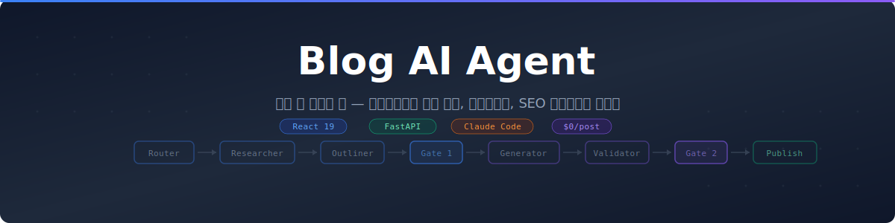
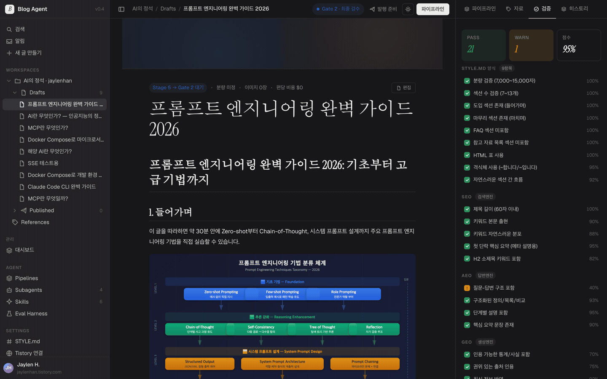
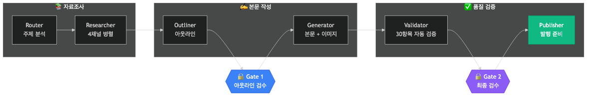
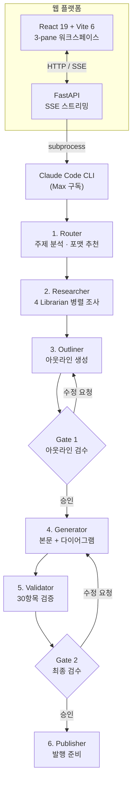

<p align="center">
  
</p>

<p align="center">
  <a href="https://github.com/JaylenAI/blog_ai_agent/actions"></a>
  <a href="LICENSE"></a>
  
  
  
  
  
</p>

<p align="center">
  <a href="#빠른-시작">빠른 시작</a> &middot;
  <a href="#주요-기능">주요 기능</a> &middot;
  <a href="#아키텍처">아키텍처</a> &middot;
  <a href="docs/">문서</a> &middot;
  <a href="CONTRIBUTING.md">기여 가이드</a>
</p>

---

## 데모

<p align="center">
  
</p>

> 3-pane 워크스페이스에서 주제를 입력하면 6단계 파이프라인이 실시간으로 진행됩니다. 우측 패널에서 30항목 검증 결과를 확인하고, Gate 2에서 최종 검수 후 발행합니다.

---

## 한 문장 정의

웹 브라우저에서 주제 한 줄을 입력하면, 6단계 파이프라인이 **자료조사 → 아웃라인 → 본문 작성 → 다이어그램 생성 → 검증 → 발행 준비**를 자동 수행합니다. Claude Max 구독 외 추가 비용 $0. 모든 단계는 실시간 SSE 스트리밍으로 화면에 표시되며, 두 번의 검수 게이트에서 사람이 방향을 잡습니다.

---

## 주요 기능

<table>
<tr>
<td width="50%">

**6단계 자동화 파이프라인**

주제 분석 → 4개 Librarian 병렬 자료조사 → 아웃라인 생성 → 본문 작성 → 30항목 자동 검증 → 발행 준비. 각 단계는 독립적으로 재시도 가능하며, 실패해도 이전 단계 결과가 보존됩니다.

</td>
<td width="50%">

**사람이 방향을 잡는 Gate 시스템**

Gate 1 (아웃라인 검수)과 Gate 2 (최종 검수)에서 사용자가 승인/거부를 결정합니다. AI는 초안 생성기이고, 최종 판단은 항상 사람의 몫입니다. Gate 2는 자동화할 수 없습니다.

</td>
</tr>
<tr>
<td>

**SEO + AEO + GEO 3대 최적화**

검색엔진 최적화(SEO), AI 답변엔진 최적화(AEO), 생성형 AI 인용 최적화(GEO)를 Validator가 30항목으로 자동 검증합니다. 95점 이상이면 통과, 미달 시 자동 재작성합니다.

</td>
<td>

**9가지 블로그 포맷**

Concept, Tutorial, Comparison, Troubleshooting, Architecture, Review, Trend, Case Study, Best Practices — 주제에 맞는 포맷을 자동 추천하거나 직접 선택할 수 있습니다.

</td>
</tr>
<tr>
<td>

**실시간 SSE 스트리밍**

파이프라인 진행 상황이 실시간으로 브라우저에 스트리밍됩니다. Generator 단계에서는 섹션별 "작성 중 → 완료" 진행률이 프로그레스 바와 함께 표시됩니다. 연결이 끊겨도 1회 자동 재연결되며, 파이프라인은 백그라운드에서 계속 실행됩니다.

</td>
<td>

**편당 비용 $0**

Claude Max 구독만으로 동작합니다. 외부 LLM API, 이미지 생성 API, 검색 API를 사용하지 않습니다. Mermaid CLI(무료)로 다이어그램을 렌더링합니다.

</td>
</tr>
</table>

---

## 아키텍처

### 파이프라인 플로우

<p align="center">
  
</p>

### 시스템 구조



### 기술 스택

| 영역 | 기술 | 비고 |
|------|------|------|
| **AI 엔진** | Claude Code CLI (subprocess) | Max 구독, 추가 비용 없음 |
| **백엔드** | FastAPI + SQLAlchemy (async) + SQLite | SSE 스트리밍, Rate Limiting |
| **프론트엔드** | React 19 + Vite 6 + Zustand 5 + Tailwind 4 | 6개 스토어, zod 런타임 검증 |
| **다이어그램** | Mermaid + mermaid-cli | PNG 렌더링 |
| **테스트** | pytest (609건) + Vitest (376건) + Playwright (48건) | 백엔드 88% 커버리지 |
| **인프라** | Docker Compose + GitHub Actions CI | 3-job 파이프라인 |

---

## 빠른 시작

### 사전 요구사항

- Python 3.12+ / [uv](https://docs.astral.sh/uv/)
- Node.js 22+ / [pnpm](https://pnpm.io/)
- [Claude Code CLI](https://docs.anthropic.com/en/docs/claude-code) (Max 구독 인증 완료)
- (선택) [mermaid-cli](https://github.com/mermaid-js/mermaid-cli) — 다이어그램 렌더링용

### 로컬 설치

```bash
git clone https://github.com/JaylenAI/blog_ai_agent.git
cd blog_ai_agent

# 백엔드
cd backend
cp ../.env.example .env          # 환경변수 편집 (OBSIDIAN_VAULT_PATH 등)
uv sync                          # 의존성 설치
uv run uvicorn app.main:app --reload

# 프론트엔드 (새 터미널)
cd frontend
pnpm install
pnpm dev
```

브라우저에서 `http://localhost:5173` 접속 → 주제 입력 → 생성 시작.

### Docker

```bash
cp .env.example .env
docker compose up --build
```

`http://localhost` 접속.

### Health Check

```bash
curl -s http://localhost:8000/api/v1/health/detailed | python3 -m json.tool
```

---

## 사용법

### 글 생성

1. **Launcher**에서 주제 입력 (예: "프롬프트 엔지니어링 완벽 가이드")
2. 포맷 선택 (자동 추천 또는 수동)
3. "생성 시작" 클릭 → 우측 패널에서 실시간 진행 확인
4. **Gate 1** — 아웃라인 확인 후 승인/거부
5. **Gate 2** — 최종 본문 + 검증 결과 확인 후 승인/거부
6. PublishKit에서 완성된 글 확인 (마크다운, HTML, 이미지, 태그)

### 사이드바 기능

| 패널 | 기능 |
|------|------|
| Dashboard | 아티클 통계, 검색, 필터링 |
| Pipelines | 모든 파이프라인 실행 이력 |
| Settings | Obsidian 연동, 일반 설정 |
| Style Guide | 블로그 양식 표준 뷰어 |
| Batch Edit | 아티클 일괄 편집 (카테고리, 태그, 상태) |

---

## API 엔드포인트

49개 REST API 엔드포인트를 제공합니다.

| 그룹 | 주요 엔드포인트 | 설명 |
|------|----------------|------|
| **Health** | `GET /api/v1/health/detailed` | DB, CLI, Mermaid, Obsidian 상태 확인 (2개) |
| **Articles** | `POST /api/v1/articles` | 아티클 CRUD + 버전 관리 + Obsidian 연동 (16개) |
| **Pipeline** | `POST /api/v1/pipeline/start/stream` | 파이프라인 실행, 승인/거부, 재시도 (13개) |
| **Formats** | `GET /api/v1/formats` | 9개 포맷 조회 + 주제별 추천 (3개) |
| **Settings** | `GET /api/v1/settings/general` | 설정 조회/변경 + 스타일 가이드 (8개) |
| **Calendar** | `GET /api/v1/calendar` | 발행 일정 조회/예약 (3개) |
| **Webhooks** | `GET /api/v1/webhooks` | 웹훅 등록/토글/삭제 (4개) |

---

## 테스트

```bash
# 백엔드 — 609 tests, 88% coverage
cd backend && uv run pytest tests/ -x -q

# 프론트엔드 — 376 tests
cd frontend && pnpm test

# E2E (Playwright)
cd frontend && pnpm test:e2e

# 린트
cd backend && uv run ruff check app/ tests/
cd frontend && pnpm lint && pnpm typecheck
```

---

## 프로젝트 구조

```
blog_ai_agent/
├── backend/                        FastAPI 백엔드
│   ├── app/
│   │   ├── api/v1/                 REST API 49개 (health, articles, pipeline, formats, settings, calendar, webhooks)
│   │   ├── pipeline/stages/        6 Stage (router → researcher → outliner → generator → validator → publisher)
│   │   ├── pipeline/gates/         Gate 1 (아웃라인), Gate 2 (최종)
│   │   ├── pipeline/subagents/     4 Librarian (공식문서, GitHub, 영문블로그, 한글블로그)
│   │   ├── claude/                 Claude CLI 래퍼 + 프롬프트 템플릿
│   │   ├── db/repositories/        Repository 패턴 (Article, Pipeline, Validation)
│   │   ├── formats/definitions/    9개 블로그 포맷 YAML 정의
│   │   ├── images/                 Mermaid + Playwright 이미지 생성
│   │   └── services/               비즈니스 로직 (Article, Pipeline, Obsidian)
│   └── tests/                      609 tests, 88% coverage (unit + integration)
│
├── frontend/                       React + Vite 프론트엔드
│   ├── src/
│   │   ├── components/             33개 컴포넌트 (layout, editor, gate, panels, tabs, publish, common)
│   │   ├── stores/                 6개 Zustand 스토어 + Facade 패턴
│   │   ├── hooks/                  5개 커스텀 훅 (SSE, 반응형, 파이프라인 액션)
│   │   ├── api/                    API 클라이언트 + zod 스키마 검증
│   │   └── styles/                 디자인 토큰 + CSS (1,867줄)
│   └── e2e/                        16 Playwright E2E 시나리오
│
├── docs/                           기획/설계 문서 (Obsidian vault 호환)
│   ├── 05-architecture/            시스템 아키텍처 (8개 문서)
│   └── style-guide/                블로그 양식 표준
│
├── CLAUDE.md                       Claude Code 작업 규칙
├── AGENTS.md                       에이전트 운용 가이드
├── CONTRIBUTING.md                 기여 가이드
├── docker-compose.yml              Docker 배포 설정
└── .github/workflows/ci.yml        CI 파이프라인 (lint → test → build → e2e)
```

---

## 문서

| 문서 | 내용 |
|------|------|
| [Architecture](docs/05-architecture/) | 시스템 설계, 파이프라인, 이미지 생성 전략 |
| [Style Guide](docs/style-guide/blog-style.md) | 블로그 양식 표준 (톤, 구조, 분량, SEO 규칙) |
| [Milestones](docs/08-milestones.md) | Phase별 마일스톤 및 진행 상태 |
| [Manual Test](docs/09-manual-test-scenarios.md) | 수동 테스트 시나리오 |
| [Current Status](docs/CURRENT_STATUS.md) | 현재 구현 상태 및 테스트 커버리지 |

---

## 검수 게이트 정책

이 프로젝트의 핵심 철학: **AI는 초안 생성기, 사람이 편집장.**

| Gate | 위치 | 묻는 질문 | 자동 건너뛰기 |
|------|------|----------|-------------|
| **Gate 1** | Outliner 완료 후 | "이 아웃라인으로 본문을 작성할까요?" | `auto_gate_one=true` 시만 |
| **Gate 2** | Validator 완료 후 | "이 최종 글을 발행할까요?" | **불가** |

---

## 기여

기여를 환영합니다. [CONTRIBUTING.md](CONTRIBUTING.md)를 참고해 주세요.

```bash
# 개발 환경 셋업
git clone https://github.com/JaylenAI/blog_ai_agent.git
cd blog_ai_agent

# 백엔드
cd backend && uv sync --all-extras --all-groups
uv run pytest tests/ -x -q              # 609 tests 통과 확인

# 프론트엔드
cd frontend && pnpm install
pnpm test                                # 376 tests 통과 확인
pnpm lint && pnpm typecheck              # 린트 + 타입 체크
```

---

## 메인테이너

**Jaylen H** ([@JaylenAI](https://github.com/JaylenAI))

- 블로그: [AI의 정석 — jaylenhan.tistory.com](https://jaylenhan.tistory.com)

---

## 라이선스

MIT &copy; 2026 Jaylen H. [LICENSE](LICENSE) 참조.

---

> **이 프로젝트의 철학**: AI는 1차 초안 생성기로 두고, 사람이 두 번의 검수 게이트에서 방향을 잡는다.
> 자동화의 목적은 작가를 대체하는 것이 아니라, 작가가 사고에 집중하도록 보일러플레이트를 제거하는 것이다.
