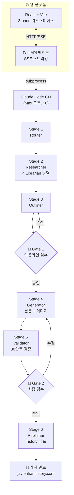

# Blog AI Agent

> 주제 한 줄 → 자료조사 → 본문 작성 → 다이어그램 생성 → Tistory 게시까지 완전 자동화하는 웹 플랫폼.
> Claude Max 구독만으로 동작하며, **편당 추가 비용 $0**.


운영 블로그 · [AI의 정석 — jaylenhan.tistory.com](https://jaylenhan.tistory.com)
GitHub · [JaylenAI/blog_ai_agent](https://github.com/JaylenAI/blog_ai_agent)

---

## 한 문장 정의

**웹 브라우저에서 "X 블로그 만들어줘" 한 줄 → [AI의 정석] 양식의 6,000~18,000자 기술 블로그를 자동 생성하고, 다이어그램 5장 + HTML 썸네일까지 만들어 Tistory에 게시한다. Claude Max 구독 외 추가 비용 $0.**

---

## 주요 기능 (구현 목표)

- **주제 한 줄 입력** → 카테고리 자동 분류 + 제목 후보 생성
- **4 Librarian 병렬 자료조사** — WebSearch + WebFetch로 12~20개 소스 수집
- **본문 자동 작성** — [AI의 정석] 표준 양식 100% 준수 (7~9 섹션)
- **다이어그램 자동 생성** — Mermaid 4~5장 + SVG + matplotlib
- **HTML 썸네일 자동 생성** — HTML/CSS 카드 + Playwright 스크린샷 (1200x630)
- **SEO + AEO + GEO 3대 최적화** — 검색엔진 + AI 답변엔진 + 생성형 AI 인용
- **Validator 자동 검증** — 14항목 양식 + SEO 8 + AEO 4 + GEO 4 체크
- **Tistory 반자동 배포** — Playwright (카카오 로그인은 사용자 수동)
- **편당 비용 $0** — Claude Max 구독 + 모든 도구 무료

---

## 시스템 아키텍처



상세는 [`docs/05-architecture/`](docs/05-architecture/) 참조.

---

## 디렉토리 구조

```
blog_ai_agent/
├── README.md                     ← 이 파일
├── CLAUDE.md                     ← Claude Code 작업 규칙
├── AGENTS.md                     ← 에이전트 운용 가이드
├── LICENSE                       ← MIT
├── .env.example                  ← 환경변수 템플릿
├── .gitignore
│
├── backend/                      ← FastAPI 백엔드
│   ├── pyproject.toml            ← uv 기반 Python 프로젝트
│   ├── app/
│   │   ├── main.py               ← FastAPI 진입점
│   │   ├── api/                  ← API 라우터 (SSE 포함)
│   │   ├── pipeline/             ← 6 Stage 파이프라인
│   │   ├── models/               ← Pydantic 모델
│   │   └── services/             ← Claude CLI 호출, 상태 관리
│   └── tests/                    ← 백엔드 테스트
│
├── frontend/                     ← React + Vite 프론트엔드
│   ├── package.json
│   ├── src/
│   │   ├── components/           ← 3-pane 워크스페이스 컴포넌트
│   │   │   ├── Sidebar/
│   │   │   ├── Topbar/
│   │   │   ├── Editor/
│   │   │   ├── Launcher/
│   │   │   ├── RightPanel/
│   │   │   └── GateModals/
│   │   ├── hooks/                ← 커스텀 훅
│   │   ├── stores/               ← Zustand 상태 관리
│   │   └── styles/               ← 디자인 토큰 + CSS
│   └── public/
│
├── docs/                         ← 기획·설계 문서 (옵시디언 vault)
│   ├── README.md                 ← 문서 인덱스
│   ├── _index.md                 ← 옵시디언 vault 진입점
│   ├── 00~08-*.md                ← Phase 0~8 문서 (✅ 완료)
│   ├── 09~16-*.md                ← Phase 9~16 문서 (🔄 예정)
│   ├── 05-architecture/          ← 시스템 설계 (7개 하위 문서)
│   ├── style-guide/              ← 양식 표준 (가장 중요)
│   ├── adr/                      ← Architecture Decision Records
│   └── meetings/                 ← 의사결정 회의록
│
└── .sisyphus/                    ← 런타임 산출물 (.gitignore)
```

---

## 기술 스택 (전부 무료)

| 영역 | 도구 | 비용 |
|------|------|------|
| AI 엔진 | Claude Code CLI (Max 구독, subprocess 호출) | $0 |
| 백엔드 | FastAPI + SSE | $0 |
| 프론트엔드 | React + Vite + Zustand | $0 |
| 자료조사 | WebSearch + WebFetch (Claude Code 내장) | $0 |
| 다이어그램 | Mermaid + `@mermaid-js/mermaid-cli` | $0 |
| 썸네일 | HTML/CSS + Playwright 스크린샷 | $0 |
| 일러스트 | SVG 직접 생성 + matplotlib | $0 |
| 배포 | Playwright (Python, 반자동) | $0 |
| 상태 저장 | SQLite + 파일 시스템 | $0 |
| Python 패키지 매니저 | **uv** | $0 |

상세 및 선택 이유는 [`docs/05-architecture/tech-stack.md`](docs/05-architecture/tech-stack.md).

---

## 비용 (편당)

| 시나리오 | 편수/월 | 월 비용 |
|---------|--------|--------|
| Claude Max 구독 한도 내 | 1~30편 | **$0** (구독료만) |

이미지 API, 검색 API, 호스팅 모두 추가 비용 없음.

---

## 문서

기획·설계·운영 문서는 모두 [`docs/`](docs/) 에. 부록 E 16 Phase 기반 구성.

**필독 (구현 시작 전)**:
- [docs/README.md](docs/README.md) — 문서 인덱스
- [docs/00-elevator-pitch.md](docs/00-elevator-pitch.md) — 한 줄 피치
- [docs/05-architecture/](docs/05-architecture/) — 시스템 설계
- [docs/style-guide/blog-style.md](docs/style-guide/blog-style.md) — **양식 표준 (가장 중요)**
- [docs/08-milestones.md](docs/08-milestones.md) — 마일스톤

**옵시디언 vault로 쓰는 법**: `docs/` 폴더를 옵시디언에 import → 그대로 vault로 작동.

---

## 로드맵 (마일스톤 요약)

| 마일스톤 | 내용 | 상태 |
|---------|------|------|
| **M1** | Phase 0~5 기획·설계 문서 완성 | ✅ 완료 |
| **M2** | Phase 6~8 UX/셋업/마일스톤 완성 | ✅ 완료 |
| **M3** | 파이프라인 코어 (Router→Researcher→Outliner→Gate 1) | ✅ 완료 |
| **M4** | Generator + Validator + Gate 2 | ✅ 완료 |
| **M5** | 이미지 파이프라인 (Mermaid + 썸네일 + SVG) | ✅ 완료 |
| **M6** | Publisher (Tistory Playwright 배포) | ✅ 완료 |
| **M7** | 웹 플랫폼 통합 (FastAPI + React SSE) | ✅ 완료 |
| **M8** | 운영 최적화 (주제 큐, 예약 발행, 분석) | ⏳ 미래 |

상세는 [`docs/08-milestones.md`](docs/08-milestones.md).

---

## 빠른 시작

### 사전 요구사항

- Python 3.12+ / [uv](https://docs.astral.sh/uv/)
- Node.js 22+ / [pnpm](https://pnpm.io/)
- [Claude Code CLI](https://docs.anthropic.com/en/docs/claude-code) (Max 구독 인증 완료)
- [mermaid-cli](https://github.com/mermaid-js/mermaid-cli) (`npm i -g @mermaid-js/mermaid-cli`)

### 설치 및 실행

```bash
git clone https://github.com/JaylenAI/blog_ai_agent.git
cd blog_ai_agent

# 백엔드
cd backend
cp .env.example .env   # OBSIDIAN_VAULT_PATH 등 편집
uv sync
uv run alembic upgrade head
uv run uvicorn app.main:app --reload

# 프론트엔드 (새 터미널)
cd frontend
pnpm install
pnpm dev
```

브라우저에서 `http://localhost:5173` 접속.

### Docker로 실행

```bash
cp backend/.env.example backend/.env
docker compose up --build
```

### 테스트

```bash
# 백엔드 (285 tests, 91%+ coverage)
cd backend && uv run pytest tests/ -x -q

# 프론트엔드 E2E (9 tests)
cd frontend && pnpm test:e2e

# 상세 health check
curl http://localhost:8000/api/v1/health/detailed | jq
```

---

## 메인테이너

**Jaylen H** ([@JaylenHan](https://github.com/JaylenHan)) — 1인 운영

- 블로그: [AI의 정석](https://jaylenhan.tistory.com)
- LinkedIn: [승헌 한](https://www.linkedin.com/in/%EC%8A%B9%ED%97%8C-%ED%95%9C-a450792a3/)

---

## 라이선스

MIT © 2026 Jaylen H. 자세한 내용은 [`LICENSE`](LICENSE).

---

> **이 프로젝트의 철학**: AI는 1차 초안 생성기로 두고, **사람이 두 번의 검수 게이트(아웃라인 / 최종)에서 방향을 잡는다.**
> 자동화의 목적은 작가를 대체하는 것이 아니라 작가가 사고에 집중하도록 보일러플레이트를 제거하는 것이다.
