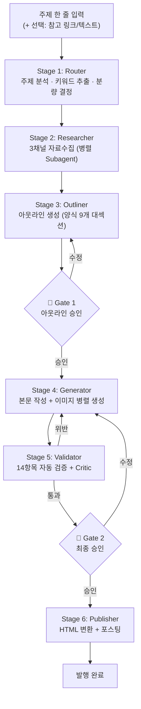
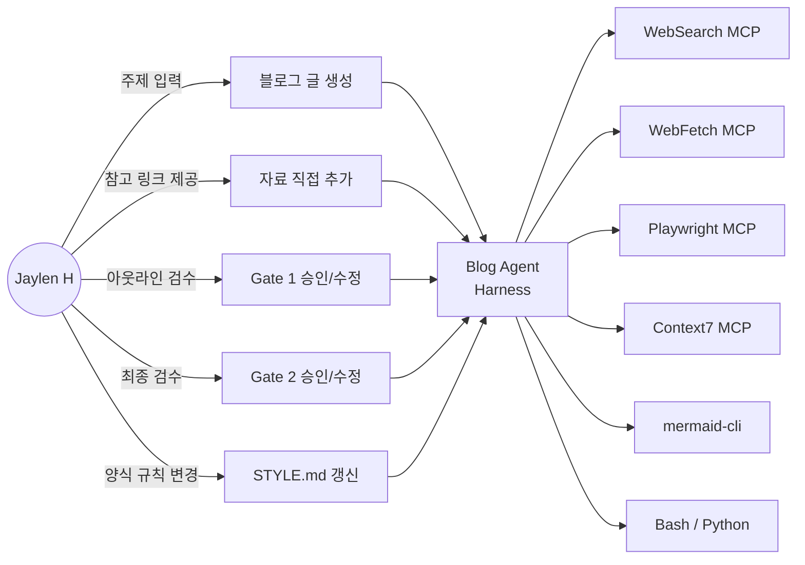

---
tags:
  - project/blog-ai-agent
  - phase/4
  - docs/requirements
  - status/active
date: 2026-05-21
created: 2026-05-21
updated: 2026-05-21
aliases:
  - 요구사항
  - Phase 4
  - MoSCoW
  - 시나리오
status: active
related:
  - "[[_index]]"
  - "[[03-team-and-roles]]"
  - "[[05-architecture/README]]"
  - "[[01-problem-statement]]"
---

# Phase 4 · 요구사항 정의 및 시나리오 설계

> 💡 부록 E Phase 4 "무엇을 만들 것인가"를 구체적으로 정의하는 단계. 여기서 모호하면 개발 도중 방향이 바뀐다.

---

## 4-1. 기능 요구사항 (MoSCoW)

### Must Have (필수 — MVP에 반드시 포함)

#### 자료수집 (Research)

- [ ] **3채널 자료수집 통합** — Claude 자동 웹서칭 + 유저 직접 제공 + Playwright 크롤링
- [ ] **자동 웹서칭** — WebSearch MCP로 주제 관련 자료 검색 (한국어 2쿼리 + 영어 3쿼리)
- [ ] **유저 제공 자료 처리** — 링크 전달 시 WebFetch로 내용 추출, 텍스트 전달 시 직접 저장
- [ ] **수집 자료 표준 형식 저장** — 각 자료를 표준 `.md` 형식으로 `references/{slug}/`에 저장
- [ ] **출처별 신뢰도 평가** — 공식문서(5), GitHub(4), 블로그(3) 등 자동 등급 부여
- [ ] **최소 수집 기준** — 총 8개 이상 확보. 미달 시 사용자에게 보고 후 결정

#### 아웃라인 (Outline)

- [ ] **양식 기반 아웃라인 자동 생성** — STYLE.md의 7~9개 대섹션 구조 준수
- [ ] **섹션별 핵심 주장 + 출처 매핑** — 어떤 자료를 어디에 사용할지 명시
- [ ] **SEO 키워드 배치 계획** — H2/H3 제목에 주 키워드 40% 이상 포함
- [ ] **🛑 Gate 1** — 아웃라인을 사용자에게 제시하고 승인/수정 대기

#### 본문 작성 (Writing)

- [ ] **STYLE.md 100% 준수** — 톤(격식체), 구조(대섹션 7~9개), 형식(표/코드/콜아웃) 모두 적용
- [ ] **섹션별 필수 요소 포함** — HTML 표 1개+, 코드 블록 2~5개, 콜아웃 1개+, 비유 1개
- [ ] **중복 노출 방지** — 버전/스타수/절감률 등 핵심 수치 본문 전체에서 1~2회만
- [ ] **참고자료 코드 유사도 <30%** — 원본 코드 변형 (도메인/변수명/프레임워크 변주)
- [ ] **마치며 3단 서사** — 현재 기술 요약 → 한계 있지만 필수인 이유 → 독자 실천 권유

#### SEO + AEO + GEO 최적화

- [ ] **SEO 기본** — 제목 60자 이내, 주 키워드 앞쪽 30자, 카테고리 태그 정확히 10개
- [ ] **JSON-LD TechArticle** — 모든 글에 구조화 데이터 스키마 삽입
- [ ] **메타 디스크립션** — 100~150자, 주 키워드 2~3회 자연 반복
- [ ] **AEO 정의문** — 각 대섹션 첫 문단에 "~란 ~하는 ~이다" 형태 정의문 삽입
- [ ] **GEO 독창적 관점** — 다른 블로그에 없는 고유 분석/실험 결과 1개 이상

#### 이미지 생성 (Image)

- [ ] **Mermaid 다이어그램 2~3장** — 아키텍처 + 라이프사이클/워크플로우
- [ ] **SVG 비교도/차트 1장** — 비용 비교, 성능 비교 등
- [ ] **자동 PNG 변환** — `.mmd` → `mmdc` → `.png` 자동 실행
- [ ] **이미지 alt 태그** — 모든 이미지에 키워드 포함 설명

#### 품질 검증 (Validation)

- [ ] **14항목 자동 체크리스트** — 존댓말/태그수/섹션수/분량/중복 등 기계적 검증
- [ ] **양식 위반 시 자동 재작성** — Critic + Reflection 1~2회
- [ ] **🛑 Gate 2** — 최종 글을 사용자에게 제시하고 승인/수정 대기

#### 포스팅 (Publishing)

- [ ] **마크다운 → 티스토리 HTML 변환** — 코드 블록, 표, 이미지 경로 모두 호환
- [ ] **이미지 플레이스홀더 → URL 자동 치환** — 이미지 업로드 후 경로 대체

---

### Should Have (중요 — 시간이 허락하면)

#### 자료수집 확장

- [ ] **Playwright 크롤링** — 동적 렌더링 필요한 사이트 (SPA, 로그인 필요 문서)
- [ ] **Context7 MCP 활용** — 특정 라이브러리 공식 문서 정밀 조회
- [ ] **grep.app MCP 활용** — GitHub 코드 패턴 실사례 검색
- [ ] **6개 버킷 완전 충족** — 공식문서/논문/GitHub/영상/영문블로그/한글블로그

#### SEO + AEO + GEO 고도화

- [ ] **HowTo Schema** — 실습 섹션에 JSON-LD HowTo 구조화 데이터 추가
- [ ] **Speakable Schema** — AEO용 음성 비서 참조 영역 명시
- [ ] **LSI 키워드 10개+** — 의미 연관 키워드 본문 전반 자연 분산
- [ ] **키워드 밀도 자동 검증** — 1~2% 범위 자동 체크

#### 품질 검증 고도화

- [ ] **Oracle Subagent 비평** — 비유 적절성, 가독성, 흐름 등 의미적 검증
- [ ] **사실 확인 (Fact-check)** — 수치/버전/날짜 등 핵심 사실 교차 검증
- [ ] **AI 슬롭 검출** — 과도한 친절함, 반복 표현, AI 특유 패턴 제거

#### 포스팅 고도화

- [ ] **티스토리 Playwright 반자동화** — 세션 유지 후 에디터 자동 입력
- [ ] **카테고리/태그 자동 설정** — 에디터 내 카테고리, 태그 자동 입력
- [ ] **미리보기 스크린샷** — 발행 전 미리보기 캡처 → 사용자 확인

---

### Could Have (있으면 좋음)

- [ ] **HTML/CSS 썸네일 자동 생성** — Playwright로 렌더링 → PNG 캡처
- [ ] **matplotlib 데이터 차트** — 정량 비교 시 Python 차트 자동 생성
- [ ] **가짜 터미널 SVG** — 설치/실행 예시를 터미널 형태로 시각화
- [ ] **대화 히스토리 저장** — 이전 블로그 생성 세션 참조 가능
- [ ] **Velog 어댑터** — Tistory 외 Velog 자동 포스팅 지원
- [ ] **블로그 성과 트래킹** — 발행 후 조회수/유입 경로 자동 수집

---

### Won't Have (이번엔 안 함 — 명시적 제외)

- [ ] ~~모바일 앱 / 웹 대시보드~~ — CLI 기반으로 충분
- [ ] ~~다국어 지원~~ — 한국어 기술 블로그 전용
- [ ] ~~자체 LLM 파인튜닝~~ — Claude Code 구독으로 충분
- [ ] ~~AI 이미지 생성 (DALL-E, Midjourney)~~ — Mermaid/SVG/HTML로 충분, 비용 발생
- [ ] ~~자동 주제 추천~~ — 주제는 사람이 결정 (설계 철학)
- [ ] ~~댓글/소셜미디어 자동 응답~~ — 스코프 외
- [ ] ~~실시간 SEO 순위 모니터링~~ — 별도 도구 사용
- [ ] ~~다른 사람의 블로그 양식 지원~~ — 본인 양식(STYLE.md)만

> ⚠️ **Won't Have 명시 이유** (부록 E §4-1): "이건 안 합니다"를 정해두지 않으면 스코프가 무한히 늘어난다. 특히 "자동 주제 추천"은 기술적으로 가능하지만, [[00-elevator-pitch#0-5|설계 철학]]에 정면으로 위배되므로 명시적으로 제외한다.

---

## 4-2. 비기능 요구사항 (Non-Functional Requirements)

| 항목 | 목표 | 비고 |
|------|------|------|
| **생성 시간 (자동)** | 5~8분 이내 | 자료수집~검증까지 (Gate 대기 제외) |
| **검수 시간 (수동)** | 15~20분 이내 | Gate 1 + Gate 2 합산 |
| **총 소요 시간** | 20~30분/편 | 기존 4~8시간 대비 75~95% 단축 |
| **양식 준수율** | 100% | STYLE.md 14항목 모두 통과 |
| **편당 비용** | $0 | Claude Code 구독 외 추가 비용 없음 |
| **월 생산량** | 10~12편 | 주 2~3편 페이스 |
| **코드 유사도** | <30% | 참고자료 코드와의 유사도 |
| **사실 오류율** | <5% | Fact-check Critic 단계 통과 기준 |
| **이미지 품질** | 300dpi+ | Mermaid PNG 출력 해상도 |
| **Tistory 호환** | 100% | 마크다운→HTML 변환 후 레이아웃 유지 |

---

## 4-3. 사용자 시나리오 (User Scenario)

### 시나리오 1: 표준 블로그 작성 (Happy Path)

- **사용자**: Jaylen H (본인)
- **상황**: "에이전틱 RAG" 주제로 기술 블로그 1편을 쓰고 싶다
- **행동**:
  1. Claude Code에서 "에이전틱 RAG 블로그 만들어줘" 입력
  2. Claude가 자동으로 자료수집 시작 (2~3분)
     - WebSearch: 한국어 2쿼리 + 영어 3쿼리
     - 결과: 10개 출처 확보, `references/agentic-rag/`에 저장
  3. 수집 결과 요약 + 아웃라인(9개 대섹션) 제시
  4. **🛑 Gate 1**: "이 아웃라인으로 진행할까요?"
     - 사용자: "3번 섹션을 '기존 RAG와의 차이'로 바꿔줘"
     - Claude: 수정 후 재제시 → 사용자 승인
  5. 본문 작성 시작 (3~5분)
     - 각 섹션 순차 작성 + 이미지 병렬 생성
     - Mermaid 3장 + SVG 1장 생성
  6. Critic 검증 (1분)
     - 14항목 체크 → 2개 위반 발견 → 자동 수정
  7. **🛑 Gate 2**: 최종 글 제시
     - 사용자: 10분간 통독 검수
     - "5번 섹션 코드 예시 하나 더 추가해줘" → Claude 수정
     - 최종 승인
  8. 마크다운 → HTML 변환 + 클립보드 복사
  9. Tistory 에디터에 붙여넣기 (수동) → 이미지 업로드 → 발행
- **기대 결과**: 총 25분. 8,000자, 표 8개, 코드 15개, 이미지 4장의 완성 글 발행

### 시나리오 2: 유저가 참고 자료를 직접 제공

- **사용자**: Jaylen H
- **상황**: 특정 논문과 GitHub 저장소를 기반으로 글을 쓰고 싶다
- **행동**:
  1. "RTK 블로그 만들어줘. 참고: https://github.com/example/rtk" 입력
  2. Claude가 유저 제공 URL을 WebFetch로 수집 (`relevance: 5` 고정)
  3. 추가로 자동 웹서칭 수행 (보완 자료 5~8개)
  4. 유저 제공 자료를 **우선 반영**한 아웃라인 생성
  5. 이후 시나리오 1과 동일 흐름
- **기대 결과**: 유저 의도가 정확히 반영된 글. 자동 수집 자료는 보완 역할

### 시나리오 3: 자료가 부족한 주제

- **사용자**: Jaylen H
- **상황**: 매우 최신이거나 니치한 주제로 자료가 부족하다
- **행동**:
  1. 웹 플랫폼에서 "블로그 만들어줘" 입력
  2. Claude 자동 웹서칭 → 신뢰할 만한 자료 3개밖에 없음 (기준 8개 미달)
  3. Claude 보고: "신뢰할 만한 자료 3개만 확보됨. 진행/추가검색/주제변경?"
  4. 사용자: "GitHub README가 주 자료니까 이 링크 추가해: [URL]"
  5. 유저 제공 자료 추가 → 총 5개로 진행 결정
  6. 아웃라인에서 자료 부족 섹션은 "경험 기반 서술"로 표시
  7. 이후 시나리오 1과 동일 흐름
- **기대 결과**: 자료 부족을 투명하게 보고. 추측으로 채우지 않음

### 시나리오 4: 양식 위반 발견

- **사용자**: Jaylen H
- **상황**: Critic이 양식 위반을 잡아냄
- **행동**:
  1. 본문 작성 완료
  2. Critic 검증 결과:
     - ❌ 단점 섹션이 7개 나열식 (기준: 4개 이하 카테고리)
     - ❌ 마치며 섹션이 2단 서사 (기준: 3단 서사)
     - ⚠️ 비유 1개가 이전 글과 유사
  3. 자동 재작성: 단점 카테고리 통합, 마치며 3단 보강
  4. 비유 유사도 → 사용자에게 보고: "이전 Prometheus 글에서 '우편 분류 시스템'을 사용했는데, 이번에도 비슷합니다. 변경할까요?"
  5. 사용자: "변경" → Claude가 새 비유로 교체
  6. 재검증 통과 → Gate 2 진입
- **기대 결과**: 양식 위반 0건으로 최종 글 제출

---

## 4-4. 파이프라인 Stage 요약 (상세는 [[05-architecture/pipeline-stages|Phase 5]])

사용자 시나리오를 파이프라인으로 매핑:

각 Stage의 입출력, 프롬프트, 도구는 [[05-architecture/pipeline-stages|Phase 5 파이프라인 상세]]에서 정의한다.

---

## 4-5. 비기능 요구사항 상세 — 3대 최적화 (SEO + AEO + GEO)

이 프로젝트의 콘텐츠는 **세 가지 엔진에 동시에 최적화**되어야 한다:

| 최적화 | 대상 | 목표 | 핵심 전략 |
|--------|------|------|----------|
| **SEO** | Google, Daum, Naver 검색엔진 | 검색 상위 노출 | 키워드, 메타태그, JSON-LD, 내부 링크 |
| **AEO** | AI 답변 엔진 (Perplexity, Bing Chat, Google SGE) | AI가 인용하는 소스 | 명확한 정의문, Q&A 구조, 구조화 데이터 |
| **GEO** | 생성형 AI (ChatGPT, Claude, Gemini) | AI 학습/참조 데이터 채택 | 독창적 관점, 정량 수치, E-E-A-T 신호 |

### SEO 요구사항 (기존 SKILL.md 유지)

- 제목 60자 이내, 주 키워드 앞쪽 30자 배치
- 카테고리 태그 정확히 10개 (주 키워드 2 + 분야 2 + 기술 2 + 제품 2 + 트렌드 2)
- 메타 디스크립션 100~150자, 주 키워드 2~3회
- H2/H3 제목에 주 키워드 또는 변형 40% 이상
- LSI 키워드 10개+ 본문 자연 분산
- 키워드 밀도 1~2%
- 모든 이미지 `alt` 태그 필수
- JSON-LD `TechArticle` schema 필수

### AEO 요구사항 (신규 추가)

- **정의문 패턴**: 각 대섹션 첫 문단에 `"~란 ~하는 ~이다"` 형태 삽입
  - AI 답변 엔진이 "X란 무엇인가?" 질문에 이 문장을 직접 인용 가능
- **핵심 요약 박스**: 각 섹션 상단에 `💡 핵심: [1~2문장]` 배치
  - AI가 요약 생성 시 이 박스를 우선 참조
- **비교표 Q&A 구조**: "A와 B의 차이점은?" → 표로 명확히 답변
  - AI 답변 엔진이 표를 그대로 인용 가능
- **HowTo Schema**: 실습/설치 섹션에 JSON-LD HowTo 구조화 데이터
  - step별 구조화 → AI가 단계별 답변 가능
- **Speakable Schema**: CSS 셀렉터로 음성 비서 참조 영역 명시

### GEO 요구사항 (신규 추가)

- **독창적 관점 섹션** (1개 이상)
  - 다른 블로그에 없는 고유 분석, 실험 결과, 경험담
  - "직접 테스트한 결과...", "실무에서 겪은 문제는..."
  - AI가 학습할 때 "새로운 정보"로 인식 → 인용 확률 상승
- **정량적 수치 적극 포함**
  - 벤치마크, 비교 수치, 절감률, 성능 지표
  - AI가 답변에 "구체적 근거"로 인용 가능
- **인용 가능한 한 줄 정의 (Quotable Definitions)**
  - 핵심 개념마다 볼드 처리 + 독립 문단
  - AI가 답변 시 그대로 인용
- **E-E-A-T 신호 강화**
  - Experience: 실제 사용 경험 포함
  - Expertise: 기술적 깊이 (코드, 아키텍처)
  - Authoritativeness: 공식문서/논문 기반 서술
  - Trustworthiness: 단점/한계 솔직히 기술

---

## 4-6. 제약 조건

| 제약 | 이유 | 대응 |
|------|------|------|
| Claude Code 구독만 사용 | 편당 $0 유지 ([[02-benchmark#2-3|차별점 2]]) | WebSearch/WebFetch 내장 + Mermaid/SVG |
| 카카오 OAuth 자동화 금지 | 보안 + TOS 위반 방지 | 수동 로그인 + 세션 유지 |
| STYLE.md 100% 준수 | 양식 일관성 = 브랜드 ([[01-problem-statement#1-4|위험 §2]]) | Critic 자동 검증 |
| Gate 2 자동화 금지 | AI 슬롭 방지 = 핵심 설계 철학 | 절대 건너뛰지 않음 |
| 한국어만 지원 | 스코프 제한 ([[#Won't Have]]) | 영문 자료는 한국어로 재구성 |
| 1인 운영 | 유지보수 부담 최소화 | 코드 단순성 우선, 과도한 추상화 금지 |

---

## 4-7. 유스케이스 다이어그램

---

## 4-8. 수락 기준 (Acceptance Criteria)

MVP 완성 판단 기준:

| # | 기준 | 검증 방법 | 통과 조건 |
|---|------|----------|----------|
| 1 | 주제 한 줄 → 완성 글 생성 | 실제 3편 생성 | 3편 모두 Gate 2 통과 |
| 2 | 총 소요시간 30분 이내 | 타이머 측정 | 3편 평균 30분 이하 |
| 3 | STYLE.md 100% 준수 | Validator 자동 검증 | 14항목 모두 통과 |
| 4 | 편당 비용 $0 | 외부 API 호출 로그 확인 | Claude Code 구독 외 0건 |
| 5 | 이미지 3~4장 자동 생성 | 생성 파일 확인 | Mermaid + SVG/차트 포함 |
| 6 | SEO schema 포함 | HTML 출력 검사 | JSON-LD TechArticle 포함 |
| 7 | Tistory 호환 HTML | 실제 붙여넣기 테스트 | 레이아웃 깨짐 없음 |
| 8 | 실제 발행 1편 | jaylenhan.tistory.com 확인 | 발행 성공 + 정상 표시 |

---

## 🔗 다음 문서

- [[05-architecture/README|Phase 5 · 시스템 아키텍처 설계]]
- [[08-milestones|Phase 8 · 마일스톤]]
