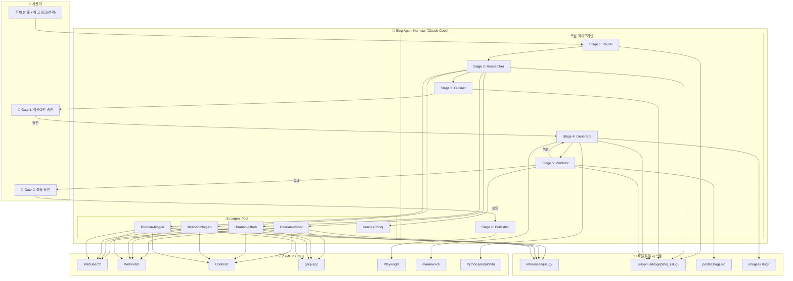
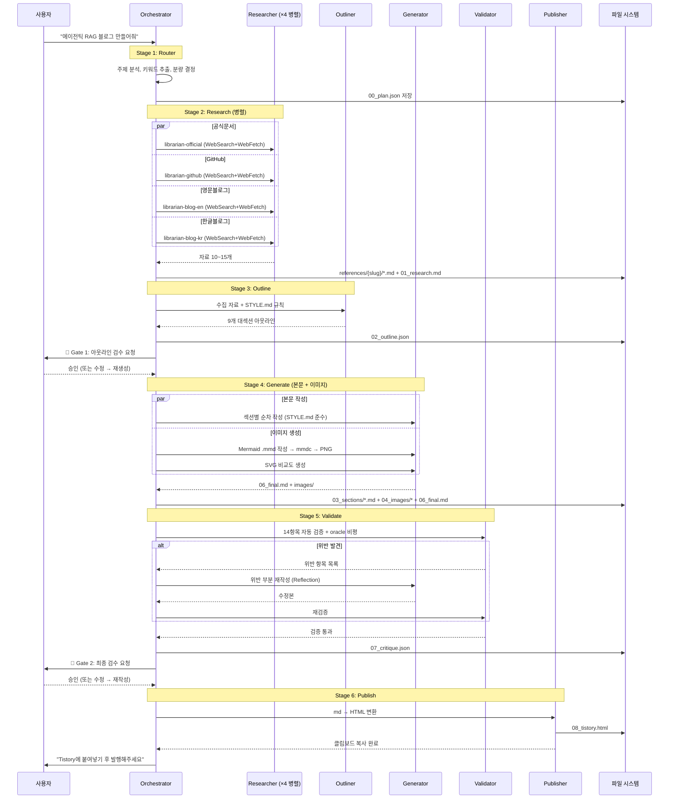

---
tags:
  - project/blog-ai-agent
  - phase/5
  - docs/architecture
  - status/active
date: 2026-05-21
created: 2026-05-21
updated: 2026-05-21
aliases:
  - 아키텍처 설계
  - Phase 5
  - 시스템 설계
status: active
related:
  - "[[_index]]"
  - "[[04-requirements]]"
  - "[[06-ux-design]]"
---

# Phase 5 · 시스템 아키텍처 설계

> 💡 부록 E Phase 5 기술 선택에는 반드시 **이유**가 있어야 한다. "남들이 많이 써서"는 이유가 아니다.

---

## 5-0. 아키텍처 총괄 개요

이 프로젝트는 **일반 소프트웨어가 아니라 하네스 엔지니어링**이다.

```
일반 프로젝트:  코드 작성 → 서버 배포 → 사용자 접속 → API 호출
하네스 프로젝트: Skill + Subagent + MCP + Prompt 조합 → Claude Code가 직접 실행
```

따라서 "서버"나 "데이터베이스"가 없다. 대신:
- **런타임**: Claude Code CLI (Claude Max 구독)
- **오케스트레이터**: blog-writer Skill (SKILL.md)
- **워커**: Subagent (librarian, oracle)
- **도구**: MCP (WebSearch, WebFetch, Context7, Playwright)
- **검증기**: Python 스크립트 + oracle Subagent
- **저장소**: 로컬 파일 시스템 (`.sisyphus/blog/`)

### 시스템 아키텍처 다이어그램



---

## 5-1. 하위 문서 매트릭스

| # | 문서 | 내용 | 우선순위 |
|---|------|------|---------|
| 1 | [[pipeline-stages]] | 6 Stage 파이프라인 상세 (각 Stage I/O, 프롬프트, 도구) | 🔥 |
| 2 | [[research-strategy]] | 3채널 자료수집 전략 (웹서칭/유저제공/크롤링) | 🔥 |
| 3 | [[content-format]] | SEO + AEO + GEO 통합 콘텐츠 양식 | 🔥 |
| 4 | [[validator-design]] | 품질 검증 시스템 (자동 14항목 + oracle 비평) | 🔥 |
| 5 | [[image-pipeline]] | 이미지 자동 생성 파이프라인 (Mermaid/SVG/matplotlib) | 🟡 |
| 6 | [[publishing-strategy]] | 티스토리 포스팅 전략 (HTML 변환 + Playwright) | 🟡 |
| 7 | [[tech-stack]] | 기술 스택 확정 + 미선택 사유 | 🟡 |

---

## 5-2. 기술 스택 확정

### ✅ 확정

| 영역 | 기술 | 선택 이유 | ADR |
|------|------|----------|-----|
| 런타임/오케스트레이터 | Claude Code CLI (Max) | 구독만으로 LLM+도구+Subagent 통합. 별도 서버 불필요 | [[adr/001]] |
| 자료검색 | WebSearch + WebFetch (내장) | $0, API 키 불필요, Exa 엔진 기반 정확도 | [[adr/004]] |
| 공식문서 조회 | Context7 MCP | 라이브러리별 정확한 문서 조회 | — |
| 코드 사례 검색 | grep.app MCP | GitHub 코드 패턴 실사례 | — |
| 다이어그램 | mermaid-cli (`mmdc`) | 텍스트 기반, 버전 관리 가능, 한국어 완벽 | [[adr/003]] |
| 데이터 차트 | Python matplotlib | 무료, 커스터마이징 자유 | — |
| 브라우저 자동화 | Playwright (Python) | Tistory 자동 입력 + 썸네일 캡처 | — |
| Python 환경 | UV | 사용자 글로벌 규칙 (pip/poetry 금지) | — |
| 배포 대상 | Tistory | 기존 운영 자산 100+글 ([[02-benchmark#2-4|비교 4]]) | [[adr/002]] |

### ❌ 검토했지만 선택하지 않은 것

| 기술 | 미선택 이유 | ADR |
|------|-----------|-----|
| LangGraph + Claude | 학습 비용 1~2주, 토큰 효율 낮음, Claude Code 단일 세션이 더 효율적 | [[adr/001]] |
| CrewAI | 토큰 56% 더 소비, 한국어 자료 부족 | [[adr/001]] |
| Tavily / Exa API | 유료 ($0 정책 위반), API 키 관리 부담 | [[adr/004]] |
| DALL-E / Midjourney | 유료, 한국어 텍스트 깨짐, 다이어그램 부적합 | [[adr/003]] |
| Velog | 기존 운영 자산 없음, 백업용으로만 고려 | [[adr/002]] |
| FastAPI 서버 | 하네스 프로젝트에 불필요. Claude Code 자체가 런타임 | — |
| PostgreSQL / MongoDB | DB 불필요. 로컬 파일 시스템으로 충분 | — |

---

## 5-3. 디렉토리 구조

```
blog_ai_agent/
├── CLAUDE.md                          # Claude Code 작업 규칙
├── AGENTS.md                          # Subagent/MCP 운용 가이드
├── README.md                          # 프로젝트 소개
├── pyproject.toml                     # UV 프로젝트 설정
│
├── .claude/
│   └── skills/
│       └── blog-writer/
│           └── SKILL.md               # 블로그 작성 Skill 본체
│
├── backend/
│   ├── pyproject.toml                 # uv 프로젝트 설정
│   └── app/
│       ├── main.py                    # FastAPI 진입점
│       ├── api/                       # API 라우터 (SSE 포함)
│       ├── pipeline/                  # 6 Stage 파이프라인
│       │   ├── orchestrator.py        # 상태 머신 총괄
│       │   ├── router.py              # Stage 1: 주제 분석
│       │   ├── researcher.py          # Stage 2: 자료수집 (4 Librarian)
│       │   ├── outliner.py            # Stage 3: 아웃라인 생성
│       │   ├── generator.py           # Stage 4: 본문 + 이미지 생성
│       │   ├── validator.py           # Stage 5: 30항목 검증
│       │   └── publisher.py           # Stage 6: Tistory 배포
│       ├── services/                  # Claude CLI, 상태 관리, SSE
│       ├── models/                    # Pydantic 모델
│       └── utils/                     # 공용 유틸리티
│   │
│   ├── validators/                    # 자동 검증 스크립트
│   │   ├── format_checker.py          # 양식 14항목 자동 검증
│   │   ├── seo_checker.py             # SEO/AEO/GEO 규칙 검증
│   │   └── duplicate_checker.py       # 중복 노출 검사
│   │
│   ├── converters/                    # 변환 도구
│   │   ├── md_to_tistory.py           # 마크다운 → 티스토리 HTML
│   │   └── image_embedder.py          # 이미지 URL 치환
│   │
│   └── utils/                         # 유틸리티
│       ├── file_manager.py            # .sisyphus/ 디렉토리 관리
│       └── reference_parser.py        # 수집 자료 표준 형식 파싱
│
├── prompts/                           # 프롬프트 모듈 (텍스트)
│   ├── research/
│   │   ├── librarian-official.md      # 공식문서 수집 프롬프트
│   │   ├── librarian-github.md        # GitHub 수집 프롬프트
│   │   ├── librarian-blog-en.md       # 영문블로그 수집 프롬프트
│   │   └── librarian-blog-kr.md       # 한글블로그 수집 프롬프트
│   ├── oracle.md                      # 비평 Subagent 프롬프트
│   ├── router.md                      # 주제 분석 프롬프트
│   ├── outliner.md                    # 아웃라인 생성 프롬프트
│   └── writer.md                      # 본문 작성 프롬프트
│
├── templates/                         # 출력 템플릿
│   ├── reference-format.md            # 수집 자료 저장 표준 형식
│   ├── outline-format.json            # 아웃라인 JSON 스키마
│   └── tistory-html.html              # 티스토리 HTML 변환 템플릿
│
├── eval/                              # 평가 하네스
│   ├── eval_suite.md                  # 평가 시나리오 정의
│   ├── golden_set/                    # 기준 블로그 (합격 사례)
│   │   └── rtk-rust-token-killer.md
│   ├── rubric.md                      # 채점 기준표
│   └── results/                       # 평가 결과 저장
│
├── tests/                             # 자동 테스트
│   ├── test_format_checker.py
│   ├── test_seo_checker.py
│   ├── test_duplicate_checker.py
│   └── test_converter.py
│
├── docs/                              # 기획/설계 문서 (부록 E 16 Phase)
│   ├── _index.md
│   ├── README.md
│   ├── 00-elevator-pitch.md
│   ├── 01-problem-statement.md
│   ├── 02-benchmark.md
│   ├── 03-team-and-roles.md
│   ├── 04-requirements.md
│   ├── 05-architecture/               # ← 이 디렉토리
│   │   ├── README.md (이 파일)
│   │   ├── pipeline-stages.md
│   │   ├── research-strategy.md
│   │   ├── content-format.md
│   │   ├── validator-design.md
│   │   ├── image-pipeline.md
│   │   ├── publishing-strategy.md
│   │   └── tech-stack.md
│   ├── style-guide/
│   ├── adr/
│   └── meetings/
│
├── scripts/                           # 실행 스크립트
│   ├── install_skill.sh               # Skill 글로벌 설치
│   └── setup_tistory.py               # Playwright 세션 초기화
│
└── .sisyphus/                         # 런타임 작업 공간 (.gitignore)
    └── blog/
        └── {YYYY-MM-DD}_{slug}/       # 글별 작업 디렉토리
            ├── 00_plan.json
            ├── 01_research.md
            ├── 02_outline.json
            ├── 03_sections/*.md
            ├── 04_images/*.png, *.svg
            ├── 05_diagrams/*.mmd
            ├── 06_final.md
            ├── 07_critique.json
            ├── 08_tistory.html
            └── meta.json
```

---

## 5-4. 데이터 흐름도



---

## 🔗 하위 문서

1. [[pipeline-stages|6 Stage 파이프라인 상세]]
2. [[research-strategy|3채널 자료수집 전략]]
3. [[content-format|SEO + AEO + GEO 통합 양식]]
4. [[validator-design|품질 검증 시스템]]
5. [[image-pipeline|이미지 자동 생성]]
6. [[publishing-strategy|포스팅 자동화]]
7. [[tech-stack|기술 스택 상세]]

---

## 🔗 다음 문서

- [[06-ux-design|Phase 6 · CLI 상호작용 UX]]
- [[07-project-setup|Phase 7 · 프로젝트 셋업]]
