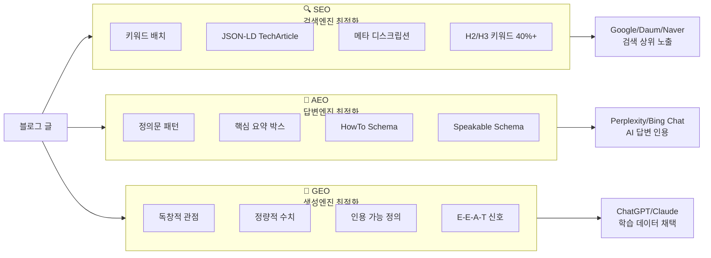

---
tags:
  - project/blog-ai-agent
  - phase/5
  - docs/architecture
  - status/active
date: 2026-05-21
created: 2026-05-21
updated: 2026-05-21
aliases:
  - 콘텐츠 양식
  - SEO AEO GEO
  - Content Format
status: active
related:
  - "[[README]]"
  - "[[pipeline-stages]]"
  - "[[validator-design]]"
---

# SEO + AEO + GEO 통합 콘텐츠 양식

> 이 문서는 기존 SKILL.md의 SEO 규칙을 확장하여, AEO(Answer Engine Optimization)와 GEO(Generative Engine Optimization)를 통합한 3대 최적화 양식을 정의한다.

---

## 3대 최적화 프레임워크



---

## SEO 규칙 (기존 SKILL.md 유지 + 정리)

### 제목 규칙

```
[카테고리] 주제(영문) 완벽 가이드 2026

제약:
- 총 60자 이내
- 주 키워드를 앞쪽 30자에 배치
- 숫자/연도 포함 시 CTR 상승
- 카테고리 태그: [AI/LLM], [DevOps], [Backend] 등
```

### 카테고리 태그 (정확히 10개)

| 종류 | 개수 | 역할 | 예시 |
|------|------|------|------|
| 주 키워드 | 2 | 핵심 검색어 | `#에이전틱RAG` `#AgenticRAG` |
| 분야 | 2 | 도메인 분류 | `#AI검색` `#LLM응용` |
| 기술 | 2 | 기술 스택 | `#RAG파이프라인` `#벡터검색` |
| 제품 | 2 | 도구/프레임워크 | `#LangChain` `#LlamaIndex` |
| 트렌드 | 2 | 시의성 | `#AI에이전트2026` `#2026` |

### 메타 디스크립션

```
- 100~150자
- 주 키워드 2~3회 자연 반복
- 독자의 pain point 반영
- CTA(행동 유도) 포함

예시:
"에이전틱 RAG(Agentic RAG)가 기존 RAG의 한계를 어떻게 극복하는지,
아키텍처부터 실습까지 완벽 정리. 2026년 최신 LangChain/LlamaIndex
구현 코드 포함."
```

### H2/H3 키워드 규칙

- H2 제목에 주 키워드 또는 변형이 **40% 이상** 포함
- H3 제목에 롱테일 키워드 삽입
- 예:
  ```
  ## 2. 에이전틱 RAG(Agentic RAG)란?          ← 주 키워드 포함 ✅
  ### 2-1. 에이전틱 RAG의 정의                 ← 변형 포함 ✅
  ### 2-2. 기존 RAG와 에이전틱 RAG의 차이       ← 롱테일 ✅
  ## 3. 에이전틱 RAG 핵심 구성요소              ← 주 키워드 ✅
  ## 7. 한 눈에 비교                           ← 키워드 없음 (허용, 40% 룰)
  ```

### LSI 키워드

- 본문 전반에 의미 연관 키워드 **10개 이상** 자연 분산
- 키워드 밀도 **1~2%** 유지
- 강제 삽입이 아니라 문맥에 자연스럽게 녹임

### 이미지 SEO

- 모든 이미지에 `alt="키워드 포함 설명"` 필수
- 파일명: `keyword-slug.png` (공백/한글 X)
- 예: `alt="에이전틱 RAG 아키텍처 다이어그램 - LangChain 기반"`

### JSON-LD TechArticle Schema

```html
<script type="application/ld+json">
{
  "@context": "https://schema.org",
  "@type": "TechArticle",
  "headline": "[AI/LLM] 에이전틱 RAG(Agentic RAG) 완벽 가이드 2026",
  "description": "에이전틱 RAG가 기존 RAG의 한계를 어떻게 극복하는지...",
  "datePublished": "2026-05-21",
  "dateModified": "2026-05-21",
  "author": {
    "@type": "Person",
    "name": "Jaylen Han",
    "url": "https://jaylenhan.tistory.com"
  },
  "publisher": {
    "@type": "Organization",
    "name": "AI의 정석"
  },
  "keywords": "에이전틱 RAG, Agentic RAG, AI 검색, RAG 파이프라인",
  "articleSection": "AI/LLM",
  "wordCount": 8000,
  "image": "https://jaylenhan.tistory.com/images/agentic-rag-architecture.png"
}
</script>
```

---

## AEO 규칙 (신규)

### AEO란?

**Answer Engine Optimization** — AI 답변 엔진(Perplexity, Bing Chat, Google AI Overview)이 블로그 내용을 **인용 소스로 채택**하도록 최적화하는 전략.

### AEO 핵심 요소

#### 1. 정의문 패턴 (Definition Statement)

각 대섹션의 **첫 문단**에 "~란 ~하는 ~이다" 형태의 명확한 정의문을 삽입한다.

```markdown
## 2. 에이전틱 RAG(Agentic RAG)란?

**에이전틱 RAG(Agentic RAG)란** 기존 RAG(Retrieval-Augmented Generation) 파이프라인에
**자율 판단 에이전트**를 결합하여, 검색 전략을 스스로 계획·실행·평가하는
차세대 검색 증강 생성 기법입니다.
```

**규칙:**
- 각 대섹션 H2 바로 아래 첫 문단에 1개
- "~란"으로 시작, "~이다/~합니다"로 종결
- 1~3문장, 100자 이내 권장
- AI가 "X란 무엇인가?" 질문에 이 문장을 직접 인용할 수 있어야 함

#### 2. 핵심 요약 박스 (Summary Box)

각 섹션의 핵심을 1~2문장으로 압축한 박스를 섹션 상단에 배치.

```markdown
> 💡 **핵심**: 에이전틱 RAG는 쿼리 분석 → 다중 소스 라우팅 → 결과 평가 →
> 필요 시 재검색이라는 4단계 자율 루프를 통해 기존 RAG 대비 정확도를 40% 향상시킵니다.
```

**규칙:**
- 각 대섹션에 0~1개 (모든 섹션에 넣을 필요 없음, 핵심 섹션만)
- AI가 요약 생성 시 이 박스를 우선 참조
- 정량 수치 포함 권장

#### 3. 비교표 Q&A 구조

비교가 필요한 곳에 "질문 → 표 답변" 패턴을 사용.

```markdown
### 기존 RAG vs 에이전틱 RAG, 무엇이 다른가?

<table>
<tr><th>비교 항목</th><th>기존 RAG</th><th>에이전틱 RAG</th></tr>
<tr><td>검색 전략</td><td>고정 파이프라인</td><td>자율 판단</td></tr>
<tr><td>쿼리 재작성</td><td>❌</td><td>✅ 자동</td></tr>
...
</table>
```

AI 답변 엔진이 "A와 B의 차이점은?"이라는 질문에 이 표를 직접 인용.

#### 4. HowTo Schema (실습 섹션)

설치/구축 섹션에 JSON-LD HowTo 구조화 데이터를 추가.

```html
<script type="application/ld+json">
{
  "@context": "https://schema.org",
  "@type": "HowTo",
  "name": "에이전틱 RAG 구축하기",
  "step": [
    {
      "@type": "HowToStep",
      "name": "LangChain 설치",
      "text": "pip install langchain langchain-openai"
    },
    {
      "@type": "HowToStep",
      "name": "에이전트 설정",
      "text": "AgentExecutor에 검색 도구와 LLM을 연결합니다"
    }
  ]
}
</script>
```

#### 5. Speakable Schema (음성 비서)

```html
"speakable": {
  "@type": "SpeakableSpecification",
  "cssSelector": [".definition-statement", ".summary-box", "h2"]
}
```

정의문과 요약 박스를 음성 비서가 읽어줄 수 있는 영역으로 지정.

---

## GEO 규칙 (신규)

### GEO란?

**Generative Engine Optimization** — 생성형 AI(ChatGPT, Claude, Gemini)가 블로그 내용을 **학습 데이터 또는 참조 소스로 채택**하도록 최적화하는 전략.

### GEO 핵심 요소

#### 1. 독창적 관점 섹션 (Unique Insight)

다른 블로그에 없는 **고유 분석, 실험 결과, 경험담**을 1개 이상 포함.

```markdown
### 직접 테스트한 결과

필자가 동일한 100개 질의셋으로 기존 RAG와 에이전틱 RAG를 비교 테스트한 결과:

<table>
<tr><th>지표</th><th>기존 RAG</th><th>에이전틱 RAG</th><th>개선율</th></tr>
<tr><td>정확도</td><td>72.3%</td><td>89.1%</td><td>+23.3%</td></tr>
<tr><td>응답 시간</td><td>1.8초</td><td>4.2초</td><td>-133%</td></tr>
<tr><td>토큰 비용</td><td>$0.003</td><td>$0.012</td><td>+300%</td></tr>
</table>

정확도는 크게 향상되지만, 응답 시간과 비용이 증가합니다.
실시간 챗봇보다는 **배치 처리나 문서 분석**에 더 적합한 패턴입니다.
```

**규칙:**
- 매 글에 1개 이상 (Could: 2~3개)
- "직접 테스트한 결과", "실무에서 겪은 문제", "우리 팀의 경험" 등의 표현
- 정량 수치 필수 포함
- AI가 학습할 때 "새로운 정보"로 인식 → 인용 확률 상승

#### 2. 정량적 수치 (Quantitative Data)

벤치마크, 비교 수치, 절감률, 성능 지표를 적극 포함.

```
✅ 좋은 예: "에이전틱 RAG는 기존 RAG 대비 정확도를 23.3% 향상시킨다"
❌ 나쁜 예: "에이전틱 RAG는 기존 RAG보다 훨씬 정확하다"
```

AI는 구체적 수치가 있는 문장을 "근거 있는 정보"로 판단하여 인용 확률이 높아짐.

#### 3. 인용 가능한 한 줄 정의 (Quotable Definition)

핵심 개념마다 **볼드 처리 + 독립 문단**으로 한 줄 정의문을 배치.

```markdown
**에이전틱 RAG(Agentic RAG)는 "검색을 지시하는 AI"에서 "검색을 스스로 계획하는 AI"로의 패러다임 전환이다.**
```

**규칙:**
- 글 전체에서 2~3개
- 볼드 + 독립 문단 (전후 빈 줄)
- AI가 답변에서 그대로 인용할 수 있는 완결된 문장
- 중복 노출 규칙과 별개 (정의문은 독립적)

#### 4. E-E-A-T 신호 강화

Google의 E-E-A-T(Experience, Expertise, Authoritativeness, Trustworthiness) 프레임워크를 GEO에도 적용.

| 신호 | 적용 방법 | 예시 |
|------|----------|------|
| **Experience** | 실제 사용 경험 포함 | "3개월간 프로덕션에서 운영한 결과..." |
| **Expertise** | 기술적 깊이 (코드, 아키텍처) | 동작 원리 + 코드 + 다이어그램 |
| **Authoritativeness** | 공식문서/논문 기반 서술 | "[공식 문서에 따르면...]" |
| **Trustworthiness** | 단점/한계 솔직히 기술 | "그러나 이 방식에는 세 가지 한계가 있습니다" |

---

## 3대 최적화 통합 체크리스트

Stage 5(Validator)에서 자동 검증할 항목:

### SEO 체크리스트 (기존)

- [ ] 제목 60자 이내
- [ ] 주 키워드 앞쪽 30자
- [ ] 태그 정확히 10개
- [ ] 메타 디스크립션 100~150자
- [ ] H2/H3 키워드 40%+
- [ ] 키워드 밀도 1~2%
- [ ] 이미지 alt 태그 전수
- [ ] JSON-LD TechArticle 존재

### AEO 체크리스트 (신규)

- [ ] 정의문 패턴 대섹션별 1개
- [ ] 핵심 요약 박스 3개 이상
- [ ] 비교표 Q&A 구조 1개 이상
- [ ] HowTo Schema (실습 섹션 있을 때)

### GEO 체크리스트 (신규)

- [ ] 독창적 관점 섹션 1개 이상
- [ ] 정량적 수치 5개 이상
- [ ] 인용 가능 정의문 2~3개
- [ ] E-E-A-T 4가지 신호 중 3가지 이상

---

## SKILL.md 확장 포인트 요약

기존 SKILL.md에 추가해야 할 규칙:

```
[기존 섹션 F: SEO 최적화 규칙]
  + §F-7. AEO 최적화 규칙
    - 정의문 패턴
    - 핵심 요약 박스
    - HowTo Schema
    - Speakable Schema
  + §F-8. GEO 최적화 규칙
    - 독창적 관점 섹션
    - 정량적 수치
    - 인용 가능 정의문
    - E-E-A-T 신호
```

---

## 🔗 관련 문서

- [[pipeline-stages#Stage 4|Stage 4 Generator]]
- [[validator-design|품질 검증 시스템]]
- 기존 SKILL.md §F (SEO 규칙)
