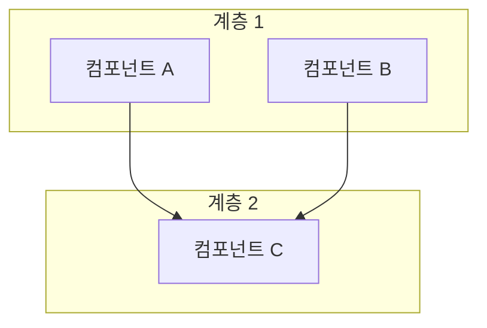
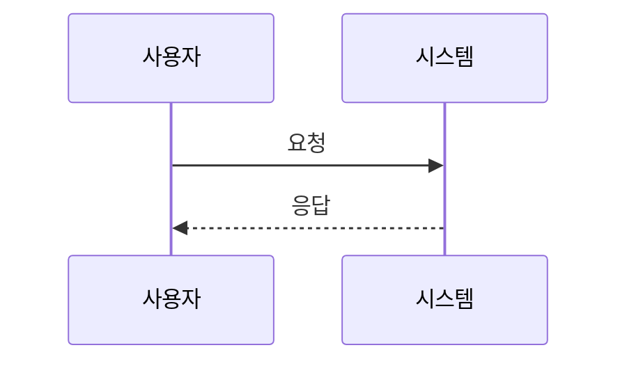
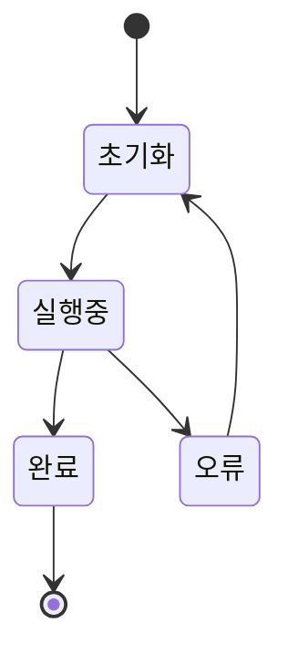

---
tags:
  - project/blog-ai-agent
  - phase/5
  - docs/architecture
  - status/active
date: 2026-05-21
created: 2026-05-21
updated: 2026-05-21
aliases:
  - 이미지 파이프라인
  - Image Pipeline
status: active
related:
  - "[[README]]"
  - "[[pipeline-stages]]"
---

# 이미지 자동 생성 파이프라인

> 이 문서는 Stage 4(Generator)에서 이미지를 자동 생성하는 전략을 정의한다.

---

## 이미지 유형별 생성 전략

| 유형 | 도구 | 용도 | 편당 개수 |
|------|------|------|----------|
| 아키텍처 다이어그램 | Mermaid (`mmdc`) → PNG | 시스템 구조, 데이터 흐름 | 1~2장 |
| 라이프사이클/워크플로우 | Mermaid (`mmdc`) → PNG | 동작 원리, 단계별 프로세스 | 1장 |
| 비교 시각화 | SVG (직접 작성) | 비용/성능/기능 비교 | 0~1장 |
| 데이터 차트 | Python matplotlib | 벤치마크, 통계 | 0~1장 |
| 가짜 터미널 | SVG (직접 작성) | 설치/실행 예시 | 0~1장 (Could) |

**기본 3~4장**: Mermaid 2~3장 + SVG/차트 1장

---

## Mermaid 다이어그램

### 생성 흐름

```
Claude가 .mmd 파일 작성
  ↓
mmdc -i input.mmd -o output.png -t dark --width 1200 --backgroundColor transparent
  ↓
images/{slug}/ 에 .mmd + .png 저장
```

### Mermaid 스타일 규칙

```
- 테마: dark (기술 블로그에 적합)
- 너비: 1200px
- 노드 텍스트: 한국어 + 영문 병기
- 색상:
  - 주요 노드: #2563EB (파랑)
  - 보조 노드: #64748B (회색)
  - 강조 노드: #E2552F (빨강)
  - 배경: transparent
- 화살표: 실선 (기본), 점선 (선택/옵션)
```

### 다이어그램 유형별 템플릿

**아키텍처 다이어그램**:


**라이프사이클/시퀀스**:


**비교/상태**:


---

## SVG 비교 시각화

Claude가 직접 SVG 코드를 작성. Mermaid로 표현하기 어려운 비교도에 사용.

### 사용 시점

- 숫자 비교 (비용, 성능, 기능 수)
- Before/After 비교
- 점수/등급 시각화

### 스타일 규칙

```
- 배경: #1a1a2e (다크)
- 텍스트: #ffffff (흰색)
- 강조: #2563EB (파랑), #E2552F (빨강)
- 폰트: 'Pretendard', sans-serif
- 크기: 800 × 400px
```

---

## Python matplotlib 차트

### 사용 시점

- 정량 벤치마크 결과 시각화
- 시계열 데이터 (트렌드)
- 비율/분포 차트

### 실행 방법

```bash
uv run python backend/app/utils/chart_generator.py \
  --type bar \
  --data '{"기존 RAG": 72.3, "에이전틱 RAG": 89.1}' \
  --title "정확도 비교 (%)" \
  --output images/{slug}/03-accuracy-comparison.png
```

### 스타일 규칙

```python
plt.style.use('dark_background')
plt.rcParams['font.family'] = 'Pretendard'
plt.rcParams['figure.figsize'] = (10, 6)
plt.rcParams['figure.dpi'] = 300
```

---

## 이미지 네이밍 규칙

```
{순번:02d}-{키워드-slug}.{확장자}

예시:
  01-agentic-rag-architecture.png     (Mermaid 아키텍처)
  01-agentic-rag-architecture.mmd     (소스)
  02-agentic-rag-lifecycle.png        (Mermaid 라이프사이클)
  03-comparison-chart.svg             (SVG 비교도)
  04-benchmark-accuracy.png           (matplotlib 차트)
```

- 순번: 2자리 (01, 02, ...)
- 키워드: 영문 소문자, 하이픈 구분
- 한글/공백 금지
- Mermaid 소스 `.mmd`도 함께 보관 (수정 용이)

---

## 본문 삽입 형식

```markdown


*그림 1. 에이전틱 RAG의 전체 아키텍처. 쿼리 분석 → 다중 소스 라우팅 → 결과 평가 → 재검색 루프.*
```

- `이미지_URL_01`: Tistory 업로드 후 실제 URL로 치환
- `alt` 태그: 키워드 포함 설명 (SEO)
- 캡션: 이탤릭, "그림 N." 형식

---

## 🔗 관련 문서

- [[pipeline-stages#Stage 4|Stage 4 Generator]]
- [[publishing-strategy|이미지 업로드 → URL 치환]]
