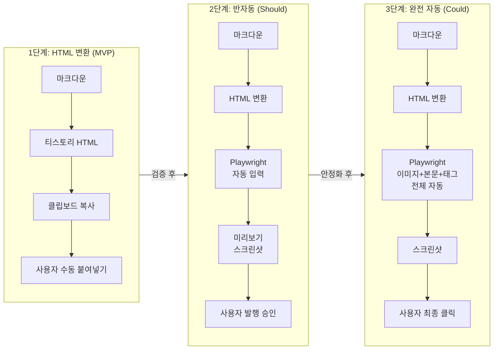

---
tags:
  - project/blog-ai-agent
  - phase/5
  - docs/architecture
  - status/active
date: 2026-05-21
created: 2026-05-21
updated: 2026-05-21
aliases:
  - 포스팅 전략
  - Publishing
  - 티스토리 자동화
status: active
related:
  - "[[README]]"
  - "[[pipeline-stages]]"
  - "[[image-pipeline]]"
---

# 포스팅 자동화 전략

> 이 문서는 Stage 6(Publisher)의 티스토리 포스팅 전략을 3단계 로드맵으로 정의한다.

---

## 포스팅 자동화 로드맵



---

## 1단계: HTML 변환 (MVP)

### 변환 대상

| 마크다운 요소 | 티스토리 HTML | 비고 |
|-------------|-------------|------|
| `# H1` | 사용 안 함 | 제목은 에디터 제목 필드에 |
| `## H2` | `<h2>` | 볼드 유지 |
| `### H3` | `<h3>` | 볼드 유지 |
| 코드 블록 | `<pre><code class="language-X">` | 언어 클래스 포함 |
| HTML `<table>` | 그대로 유지 | 이미 HTML |
| `> 인용구` | `<blockquote>` | 콜아웃 이모지 유지 |
| `` | `` | URL 치환 필요 |
| `**볼드**` | `<strong>` | |
| `*이탤릭*` | `<em>` | |
| `- 리스트` | `<ul><li>` | |
| JSON-LD | `<script>` 태그 | 본문 최하단 삽입 |

### 변환 스크립트 설계

```python
# converters/md_to_tistory.py

def convert_markdown_to_tistory_html(md_content: str) -> str:
    """마크다운을 티스토리 호환 HTML로 변환"""
    html = markdown.markdown(
        md_content,
        extensions=['tables', 'fenced_code', 'codehilite']
    )
    
    html = fix_code_blocks(html)       # 코드 블록 클래스 보정
    html = fix_image_tags(html)        # 이미지 태그 보정
    html = inject_json_ld(html)        # JSON-LD 삽입
    html = apply_tistory_styles(html)  # 티스토리 스타일 적용
    
    return html
```

### 이미지 플레이스홀더

변환 시 이미지는 플레이스홀더로 표시:

```html
<!-- IMAGE_PLACEHOLDER: 01-agentic-rag-architecture.png -->
<!-- ALT: 에이전틱 RAG 아키텍처 다이어그램 -->
```

사용자가 Tistory에 이미지를 업로드한 후 URL을 제공하면:

```python
# converters/image_embedder.py

def replace_image_placeholders(html: str, url_map: dict) -> str:
    """플레이스홀더를 실제 Tistory 이미지 URL로 치환"""
    for filename, url in url_map.items():
        placeholder = f'<!-- IMAGE_PLACEHOLDER: {filename} -->'
        img_tag = f''
        html = html.replace(placeholder, img_tag)
    return html
```

### 최종 출력

```
1. 06_final.md → md_to_tistory.py → 08_tistory.html 생성
2. 08_tistory.html 내용을 클립보드에 복사 (pbcopy)
3. 사용자에게 안내:
   "HTML이 클립보드에 복사되었습니다.
    Tistory 에디터 → HTML 모드 → 붙여넣기
    이미지 N장을 순서대로 업로드한 후 URL을 알려주세요."
```

---

## 2단계: Playwright 반자동 (Should Have)

### 전제 조건

- 사용자가 **수동으로** Tistory에 로그인 (카카오 OAuth)
- Playwright가 로그인된 브라우저 세션을 재사용

### 세션 관리

```python
# scripts/setup_tistory.py

async def setup_tistory_session():
    """사용자 수동 로그인 → 세션 쿠키 저장"""
    browser = await playwright.chromium.launch(headless=False)
    context = await browser.new_context()
    page = await context.new_page()
    
    await page.goto("https://www.tistory.com/auth/login")
    
    # 사용자에게 수동 로그인 요청
    print("티스토리에 로그인해주세요. 완료 후 Enter를 누르세요.")
    input()
    
    # 세션 쿠키 저장
    await context.storage_state(path=".sisyphus/tistory_session.json")
    print("세션 저장 완료: .sisyphus/tistory_session.json")
    
    await browser.close()
```

### 자동 입력 흐름

```python
async def publish_to_tistory(html_path: str, title: str, tags: list[str]):
    """Playwright로 티스토리 에디터에 자동 입력"""
    context = await browser.new_context(
        storage_state=".sisyphus/tistory_session.json"
    )
    page = await context.new_page()
    
    # 1. 글쓰기 페이지 이동
    await page.goto("https://jaylenhan.tistory.com/manage/newpost")
    
    # 2. HTML 모드 전환
    await page.click('[data-mode="html"]')
    
    # 3. 제목 입력
    await page.fill('#post-title-inp', title)
    
    # 4. 본문 HTML 입력
    html_content = Path(html_path).read_text()
    await page.fill('#html-editor', html_content)
    
    # 5. 카테고리 선택
    await page.select_option('#category-select', label=category)
    
    # 6. 태그 입력
    for tag in tags:
        await page.fill('#tag-input', tag)
        await page.keyboard.press('Enter')
    
    # 7. 미리보기 스크린샷
    await page.click('[data-action="preview"]')
    await page.screenshot(path=".sisyphus/preview.png")
    
    print("미리보기 스크린샷: .sisyphus/preview.png")
    print("발행하시겠습니까? (발행은 수동으로)")
```

### 보안 규칙

- **카카오 OAuth 자동화 절대 금지** — 수동 로그인만
- 세션 파일 `.sisyphus/tistory_session.json`은 `.gitignore`
- `headless=False` — 사용자가 브라우저 동작을 직접 확인
- 자동 "발행" 클릭 금지 — 미리보기까지만 자동, 발행은 수동

---

## 3단계: 완전 자동 (Could Have)

2단계 안정화 후 확장:

- 이미지 드래그앤드롭 자동화
- 이미지 업로드 → URL 자동 추출 → 플레이스홀더 치환
- 카테고리/태그 자동 설정
- 예약 발행 설정 (날짜/시간)
- 미리보기 스크린샷 → Gate 2에 포함

> ⚠️ **3단계에서도 "발행" 최종 클릭은 사용자 수동**. 이것은 Gate 2의 연장선이다.

---

## 셀렉터 관리 전략

티스토리 에디터는 버전 업데이트 시 셀렉터가 변경될 수 있다.

### 셀렉터 다중화

```python
SELECTORS = {
    "title": [
        '#post-title-inp',           # 현재 (2026.05)
        'input[name="title"]',       # 대안 1
        '.title-input',              # 대안 2
    ],
    "html_editor": [
        '#html-editor',              # 현재
        '.CodeMirror',               # 대안 1
        'textarea[name="content"]',  # 대안 2
    ],
}

async def safe_fill(page, selector_key, value):
    """다중 셀렉터 순차 시도"""
    for selector in SELECTORS[selector_key]:
        try:
            await page.fill(selector, value, timeout=3000)
            return
        except TimeoutError:
            continue
    raise PublisherError(f"셀렉터 실패: {selector_key}. Tistory 에디터 변경 확인 필요.")
```

### 셀렉터 깨짐 대응

1. `PublisherError` 발생 시 사용자에게 보고
2. 스크린샷 첨부
3. 임의로 다른 셀렉터 시도하지 않음 (CLAUDE.md §10 규칙)
4. 1단계(HTML 변환 + 클립보드)로 폴백

---

## 🔗 관련 문서

- [[pipeline-stages#Stage 6|Stage 6 상세]]
- [[image-pipeline|이미지 생성 → 업로드 연계]]
