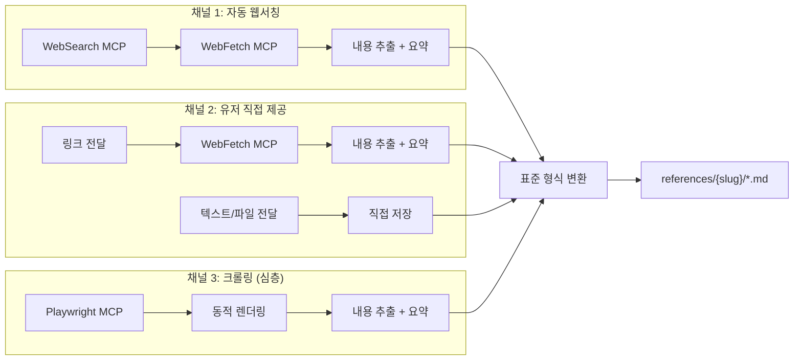

---
tags:
  - project/blog-ai-agent
  - phase/5
  - docs/architecture
  - status/active
date: 2026-05-21
created: 2026-05-21
updated: 2026-05-21
aliases:
  - 자료수집 전략
  - Research Strategy
  - 3채널 자료수집
status: active
related:
  - "[[README]]"
  - "[[pipeline-stages]]"
  - "[[content-format]]"
---

# 3채널 자료수집 전략

> 이 문서는 Stage 2(Researcher)의 3가지 자료수집 채널을 상세히 정의한다.

---

## 채널 개요



| 채널 | 트리거 | 도구 | 우선 사용 |
|------|--------|------|----------|
| 자동 웹서칭 | 항상 (기본) | WebSearch + WebFetch | ✅ |
| 유저 직접 제공 | 사용자가 링크/텍스트 전달 시 | WebFetch (링크) / 직접 (텍스트) | 유저 입력 시 |
| Playwright 크롤링 | 동적 페이지, SPA, JS 렌더링 필요 시 | Playwright MCP | 선택적 |

---

## 채널 1: 자동 웹서칭 (기본)

### 검색 쿼리 전략

Stage 1(Router)에서 생성된 `search_queries`를 기반으로 4개 librarian Subagent가 병렬 검색한다.

```
검색 쿼리 생성 규칙:
  - 한국어 2개: 주제 한국어명 + "가이드/사용법/완벽정리" + 연도
  - 영어 3개: 주제 영문명 + "tutorial/guide/comparison" + 연도
  - 각 librarian은 자신의 버킷에 맞게 쿼리를 변형
```

### 4개 Librarian Subagent 상세

#### librarian-official (공식문서)

```markdown
[CONTEXT] {topic} 주제의 기술 블로그 작성을 위한 자료조사 단계.
[GOAL] 공식 문서에서 권위 있는 정보 2~3개 확보.
[DOWNSTREAM] 본문 작성 시 "정의", "아키텍처", "API 사용법" 섹션의 근거.

[REQUEST]
1. {topic}의 공식 문서 / Getting Started 페이지
2. {topic}의 아키텍처 / 설계 문서
3. {topic}의 최신 릴리스 노트 / 변경 이력

검색 쿼리 예시:
  - "{topic} official documentation"
  - "{topic} site:github.com/*/docs"
  - "{topic} architecture design doc"

각 출처마다: URL, 핵심 단편 인용(50~100자), 버전/날짜, 신뢰도 평가.
공식 문서는 항상 relevance: 5.
```

#### librarian-github (GitHub 저장소)

```markdown
[CONTEXT] {topic} 주제의 기술 블로그 작성을 위한 자료조사 단계.
[GOAL] 실제 코드 사례와 프로젝트 구조 2~3개 확보.
[DOWNSTREAM] 본문 작성 시 "코드 예시", "실습" 섹션의 근거.

[REQUEST]
1. {topic} 관련 GitHub 저장소 (stars > 100)
2. README의 핵심 아키텍처/사용법 요약
3. 주요 코드 패턴 (grep.app으로 실사례 검색)

검색 쿼리 예시:
  - "{topic} github stars:>100"
  - grep.app: "{topic} import" language:Python

각 출처마다: URL, Stars 수, 최신 커밋 날짜, 핵심 코드 스니펫.
코드는 원본 그대로 기록 (본문 작성 시 30% 이상 변형 필수).
```

#### librarian-blog-en (영문 기술 블로그)

```markdown
[CONTEXT] {topic} 주제의 기술 블로그 작성을 위한 자료조사 단계.
[GOAL] 영문 심층 기술 블로그/튜토리얼 2~3개 확보.
[DOWNSTREAM] 본문 작성 시 다양한 관점과 실무 경험 참조.

[REQUEST]
1. {topic}의 심층 튜토리얼 (2025~2026년)
2. {topic}의 비교 분석 글 (vs 대안 기술)
3. {topic}의 실무 적용 사례 / 경험담

검색 쿼리 예시:
  - "{topic} tutorial guide 2025 OR 2026"
  - "{topic} vs {alternative} comparison"
  - "{topic} production experience lessons learned"

dev.to, medium, 개인 블로그 우선.
마케팅성 포스트 제외 (광고/SEO만 목적인 글).
```

#### librarian-blog-kr (한글 기술 블로그)

```markdown
[CONTEXT] {topic} 주제의 한국어 기술 블로그 작성을 위한 자료조사 단계.
[GOAL] 한글 블로그/튜토리얼 2~3개 확보.
[DOWNSTREAM] 한국어 표현/용어 참조 + 한국 개발자 관점 반영.

[REQUEST]
1. {topic}의 한국어 심층 가이드 (2025~2026년)
2. {topic}의 한국어 실무 적용 사례
3. {topic}의 한국어 비교 분석

검색 쿼리 예시:
  - "{한국어 주제명} 완벽 가이드 2026"
  - "{한국어 주제명} 사용법 정리"
  - "{한국어 주제명} 장단점 비교"

벨로그, 티스토리, 네이버 블로그 우선.
번역기로 돌린 듯한 어색한 글 제외.
```

### 수집 품질 필터링

각 librarian이 자료를 수집할 때 다음 필터를 적용:

```
✅ 수집 대상:
  - 기술적 깊이가 있는 글 (코드, 아키텍처, 비교 분석)
  - 2024년 이후 작성/업데이트된 글
  - 저자/출처가 명확한 글
  - 공식 문서, CNCF/Linux Foundation 등 권위 기관

❌ 제외 대상:
  - 마케팅/광고성 콘텐츠
  - AI 자동 생성으로 보이는 저품질 글
  - 2023년 이전의 구버전 정보
  - 제목만 키워드 나열인 SEO 쓰레기
  - 동일 내용 복제본
```

---

## 채널 2: 유저 직접 제공

### 트리거 패턴

```
# 링크 제공
"참고: https://example.com/article"
"이 링크도 포함해줘: https://..."

# 텍스트 제공
"이 내용도 참고해줘: [텍스트]"
"아래 자료 기반으로 작성해줘:\n[내용]"

# 파일 제공
"references/ 에 넣어둔 파일 참고해"
```

### 처리 규칙

| 유형 | 처리 | relevance | 우선순위 |
|------|------|-----------|---------|
| 링크 | WebFetch → 내용 추출 → 표준 형식 변환 | 5 (고정) | 자동 수집보다 높음 |
| 텍스트 | 직접 `.md` 저장 | 5 (고정) | 자동 수집보다 높음 |
| 파일 | 표준 형식 확인 → 없으면 변환 | 5 (고정) | 자동 수집보다 높음 |

**핵심 원칙**: 유저 제공 자료는 `relevance: 5`로 고정하고, 본문 작성 시 **반드시** 반영한다. 자동 수집 자료보다 우선순위가 높다.

### 유저 제공 자료 + 자동 수집 조합

```
Case 1: 유저가 링크 3개 제공
  → 유저 자료 3개 (relevance: 5) + 자동 수집 5~8개
  → 총 8~11개. 유저 자료를 아웃라인의 핵심 섹션에 배치

Case 2: 유저가 텍스트로 핵심 내용 제공
  → 유저 텍스트를 "독창적 관점" 섹션에 활용 (GEO 효과)
  → 자동 수집은 보완/검증 역할

Case 3: 유저가 참고 자료 없이 주제만 제공
  → 100% 자동 수집 (채널 1만 사용)
```

---

## 채널 3: Playwright 크롤링 (심층)

### 사용 시점

일반 WebFetch로 내용 추출이 안 되는 경우에만 사용:

- JavaScript SPA로 동적 렌더링되는 사이트
- 로그인 벽 뒤의 공개 콘텐츠 (로그인은 사용자 수동)
- PDF 내장 뷰어 (iframe)
- 복잡한 인터랙티브 문서

### 처리 흐름

```
1. WebFetch 시도 → 내용 비어 있거나 불완전
2. Playwright MCP로 전환
3. headless=false로 브라우저 열기
4. 페이지 로드 대기 (networkidle)
5. 본문 영역 셀렉터로 내용 추출
6. 표준 형식으로 변환 → 저장
```

### 제약

- 크롤링 대상 사이트의 `robots.txt` 확인 (차단 시 포기)
- 크롤링 빈도 제한 (분당 3회 이하)
- 개인정보가 포함된 페이지 크롤링 금지

---

## 수집 자료 표준 저장 형식

모든 채널에서 수집된 자료는 다음 형식으로 통일:

```markdown
---
source: https://example.com/article
type: official           # official | github | blog-en | blog-kr | paper | video | user-provided
bucket: 공식문서          # 6개 버킷 중 하나
title: "Article Title"
author: "Author Name"
date: 2026-05-15
relevance: 5             # 1~5 (유저 제공은 항상 5)
collected_by: librarian-official  # 어떤 Subagent가 수집했는지
collected_at: 2026-05-21T10:05:00
---

## 핵심 요약 (3줄)
- 에이전틱 RAG는 기존 RAG에 자율 판단 에이전트를 결합한 패턴이다
- LangChain과 LlamaIndex에서 각각 구현체를 제공한다
- 핵심 차별점은 다중 소스 라우팅과 자동 쿼리 재작성이다

## 인용 가능 포인트
- "Agentic RAG systems can improve retrieval accuracy by up to 40% compared to traditional RAG"
- 최신 버전: LangChain v0.3, LlamaIndex v0.11

## 코드 스니펫 (참고용 — 본문에서 30% 이상 변형 필수)
```python
# 원본 코드 (그대로 사용 금지)
from langchain import AgentExecutor
agent = AgentExecutor(tools=[retriever], llm=claude)
```

## 통계/수치 (본문 인용 후보)
- GitHub Stars: 12,400 (2026.05 기준)
- 논문 인용 수: 340회
- 벤치마크: 기존 RAG 대비 정확도 40% 향상

## 한계/주의점
- GPU 메모리 2x 필요
- 응답 지연 증가 (평균 2.3초 → 4.1초)
```

---

## 수집 결과 보고서 (`01_research.md`)

Stage 2 완료 후 자동 생성:

```markdown
# 자료수집 결과 보고서

## 주제: 에이전틱 RAG (Agentic RAG)
## 수집일: 2026-05-21

### 수집 현황

| 버킷 | 목표 | 수집 | 상태 |
|------|------|------|------|
| 공식문서 | 2~3 | 2 | ✅ |
| GitHub | 2~3 | 3 | ✅ |
| 영문블로그 | 2~3 | 2 | ✅ |
| 한글블로그 | 2~3 | 2 | ✅ |
| 논문/리포트 | 0~2 | 0 | ⏭️ 스킵 |
| 유저제공 | - | 1 | ✅ |
| **합계** | **8~15** | **10** | **✅ 기준 충족** |

### 수집 자료 목록

| # | 파일 | 유형 | 신뢰도 | 핵심 활용 포인트 |
|---|------|------|--------|----------------|
| 1 | ref-001-official-langchain.md | 공식문서 | 5 | 아키텍처 정의, API 예시 |
| 2 | ref-002-official-llamaindex.md | 공식문서 | 5 | 비교 관점, 구현 패턴 |
| ... | ... | ... | ... | ... |

### 자료 부족 영역
- 논문/리포트: 해당 주제의 학술 논문이 아직 적음
- 대응: 공식문서와 GitHub 자료로 대체 가능

### 아웃라인 작성 권장사항
- ref-001, ref-002를 "정의" 섹션의 주 근거로 사용
- ref-005의 비교 분석을 "기존 RAG와의 차이" 섹션에 활용
- ref-009(유저 제공)를 "독창적 관점" 또는 "실무 경험" 섹션에 반영
```

---

## 수집 실패 대응

| 상황 | 대응 | 자동/수동 |
|------|------|----------|
| 총 8개 미달 | 사용자에게 보고: "N개만 확보됨. 진행/추가검색/주제변경?" | 수동 |
| 특정 librarian 0건 | 다른 librarian 결과로 보완, 사용자에게 보고 | 반자동 |
| WebSearch 3회 연속 실패 | 해당 librarian 스킵, 나머지로 진행 | 자동 |
| WebFetch 내용 추출 실패 | Playwright 크롤링으로 폴백 | 자동 |
| 유저 제공 링크 접근 불가 | 사용자에게 보고: "이 URL에 접근할 수 없습니다" | 수동 |
| 수집 자료 대부분 2023년 이전 | 사용자에게 보고: "최신 자료가 부족합니다" | 수동 |

---

## 🔗 관련 문서

- [[pipeline-stages#Stage 2|Stage 2 상세]]
- [[content-format|수집 자료를 본문에 활용하는 규칙]]
- [[validator-design#코드 유사도|코드 유사도 검증]]
