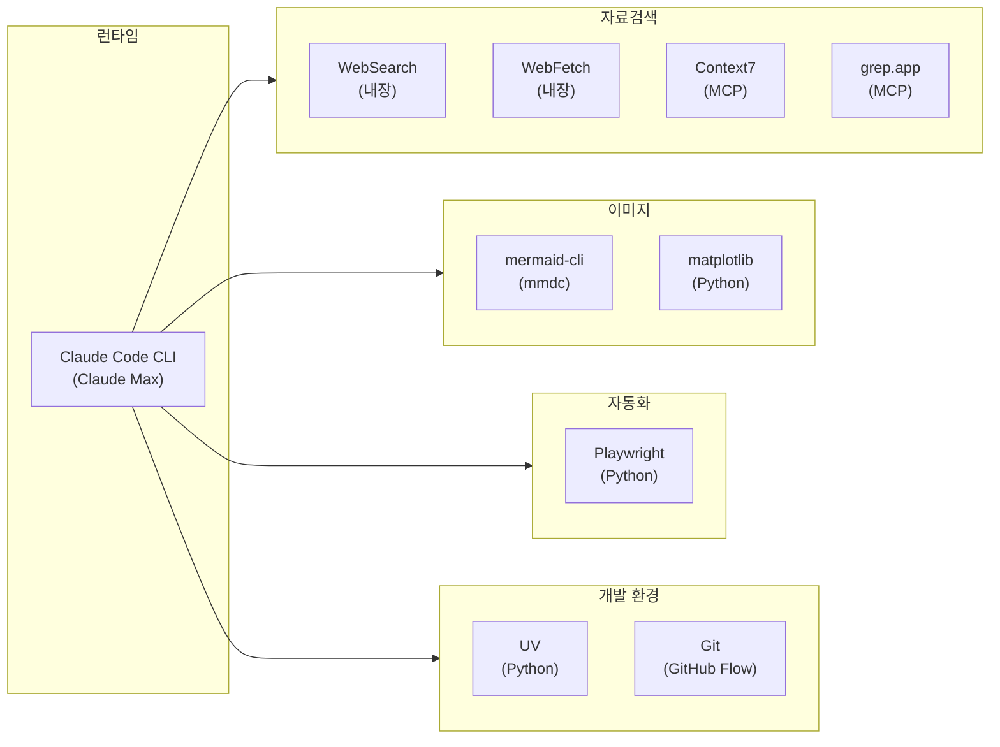

---
tags:
  - project/blog-ai-agent
  - phase/5
  - docs/architecture
  - status/active
date: 2026-05-21
created: 2026-05-21
updated: 2026-05-21
aliases:
  - 기술 스택
  - Tech Stack
status: active
related:
  - "[[README]]"
  - "[[pipeline-stages]]"
---

# 기술 스택 확정

> 이 문서는 Phase 5에서 확정된 기술 스택의 선택 이유와 미선택 사유를 정리한다.

---

## 확정 스택 요약



---

## 상세 스택 비교

### 오케스트레이션: Claude Code CLI (Max)

| 비교 | Claude Code (Max) ⭐ | LangGraph + Claude | CrewAI | AutoGen |
|------|---------------------|---------------------|--------|---------|
| 토큰 효율 | ✅ 최적 (단일 세션) | ⚠️ 중간 | ❌ 56% 더 소비 | ⚠️ 중간 |
| 추가 비용 | $0 (구독 포함) | API 비용 발생 | API 비용 발생 | API 비용 발생 |
| 학습 비용 | ✅ 0 (이미 사용 중) | ❌ 1~2주 | ✅ 30분 | ❌ 1주 |
| Subagent 지원 | ✅ 네이티브 | ✅ 노드 기반 | ✅ Agent 기반 | ✅ Agent 기반 |
| MCP 통합 | ✅ 네이티브 | ❌ 별도 구현 | ❌ 별도 구현 | ❌ 별도 구현 |
| Skill 시스템 | ✅ SKILL.md | ❌ 없음 | ❌ 없음 | ❌ 없음 |
| 별도 서버 필요 | ❌ | ✅ | ✅ | ✅ |

**선택 이유**: Claude Max 구독만으로 LLM + 도구 + Subagent + Skill이 모두 통합. 별도 서버/인프라 불필요. API 비용 $0.

### 자료검색: WebSearch + WebFetch (내장)

| 비교 | WebSearch/WebFetch ⭐ | Tavily API | Exa API | Serper |
|------|----------------------|------------|---------|--------|
| 가격 | ✅ $0 | $0.005/쿼리 | $0.007/쿼리 | $0.001/쿼리 |
| API 키 | ✅ 불필요 | ❌ 필요 | ❌ 필요 | ❌ 필요 |
| 한국어 | ✅ 지원 | ✅ 지원 | △ | △ |
| 정확도 | ✅ Exa 기반 | ✅ 93.3% | ✅ 94.9% | △ |
| 통합 복잡도 | ✅ 0 (내장) | ❌ MCP 설정 | ❌ MCP 설정 | ❌ MCP 설정 |

**선택 이유**: $0 정책 유지 + API 키 관리 부담 없음 + 이미 내장.

### 다이어그램: Mermaid + SVG

| 비교 | Mermaid + SVG ⭐ | DALL-E 3 | FLUX.2 Pro | Midjourney |
|------|-----------------|----------|------------|------------|
| 가격 (5장) | ✅ $0 | $0.20 | $0.15 | $0.10 |
| 한국어 텍스트 | ✅ 완벽 | ❌ 깨짐 | ❌ 깨짐 | ❌ 깨짐 |
| 기술 다이어그램 | ✅ 강점 | ❌ 부적합 | ❌ 부적합 | ❌ 부적합 |
| 버전 관리 | ✅ 텍스트 | ❌ 바이너리 | ❌ 바이너리 | ❌ 바이너리 |
| 수정 용이성 | ✅ 코드 편집 | ❌ 재생성 | ❌ 재생성 | ❌ 재생성 |
| 브랜드 일관성 | ✅ 테마 고정 | ❌ 매번 다름 | ❌ 매번 다름 | △ |

**선택 이유**: 기술 블로그의 다이어그램은 아키텍처/플로우차트가 핵심. AI 이미지 생성은 부적합.

### 배포 대상: Tistory

| 비교 | Tistory ⭐ | Velog | Hashnode | GitHub Pages |
|------|-----------|-------|----------|-------------|
| 기존 자산 | ✅ 100+글 | ❌ | ❌ | ❌ |
| 한국 SEO | ✅ Daum 강점 | ✅ 개발자 한정 | △ 글로벌 | △ |
| 자동화 | 🟡 Playwright | 🟡 Playwright | ✅ GraphQL | ✅ Git Push |
| 커스터마이징 | ✅ HTML 자유 | △ 제한적 | ✅ | ✅ |

**선택 이유**: 기존 운영 자산(100+ 글)이 있고, Daum 검색 노출이 한국 시장에서 가장 강력.

### Python 환경: UV

사용자 글로벌 규칙에 따라 UV 사용. pip/venv/poetry/conda 금지.

---

## 의존성 목록

### Python (pyproject.toml)

```toml
[project]
name = "blog-ai-agent"
version = "0.1.0"
requires-python = ">=3.11"

dependencies = [
    "markdown>=3.7",           # 마크다운 → HTML 변환
    "playwright>=1.49",        # 브라우저 자동화
    "pillow>=11.0",            # 이미지 후처리
]

[project.optional-dependencies]
dev = [
    "pytest>=8.0",
    "ruff>=0.8",
    "matplotlib>=3.9",         # 데이터 차트 (선택)
]

[tool.ruff]
line-length = 100
target-version = "py311"

[tool.pytest.ini_options]
testpaths = ["tests"]
```

### Node.js (npm)

```bash
npm install -g @mermaid-js/mermaid-cli    # mermaid-cli (mmdc)
```

### 시스템

```
- Claude Code CLI (Claude Max 구독)
- Git
- Node.js 16+ (mmdc용)
- Python 3.11+
- UV
```

---

## 비용 모델

| 항목 | 단가 | 편당 비용 | 월 비용 (12편) |
|------|------|----------|---------------|
| Claude Max 구독 | $100/월 (고정) | - | $100 |
| WebSearch/WebFetch | 구독 포함 | $0 | $0 |
| mermaid-cli | 무료 | $0 | $0 |
| matplotlib | 무료 | $0 | $0 |
| Playwright | 무료 | $0 | $0 |
| Tistory | 무료 | $0 | $0 |
| **편당 한계 비용** | | **$0** | |
| **월 총 비용** | | | **$100 (구독 고정)** |

> 💡 Claude Max 구독은 블로그 에이전트뿐 아니라 모든 Claude Code 작업에 사용되므로, 블로그 에이전트의 실질 한계 비용은 **$0**.

---

## 🔗 관련 문서

- [[README|Phase 5 아키텍처 개요]]
- [[../02-benchmark#2-4|기술 벤치마크 (Phase 2)]]
- ADR: [[../adr/001-claude-agent-sdk-vs-langgraph|001]], [[../adr/003-mermaid-vs-paid-image-api|003]], [[../adr/004-websearch-vs-tavily|004]]
