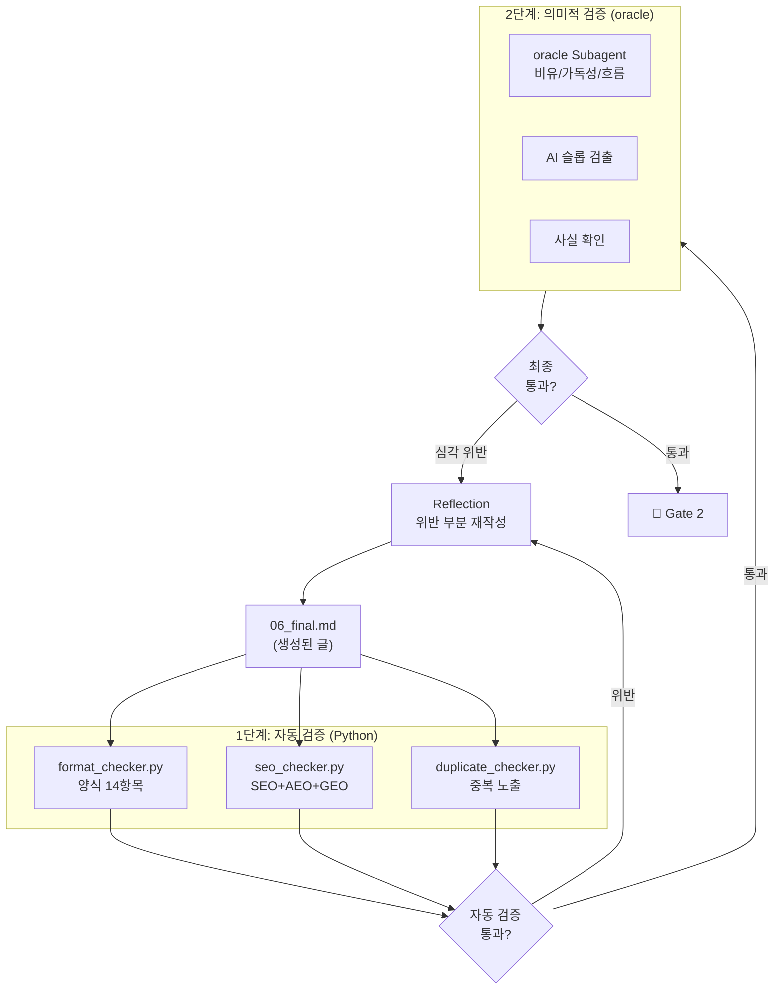

---
tags:
  - project/blog-ai-agent
  - phase/5
  - docs/architecture
  - status/active
date: 2026-05-21
created: 2026-05-21
updated: 2026-05-21
aliases:
  - 품질 검증
  - Validator
  - Critic
status: active
related:
  - "[[README]]"
  - "[[pipeline-stages]]"
  - "[[content-format]]"
---

# 품질 검증 시스템 (Validator)

> 이 문서는 Stage 5(Validator)의 자동 검증 14항목 + oracle 비평 시스템을 정의한다.

---

## 검증 아키텍처



---

## 1단계: 자동 검증 (format_checker.py)

### 14항목 체크리스트 상세

| # | 항목 | 검증 방법 | 통과 기준 | 자동 수정 |
|---|------|----------|----------|----------|
| 1 | 존댓말 일관성 | 정규식: `~요$`, `~어$`, `~지$` 탐지 | "~요" 반말체 0건 | ✅ 가능 |
| 2 | 태그 개수 | `#` 태그 카운트 | 정확히 10개 | ❌ 보고 |
| 3 | 대섹션 수 | `## ` H2 헤딩 카운트 | 7~9개 (분량별 조정) | ❌ 보고 |
| 4 | 분량 | 글자 수 계산 (코드/HTML 제외) | 목표 ±15% | ❌ 보고 |
| 5 | 중복 노출 | 핵심 수치/비유 출현 횟수 | 버전 1회, 절감률 2회, 비유 1회 | ✅ 가능 |
| 6 | 코드 블록 수 | 코드 펜스 카운트 / 섹션 | 섹션당 2~5개 | ❌ 보고 |
| 7 | 콜아웃 수 | `> 💡\|⚠️\|🔥\|📌` 카운트 | 전체 3개 이상 | ❌ 보고 |
| 8 | FAQ 섹션 부재 | "FAQ", "자주 묻는" 텍스트 탐지 | 존재하면 FAIL | ✅ 자동 삭제 |
| 9 | 참고자료 섹션 부재 | "참고 자료", "References" 탐지 | 존재하면 FAIL | ✅ 자동 삭제 |
| 10 | JSON-LD 존재 | `<script type="application/ld+json">` 탐지 | 존재해야 PASS | ❌ 보고 |
| 11 | 키워드 밀도 | 주 키워드 출현수 / 총 단어수 | 1~2% | ❌ 보고 |
| 12 | 이미지 alt | `![` 또는 ` CheckResult:
    """존댓말 일관성 검사 — '~요' 반말체 탐지"""
    informal_patterns = [
        r'[가-힣]+해요',
        r'[가-힣]+돼요',
        r'[가-힣]+인데요',
        r'[가-힣]+거예요',
    ]
    violations = []
    for pattern in informal_patterns:
        matches = re.findall(pattern, content)
        violations.extend(matches)
    
    if violations:
        return CheckResult(
            item="존댓말 일관성",
            status="FAIL",
            message=f"반말체 {len(violations)}건 발견: {violations[:3]}",
            auto_fixable=True,
            fix_suggestion="격식체(~합니다/~입니다)로 변환"
        )
    return CheckResult(item="존댓말 일관성", status="PASS", message="", auto_fixable=False)

def check_tag_count(content: str) -> CheckResult:
    """카테고리 태그 정확히 10개 확인"""
    tags = re.findall(r'#\w+', content[:500])  # 상단 태그 영역만
    count = len(tags)
    if count != 10:
        return CheckResult(
            item="태그 개수",
            status="FAIL",
            message=f"태그 {count}개 (기준: 10개)",
            auto_fixable=False,
            fix_suggestion=f"{'추가' if count < 10 else '제거'} 필요"
        )
    return CheckResult(item="태그 개수", status="PASS", message="10개", auto_fixable=False)

# ... 14개 함수 모두 같은 패턴
```

### 검증 결과 출력 형식

```json
{
  "timestamp": "2026-05-21T10:15:00",
  "file": "06_final.md",
  "total_checks": 14,
  "passed": 12,
  "failed": 2,
  "warnings": 0,
  "results": [
    {"item": "존댓말 일관성", "status": "PASS"},
    {"item": "태그 개수", "status": "PASS"},
    {"item": "대섹션 수", "status": "PASS"},
    {"item": "분량", "status": "FAIL", "message": "5,200자 (목표 6,000~8,000)", "fix": "섹션 확장 필요"},
    {"item": "중복 노출", "status": "PASS"},
    {"item": "코드 블록 수", "status": "PASS"},
    {"item": "콜아웃 수", "status": "PASS"},
    {"item": "FAQ 부재", "status": "PASS"},
    {"item": "참고자료 부재", "status": "PASS"},
    {"item": "JSON-LD", "status": "PASS"},
    {"item": "키워드 밀도", "status": "FAIL", "message": "0.8% (기준 1~2%)", "fix": "키워드 추가 삽입"},
    {"item": "이미지 alt", "status": "PASS"},
    {"item": "마치며", "status": "PASS"},
    {"item": "📝 정리", "status": "PASS"}
  ],
  "auto_fixed": 0,
  "needs_reflection": true,
  "reflection_targets": ["분량 확장", "키워드 밀도 조정"]
}
```

---

## SEO/AEO/GEO 검증 (seo_checker.py)

### SEO 검증 항목

| 항목 | 검증 방법 | 기준 |
|------|----------|------|
| 제목 길이 | 문자열 길이 | ≤60자 |
| 주 키워드 위치 | 첫 30자 내 존재 여부 | 앞쪽 30자에 포함 |
| 메타 디스크립션 | 길이 + 키워드 카운트 | 100~150자, 키워드 2~3회 |
| H2 키워드 비율 | H2 중 키워드 포함 비율 | ≥40% |
| 키워드 밀도 | 키워드 출현수 / 총 단어수 | 1~2% |
| 이미지 alt | alt 속성 존재 비율 | 100% |

### AEO 검증 항목

| 항목 | 검증 방법 | 기준 |
|------|----------|------|
| 정의문 패턴 | "~란" + "~이다/~합니다" 패턴 탐지 | 대섹션별 1개 |
| 핵심 요약 박스 | `💡 **핵심**:` 패턴 카운트 | ≥3개 |
| 비교표 존재 | `<table>` + 비교 헤딩 탐지 | ≥1개 |
| HowTo Schema | JSON-LD HowTo 존재 | 실습 섹션 있으면 필수 |

### GEO 검증 항목

| 항목 | 검증 방법 | 기준 |
|------|----------|------|
| 독창적 관점 | "직접 테스트", "실무에서", "경험" 등 표현 | ≥1개 섹션 |
| 정량 수치 | 숫자 + % 또는 단위 패턴 | ≥5개 |
| 인용 정의문 | 볼드 + 독립 문단 패턴 | 2~3개 |

---

## 중복 노출 검사 (duplicate_checker.py)

### 검사 대상

| 대상 | 최대 허용 횟수 | 검증 방법 |
|------|-------------|----------|
| 버전 번호 (v1.0, v3.2 등) | 1회 | 정규식 `v\d+\.\d+` 카운트 |
| GitHub 스타/스펙 수치 | 1회 | "stars", "star" + 숫자 패턴 |
| 주요 경고문 | 1회 | 동일 `⚠️` 블록 내용 해시 비교 |
| 대표 절감률/성능 수치 | 2회 | 동일 "N%" 출현 카운트 |
| 대표 예시 명령어 | 1회 | 동일 코드 블록 내용 해시 비교 |
| 대표 비유 | 1회 | 비유 키워드 추출 + 유사도 |

### 코드 유사도 검사

수집된 참고자료(`references/*.md`)의 코드 블록과 본문 코드 블록의 유사도를 검사.

```python
def check_code_similarity(blog_code: str, reference_code: str) -> float:
    """두 코드 블록의 유사도를 0~1로 반환"""
    # 공백/주석 제거 후 토큰화
    blog_tokens = tokenize(normalize(blog_code))
    ref_tokens = tokenize(normalize(reference_code))
    
    # Jaccard 유사도
    intersection = set(blog_tokens) & set(ref_tokens)
    union = set(blog_tokens) | set(ref_tokens)
    
    return len(intersection) / len(union) if union else 0.0

# 기준: 0.3 (30%) 이상이면 FAIL
```

---

## 2단계: 의미적 검증 (oracle Subagent)

### 호출 조건

자동 검증 **통과 후**, 다음 조건 중 하나라도 해당하면 실행:

1. 자동 검증에서 FAIL이 2개 이상이었다가 Reflection으로 수정됨 (재검증 필요)
2. 장문 글 (10,000자 이상)
3. 사용자가 `--strict` 플래그를 지정

### oracle 프롬프트

```markdown
[CONTEXT] 한국어 기술 블로그 글의 최종 품질 검증 단계.
STYLE.md 자동 검증(14항목)은 이미 통과함.

[GOAL] 기계적으로 검증할 수 없는 의미적 품질을 평가.

[REQUEST]
다음 5개 기준으로 검증하고, 각각 PASS/WARN/FAIL로 판정:

1. **비유의 적절성**: 각 섹션의 비유가 주제에 맞고 신선한가?
   이전 글에서 사용한 비유와 겹치지 않는가?

2. **가독성/흐름**: 섹션 간 자연스러운 전환이 이루어지는가?
   논리적 흐름이 끊기는 곳은 없는가?

3. **AEO 정의문 품질**: 각 대섹션의 정의문이 AI 답변 엔진이
   인용할 만큼 명확하고 정확한가?

4. **GEO 독창성**: 다른 블로그에 없는 고유한 관점/분석이 포함되어 있는가?
   단순 번역/요약 수준인 부분은 없는가?

5. **AI 슬롭 패턴**: 다음 패턴이 있으면 지적:
   - 과도한 "~할 수 있습니다" 반복
   - "매우 중요합니다", "핵심적입니다" 등 빈 강조
   - 동일 구조의 문장 3회 이상 반복
   - 근거 없는 단정 ("최고의", "유일한")
   - 불필요한 영어 직역체

[OUTPUT FORMAT]
{
  "checks": [
    {"name": "비유 적절성", "status": "PASS|WARN|FAIL", "detail": "..."},
    ...
  ],
  "overall": "PASS|FAIL",
  "suggestions": ["..."]
}
```

---

## Reflection 프로세스

위반 발견 시 자동 수정 흐름:

```
위반 발견
  │
  ├─ auto_fixable == true
  │   → 자동 수정 (존댓말 변환, FAQ 삭제 등)
  │   → 재검증
  │
  └─ auto_fixable == false
      │
      ├─ 경미한 위반 (1~2건)
      │   → Orchestrator가 해당 섹션만 재작성
      │   → 재검증 (최대 2회)
      │
      └─ 심각한 위반 (3건+) 또는 구조적 문제
          → 사용자에게 보고
          → 사용자 판단: 수동 수정 / 전체 재작성 / 예외 허용
```

### Reflection 제한

- 최대 2회 반복 (무한 루프 방지)
- 2회 후에도 FAIL → 사용자에게 위반 항목 보고 + 수동 수정 요청
- Reflection마다 수정 전후 diff 기록 (`07_critique.json`에 포함)

---

## 검증 결과 최종 보고 (07_critique.json)

```json
{
  "timestamp": "2026-05-21T10:16:00",
  "file": "06_final.md",
  
  "auto_check": {
    "total": 14,
    "passed": 14,
    "failed": 0,
    "reflection_count": 1,
    "reflection_history": [
      {
        "round": 1,
        "failed_items": ["분량", "키워드 밀도"],
        "fixes_applied": ["섹션 3 확장 (+800자)", "키워드 5회 추가"],
        "recheck_result": "PASS"
      }
    ]
  },
  
  "seo_check": {
    "title_length": 52,
    "keyword_density": 1.4,
    "h2_keyword_ratio": 0.44,
    "meta_description_length": 128,
    "json_ld": true,
    "status": "PASS"
  },
  
  "aeo_check": {
    "definition_statements": 8,
    "summary_boxes": 4,
    "comparison_tables": 2,
    "howto_schema": true,
    "status": "PASS"
  },
  
  "geo_check": {
    "unique_insights": 1,
    "quantitative_data": 7,
    "quotable_definitions": 3,
    "eeat_signals": ["experience", "expertise", "authoritativeness"],
    "status": "PASS"
  },
  
  "oracle_check": {
    "invoked": false,
    "reason": "자동 검증 1회 Reflection으로 완료, 표준 분량 글"
  },
  
  "duplicate_check": {
    "version_mentions": 1,
    "star_mentions": 1,
    "metaphor_duplicates": 0,
    "code_similarity_max": 0.22,
    "status": "PASS"
  },
  
  "final_status": "PASS",
  "ready_for_gate2": true
}
```

---

## 🔗 관련 문서

- [[pipeline-stages#Stage 5|Stage 5 상세]]
- [[content-format|SEO+AEO+GEO 체크리스트]]
- [[research-strategy|참고자료 (코드 유사도 비교 원본)]]
