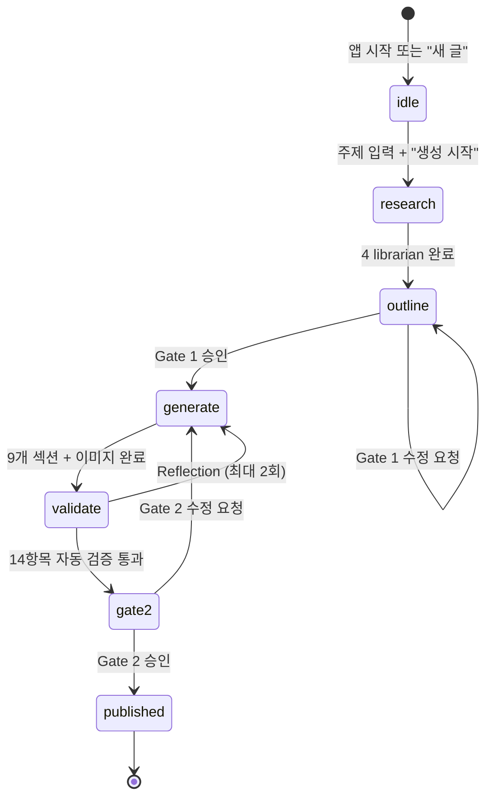

---
tags:
  - project/blog-ai-agent
  - phase/6
date: 2026-05-21
created: 2026-05-21
updated: 2026-05-21
aliases:
  - UX Design
  - Phase 6
  - UI/UX 설계
status: active
related:
  - "[[04-requirements]]"
  - "[[05-architecture/README]]"
  - "[[05-architecture/pipeline-stages]]"
  - "[[05-architecture/validator-design]]"
  - "[[07-project-setup]]"
---

# Phase 6 — UX/UI 설계

> 부록 E Phase 6. Claude Design으로 제작한 인터랙티브 프로토타입 기반 UI/UX 사양.

---

## 1. 디자인 원칙

| 원칙 | 설명 |
|------|------|
| **도메인 투명성** | 6-Stage 파이프라인의 모든 단계가 UI에 직접 노출. 사용자는 "지금 어느 단계인지" 항상 알 수 있어야 한다 |
| **인간 게이트 최우선** | Gate 1·2는 모달로 명시적 액션을 요구. Gate 2는 "절대 자동화 불가" 문구 상시 표시 |
| **정보 밀도 조절** | Compact / Cozy / Spacious 3단 밀도 + 우측 패널 토글로 사용자가 정보량 제어 |
| **미니멀 미감** | Notion·Storybook 류의 깔끔함 차용, 모노크롬 + 1포인트 액센트. 오리지널 디자인 |

---

## 2. 레이아웃 구조

### 2-1. 3-Pane 워크스페이스

```
┌──────────────┬─────────────────────────────────────┬────────────────────┐
│   Sidebar    │              Main Editor             │   Right Panel      │
│   260px      │         flex (나머지 공간)              │   360px            │
│              │                                      │                    │
│  Workspaces  │  상단: Topbar (44px)                   │  탭: 파이프라인      │
│  Agent       │  중앙: Editor 또는 Launcher             │       자료           │
│  Settings    │  하단: 슬래시 커맨드 힌트                  │       검증           │
│              │                                      │                    │
│  하단: 사용자   │                                      │                    │
└──────────────┴─────────────────────────────────────┴────────────────────┘
```

### 2-2. 반응형 동작

| 화면 폭 | Sidebar | Right Panel | 비고 |
|---------|---------|-------------|------|
| ≥ 1400px | 고정 260px | 고정 360px | 풀 3-pane |
| 1024–1399px | 접기/펼기 | 접기/펼기 | 토글 버튼 |
| < 1024px | 오버레이 | 오버레이 | 모바일 대응 (Phase 15+) |

---

## 3. 컴포넌트 사양

### 3-1. Sidebar (좌측 네비게이션)

```
Blog Agent [B] v0.4        ← 브랜드 마크 + 버전
─────────────────────────
🔍 검색
📥 알림 (2)
＋ 새 글 만들기
─────────────────────────
WORKSPACES
  ▶ AI의 정석 · jaylenhan
    ▶ Drafts (3)
      • 에이전틱 RAG 완벽 가이드 2026  ← 활성 (배경색)
      ◦ MCP 서버 직접 구축하기
      ◦ 한국어 LLM 파인튜닝 비용 분석
    ▶ Published (3)
      ◦ Prometheus 완벽 가이드 2026    12.4k
      ◦ Kubernetes Operator 패턴 정리   8.1k
      ◦ Tistory Playwright 자동화 회고   3.6k
    🏷 References (24)
─────────────────────────
AGENT
  📊 Pipelines
  🤖 Subagents (5)
  ✨ Skills (1)
  🧪 Eval Harness
─────────────────────────
SETTINGS
  # STYLE.md
  🌐 Tistory 연결
  ⚙ MCP & API
─────────────────────────
[JH] Jaylen H.
     jaylenhan.tistory.com
```

**주요 인터랙션**:
- Drafts/Published: 접기/펼기 (chevron)
- 활성 글: 배경색 하이라이트 + 좌측 파란 점 (진행 중일 때)
- "새 글 만들기" 클릭 → Launcher (idle) 상태 진입

### 3-2. Topbar (상단 바)

```
[☰]  AI의 정석 / Drafts / 에이전틱 RAG 완벽 가이드 20...
                                    [Generator · 본문 생성 중]  👁 미리보기  📤  [파이프라인]  ···
```

| 요소 | 설명 |
|------|------|
| 사이드바 토글 | 좌측 ☰ 버튼 |
| 브레드크럼 | Workspace / 폴더 / 글 제목 (말줄임) |
| 파이프라인 필 | 현재 Stage 표시. `live` (파란 펄스), `done` (초록) |
| 액션 버튼 | 미리보기, 공유, 파이프라인 패널 토글, 더보기 |

**파이프라인 필 상태별 텍스트**:

| mode | 텍스트 | 스타일 |
|------|--------|--------|
| idle | 표시 안 함 | — |
| research | Researcher · 자료수집 중 | live (펄스) |
| outline | Gate 1 · 아웃라인 대기 | live |
| generate | Generator · 본문 생성 중 | live |
| validate | Validator · 14항목 검증 | live |
| gate2 | Gate 2 · 최종 검수 | live |
| published | Tistory 발행 완료 | done (초록) |

### 3-3. Launcher (idle 상태)

Notion의 빈 페이지 + Cursor의 composer 느낌.

```
        [B]

  오늘은 어떤 주제로 쓸까요?

  주제 한 줄을 입력하면 자료수집부터 발행 준비까지
  30분 안에 완료됩니다.
  Gate 1·2 검수는 절대 자동화하지 않습니다.

  ┌────────────────────────────────────────┐
  │ ✨ /blog                                │
  │                                        │
  │ 예: 에이전틱 RAG에 대해 다이어그램       │
  │     포함해서 깊게 정리해줘              │
  │                                        │
  │ [📄 표준 7~9] [장문 9~11] [+ 참고 자료]│
  │ [🔒 Gate 1 자동]        [✨ 생성 시작 ⌘↵]│
  └────────────────────────────────────────┘

  ✅ 편당 추가 비용 $0 · Claude Code 구독으로만 운영

  ┌──────────────────┐ ┌──────────────────┐
  │ AI/LLM           │ │ DEVOPS           │
  │ 에이전틱 RAG      │ │ MCP 서버 직접     │
  │ 완벽 가이드 2026  │ │ 구축하기          │
  │ 표준 · 8~10K자   │ │ 장문 · Playwright │
  └──────────────────┘ └──────────────────┘
  ┌──────────────────┐ ┌──────────────────┐
  │ AI/LLM           │ │ BACKEND          │
  │ Claude Agent SDK │ │ 한국어 LLM       │
  │ 입문             │ │ 파인튜닝 비용 분석│
  │ 표준 · 비교 분석 │ │ 정량 · matplotlib │
  └──────────────────┘ └──────────────────┘
```

**인터랙션**:
- 주제 입력 후 `⌘ + Enter` 또는 "생성 시작" 클릭 → `research` 모드 진입
- 분량 토글: 표준(7~9섹션) / 장문(9~11섹션)
- "+ 참고 자료": Channel 2 사용자 자료 첨부 (Phase 9 구현)
- "Gate 1 자동": `--auto` 플래그 토글 (Gate 2는 토글 불가)
- 추천 카드 클릭 → 해당 주제로 바로 생성 시작

### 3-4. Editor (에디터 영역)

**헤더 영역**:

```
  [커버 이미지 영역 — 그라데이션 플레이스홀더]

  Stage 4 · 본문 생성 (5/9) · 예상 분량 7,500자 · 다이어그램 3장 · 편당 비용 $0

  [AI/LLM]
  에이전틱 RAG(Agentic RAG) 완벽 가이드 2026

  기존 RAG의 한계를 넘어, 검색을 스스로 계획하는 차세대 패턴.
  도서관 사서 비유로 풀어보는 4단계 자율 루프와 LangChain 30분 실습까지.

  #에이전틱RAG  #AgenticRAG  #AI검색  #LLM응용  #RAG파이프라인
  #벡터검색  #LangChain  #LlamaIndex  #AI에이전트2026  #2026

  ┌──────────┬──────────┬──────────┬──────────┐
  │ 참고자료  │ 대섹션    │ 키워드밀도 │ 예상소요  │
  │ 9 / 8-15 │ 9 / 7-9  │ 1.4%     │ 23 분    │
  └──────────┴──────────┴──────────┴──────────┘
```

**섹션 블록** (mode별 상태 머신):

| mode | 섹션 1~3 | 섹션 4 | 섹션 5~9 |
|------|----------|--------|----------|
| research | skeleton | skeleton | skeleton |
| outline | skeleton | skeleton | skeleton |
| generate | 생성 완료 | Generator 작성 중 (일부 + skeleton) | 대기 |
| validate | 전부 완료 | 전부 완료 | 전부 완료 |
| gate2 | 전부 완료 | 전부 완료 | 전부 완료 |
| published | 전부 완료 | 전부 완료 | 전부 완료 |

**섹션 블록 내부 콘텐츠 타입**:

| 타입 | 설명 | STYLE.md 대응 |
|------|------|--------------|
| `p` | 본문 단락 (**bold** 인라인 파싱) | 격식체 |
| `h3` | H3 소제목 | `### **N-N. 제목**` |
| `aeo` | AEO 정의문 블록 (좌측 accent 보더) | "~란 ~하는 ~이다" |
| `callout` | 콜아웃 박스 (💡/⚠️/🔥/📌) | `> 아이콘 **제목:** 설명` |
| `table` | 비교표 | `| 항목 | 기존 | 신규 |` |
| `code` | 코드 블록 (구문 강조) | ` ```lang ``` ` |
| `figure` | Mermaid/SVG 다이어그램 + 캡션 + 배지 | 이미지 5장 |

**참조 칩**: 각 섹션 하단에 `R-001`, `R-005` 등 참고자료 ID 칩 표시.

### 3-5. Right Panel (우측 패널)

3개 탭 구성:

#### 탭 1: 파이프라인

6 Stage + 2 Gate의 타임라인 뷰.

```
✅ Stage 1  Router
   주제 분석 · 키워드 추출 · 분량 결정 · 10~20초

✅ Stage 2  Researcher
   4-channel 자료수집 (병렬) · 2~3분

   [활성 시 상세 — librarian 4카드 그리드]
   ┌───────────────┬───────────────┐
   │ librarian-    │ librarian-    │
   │ official ✅   │ github ✅     │
   │ 2건 · OK      │ 2건 · OK      │
   ├───────────────┼───────────────┤
   │ librarian-    │ librarian-    │
   │ blog-en 🔄   │ blog-kr 🔄   │
   │ 1/2…          │ 0/2…          │
   └───────────────┴───────────────┘

   [실시간 로그 스트림]
   10:00:02  ROUTER    주제 분석 완료 · 카테고리 [AI/LLM]
   10:01:18  RESEARCH  librarian-official → 2건 (relevance 5)
   ...

✅ Stage 3  Outliner
   7~9개 대섹션 + 출처 매핑 · 30~60초

✅ Gate 1
   사용자 아웃라인 승인 · 사람 검수
   [아웃라인 검수 열기] 버튼

▶ Stage 4  Generator  ← 현재 활성
   본문 + Mermaid/SVG 병렬 생성 · 3~5분
   섹션 5/9 작성 중 · 이미지 2/3 렌더 완료

○ Stage 5  Validator
   14항목 + SEO/AEO/GEO + oracle · 30~60초

○ Gate 2
   최종 승인 (필수, 자동화 불가) · 사람 검수

○ Stage 6  Publisher
   md → Tistory HTML + 클립보드 · 1~2분
```

#### 탭 2: 자료 (References)

```
총 9건 확보 · 최소 기준 8건 충족     [+]

[5] R-001  LangChain Agentic RAG — Official Docs
    official  python.langchain.com

[5] R-002  LlamaIndex Agentic Strategies
    official  docs.llamaindex.ai

[4] R-003  langchain-ai/rag-from-scratch
    github  github.com/langchain-ai

[4] R-004  phidatahq/phidata — Agent stack
    github  github.com/phidatahq

[3] R-005  What is Agentic RAG?
    blog-en  deeplearning.ai
...
```

- 신뢰도 배지: `5` = 초록, `4` = 노랑, `3` = 회색
- librarian 출처 표시 (`librarian-official`, `librarian-github` 등)

#### 탭 3: 검증 (Validator)

```
┌────────┬────────┬────────┐
│ PASS   │ WARN   │ FAIL   │
│  25    │   1    │   0    │
└────────┴────────┴────────┘

STYLE.MD 양식  [14항목]
✅ 존댓말 일관성           반말체 0건
✅ 카테고리 태그 개수       10/10
✅ 대섹션 수               9개 (기준 7~9)
✅ 분량                    7,820자 (목표 ±15%)
✅ 중복 노출               v0.3 1회, 89.1% 1회
✅ 코드 블록 수             섹션당 평균 2.1개
✅ 콜아웃 박스              💡⚠️🔥 총 5개
✅ FAQ 섹션 부재            탐지되지 않음
✅ 참고자료 섹션 부재        탐지되지 않음
✅ JSON-LD TechArticle      스키마 삽입 확인
✅ 키워드 밀도              1.4% (1~2% 범위)
✅ 이미지 alt 태그          3/3 이미지 OK
✅ 마치며 3단 서사           현재 · 한계 · 권유
⚠️ 정리 섹션               불릿 6개

SEO  [검색엔진]
✅ 제목 길이               52자 ≤ 60
✅ 주 키워드 위치           앞쪽 30자 내
✅ 메타 디스크립션          128자, 키워드 3회
✅ H2 키워드 비율           44% ≥ 40%

AEO  [답변엔진]
✅ 정의문 패턴             8개 (대섹션별 1개)
✅ 핵심 요약 박스           4개 ≥ 3
✅ 비교표 Q&A              2개 ≥ 1
✅ HowTo Schema            실습 섹션 포함

GEO  [생성엔진]
✅ 독창적 관점             1개 (직접 테스트 결과)
✅ 정량 수치               12개 ≥ 5
✅ 인용 가능 정의           3개
✅ E-E-A-T 신호            Experience · Expertise · Authority

중복 노출 & 코드 유사도
✅ 버전 번호 / 절감률 / 비유 중복    기준 내
✅ 코드 유사도 최대값                0.22 ≤ 0.30
```

### 3-6. Gate 모달

#### Gate 1 — 아웃라인 검수

```
┌──────────────────────────────────────────┐
│ [GATE 1]  아웃라인 검수                [×]│
│                                          │
│ Stage 2~3이 완료되었습니다.               │
│ 총 9건의 참고자료를 확보했고,             │
│ STYLE.md 권장 구조에 따라 9개 대섹션으로  │
│ 아웃라인을 잡았습니다.                    │
│                                          │
│ 제목                                     │
│ [AI/LLM] 에이전틱 RAG 완벽 가이드 2026   │
│                                          │
│ 1. 들어가며                 R-001  R-005  │
│    기존 RAG의 한계 → 등장 배경           │
│ 2. 에이전틱 RAG란?    R-001 R-002 R-006 MMD│
│    정의 + 등장 배경 + 차이               │
│ 3. 핵심 구성요소        R-001  R-003  MMD │
│    쿼리 분석기 / 라우터 / 평가기 / 메모리 │
│ ... (9개 섹션 전부 표시)                  │
│                                          │
│ 💡 수정 예시: "3번 섹션을 '기존 RAG와의  │
│ 차이'로 바꿔줘" 처럼 자연어로 요청하면    │
│ 아웃라인을 다시 짭니다.                   │
│                                          │
│ Gate 1은 --auto로 건너뛸 수 있지만       │
│ 기본은 사람이 검수                        │
│                                          │
│              [수정 요청] [나중에] [✓ 본문 생성 시작]│
└──────────────────────────────────────────┘
```

#### Gate 2 — 최종 검수

```
┌──────────────────────────────────────────┐
│ [GATE 2]  최종 검수 — Tistory 게시 전  [×]│
│                                          │
│ Validator 25/26 통과, Reflection 1회.    │
│ 이 게이트는 절대 자동화하지 않습니다.      │
│ 실제로 발행할지 사람이 결정합니다.         │
│                                          │
│ ┌────────┬────────┬────────┐             │
│ │ PASS   │ WARN   │ FAIL   │             │
│ │  25    │   1    │   0    │             │
│ └────────┴────────┴────────┘             │
│                                          │
│ 하이라이트 — 통과 항목                    │
│ ✅ 정의문 패턴  8개                       │
│ ✅ 핵심 요약 박스  4개 ≥ 3               │
│ ✅ 독창적 관점  1개                       │
│ ✅ 정량 수치  12개 ≥ 5                   │
│                                          │
│ 남은 경고 1건                            │
│ ⚠️ 정리 섹션 불릿 수  6개 (허용 범위)     │
│                                          │
│ 📌 발행 직전 체크:                        │
│ · 카테고리 태그 10개 확인 완료            │
│ · JSON-LD + HowTo schema 삽입 완료       │
│ · 이미지 3장 alt 태그 부여 완료           │
│ · 마치며 3단 서사 구조 확인               │
│                                          │
│ Gate 2는 절대 자동화 불가 — 사람만 결정   │
│                                          │
│        [수정 요청] [나중에] [✓ Tistory에 발행 준비]│
└──────────────────────────────────────────┘
```

---

## 4. 디자인 토큰

### 4-1. 타이포그래피

| 용도 | 폰트 | 비고 |
|------|------|------|
| 본문/UI | Geist (sans-serif) | 14px / line-height 1.55 |
| 코드 | Geist Mono | 12.5px |
| 제목/브랜드 | Instrument Serif | Editor 제목, 모달 제목 |

### 4-2. 컬러 시스템 (oklch)

**라이트 모드**:

| 토큰 | 값 | 용도 |
|------|-----|------|
| `--bg` | `#FBFBFA` | 전체 배경 |
| `--bg-elev` | `#FFFFFF` | 카드/모달 배경 |
| `--bg-sub` | `#F4F4F2` | 서브 영역 배경 |
| `--bg-hover` | `#EFEEEB` | 호버 상태 |
| `--bg-active` | `#E9E8E4` | 활성 상태 |
| `--border` | `#E8E8E5` | 기본 보더 |
| `--text` | `#1F1E1B` | 본문 텍스트 |
| `--text-muted` | `#6B6963` | 보조 텍스트 |
| `--text-faint` | `#9C9A93` | 비활성 텍스트 |
| `--accent` | `oklch(55% 0.13 255)` | 액센트 (인디고) |
| `--success` | `oklch(58% 0.12 150)` | 성공/PASS |
| `--warn` | `oklch(70% 0.14 70)` | 경고/WARN |
| `--danger` | `oklch(58% 0.18 25)` | 실패/FAIL |

**다크 모드**:

| 토큰 | 값 | 비고 |
|------|-----|------|
| `--bg` | `#18181A` | 다크 배경 |
| `--bg-elev` | `#1F1F22` | 카드 배경 |
| `--text` | `#ECECEA` | 텍스트 |
| `--accent` | `oklch(72% 0.13 255)` | 액센트 밝기 상향 |

### 4-3. Geometry

| 토큰 | 값 |
|------|-----|
| `--sidebar-w` | 260px |
| `--right-w` | 360px |
| `--top-h` | 44px |
| `--radius` | 8px (기본) |
| `--radius-xs` | 4px |
| `--radius-lg` | 12px |
| `--row-h` | 28px (Cozy 기본) |

### 4-4. 밀도 변형

| 밀도 | `--row-h` | `--gap` |
|------|-----------|---------|
| Compact | 24px | 6px |
| Cozy | 28px | 8px |
| Spacious | 32px | 12px |

---

## 5. 상태 흐름 (State Machine)



---

## 6. 프로토타입 파일 목록

Claude Design으로 제작된 프로토타입 파일:

| 파일 | 역할 | 줄 수 |
|------|------|-------|
| `Workspace.html` | 진입점 HTML | — |
| `styles.css` | 전체 디자인 토큰 + 컴포넌트 스타일 | 1,195 |
| `app.jsx` | App 셸 (상태 관리, 테마, 게이트) | 108 |
| `sidebar.jsx` | 좌측 네비게이션 | 127 |
| `topbar.jsx` | 상단 브레드크럼 + 상태 필 | 57 |
| `editor.jsx` | 에디터 영역 (섹션 렌더링) | 318 |
| `launcher.jsx` | idle 상태 런처 | 91 |
| `right-panel.jsx` | 파이프라인/자료/검증 3탭 | 258 |
| `gate-modals.jsx` | Gate 1·2 검수 모달 | 141 |
| `icons.jsx` | SVG 아이콘 라이브러리 (43종) | 44 |
| `mock-data.js` | 현실적 모크 데이터 | 287 |
| `tweaks-custom.jsx` | 상태 시뮬레이션 컨트롤 | — |

**프로토타입 위치**: 별도 보관 (프로덕션 코드와 분리)

---

## 7. Phase 9 구현 시 추가 필요 화면

| 화면 | 우선순위 | 설명 |
|------|----------|------|
| STYLE.md 에디터 | Should | 양식 규칙 열람/수정 화면 |
| 참고자료 첨부 모달 | Should | Channel 2 사용자 자료 입력 (URL/텍스트/파일) |
| Tistory 연결 설정 | Should | Playwright 세션 관리, 셀렉터 설정 |
| Subagent 카탈로그 | Could | librarian/oracle 설정 열람 |
| 발행 후 성과 대시보드 | Could | 조회수/검색 노출 트래킹 |
| Eval Harness 화면 | Could | 자동 평가 결과 열람 |

---

## 8. 접근성 가이드라인 (Phase 9 구현 시)

- 키보드 네비게이션: 모든 인터랙티브 요소 `Tab` 접근 가능
- 모달: `Escape` 닫기, 포커스 트랩
- 컬러 대비: WCAG AA 기준 충족 (oklch로 다크 모드 대비비 자동 보정)
- 스크린리더: 주요 영역 `aria-label` 부여
- 모션 감소: `prefers-reduced-motion` 미디어쿼리 대응

---

## 9. 디자인 결정 기록

| 결정 | 이유 |
|------|------|
| 3-pane 고정 레이아웃 | 블로그 작성은 에디터 + 컨텍스트(파이프라인/자료/검증)를 동시에 봐야 효과적 |
| Notion 스타일 사이드바 | 사용자가 Notion을 일상적으로 사용하므로 학습 비용 최소화 |
| Gate 모달 분리 | Gate는 의사결정 포인트이므로 인라인이 아닌 모달로 명시적 액션 유도 |
| oklch 컬러 시스템 | 다크/라이트 모드 전환 시 채도·명도 일관성 유지에 유리 |
| Geist + Instrument Serif | 기술 문서의 가독성(Geist) + 블로그 제목의 품격(Instrument Serif) |
| 자체 브랜드 마크 'B' | Notion/Storybook 브랜드 복제 방지. 심플한 원형 마크 |

---

> **다음 단계**: [[07-project-setup|Phase 7 프로젝트 셋업]] → [[08-milestones|Phase 8 마일스톤]]
