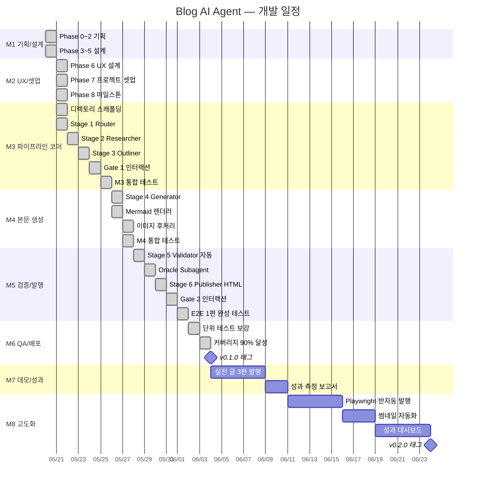
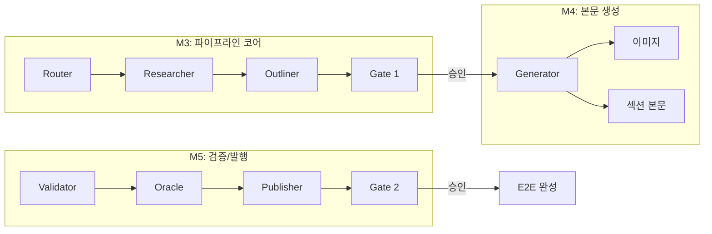

---
tags:
  - project/blog-ai-agent
  - phase/8
date: 2026-05-21
created: 2026-05-21
updated: 2026-05-26
aliases:
  - Milestones
  - Phase 8
  - 마일스톤
  - Gantt
status: active
related:
  - "[[07-project-setup]]"
  - "[[04-requirements]]"
  - "[[05-architecture/pipeline-stages]]"
  - "[[09-development-guide]]"
---

# Phase 8 — 마일스톤 & 일정 계획

> 부록 E Phase 8. 마일스톤 정의, 수직 슬라이스 전략, Gantt 차트, 릴리스 기준.

---

## 1. 전체 마일스톤 개요

| 마일스톤 | Phase | 이름 | 목표 | 기간 | 결과물 |
|----------|-------|------|------|------|--------|
| **M1** | 0~5 | 기획/설계 완료 | 16 Phase 문서 중 기획~설계 완성 | ✅ 완료 | docs/00~05 (12문서) |
| **M2** | 6~8 | UX/셋업/마일스톤 | UI/UX 프로토타입 + 개발 환경 + 일정 | ✅ 완료 | docs/06~08 |
| **M3** | 9 | 파이프라인 코어 | Stage 1~3 (Router→Researcher→Outliner) + Gate 1 | ✅ 완료 | MVP 반쪽: 주제→아웃라인 |
| **M4** | 9 | 본문 생성 | Stage 4 (Generator) + 이미지 파이프라인 | ✅ 완료 | 전체 글 생성 가능 |
| **M5** | 9 | 검증/발행 | Stage 5~6 (Validator→Publisher) + Gate 2 | ✅ 완료 | E2E 1편 완성 |
| **M6** | 10~11 | QA/배포 | 테스트 80%+ 커버리지 + 안정화 | ✅ 완료 | v0.1.0 릴리스 준비 |
| **M7** | 12~13 | 데모/성과 | 실제 글 3편 발행 + 성과 측정 | 대기 | 포트폴리오 |
| **M8** | 14~16 | 고도화 | Playwright 발행, 썸네일, 성과 대시보드 | 대기 | v0.2.0+ |

---

## 2. Gantt 차트

---

## 3. 마일스톤 상세

### M3: 파이프라인 코어 (2주)

**목표**: 주제를 입력하면 아웃라인까지 생성되고, Gate 1에서 사용자 검수를 받을 수 있는 상태.

| 작업 | 기간 | 의존성 | 산출물 |
|------|------|--------|--------|
| 디렉토리 스캐폴딩 | 1일 | — | `backend/app/`, `frontend/src/`, `tests/` 기본 구조 |
| Stage 1 Router | 3일 | — | `backend/app/pipeline/router.py`, `00_plan.json` 생성 |
| Stage 2 Researcher | 5일 | Router | 4 librarian Subagent, `01_research.md` 생성 |
| Stage 3 Outliner | 3일 | Researcher | `02_outline.json` 생성, 출처 매핑 |
| Gate 1 CLI | 1일 | Outliner | 터미널에서 아웃라인 표시 + 승인/수정 인터랙션 |
| M3 통합 테스트 | 1일 | 전부 | "에이전틱 RAG" 주제로 아웃라인까지 E2E |

**완료 기준**:
- [x] 주제 입력 → `00_plan.json` 생성 (10~20초)
- [x] 4개 librarian 병렬 실행 → 8건 이상 자료 확보
- [x] STYLE.md 구조에 맞는 7~9개 대섹션 아웃라인 생성
- [x] Gate 1에서 사용자가 승인/수정 선택 가능
- [x] 단위 테스트 커버리지 60%+

**수직 슬라이스 전략**: Router 단독 테스트 → Researcher 단독 테스트 → Outliner 단독 테스트 → 3 Stage 연결 테스트. 각 Stage를 독립적으로 개발·검증한 뒤 연결.

---

### M4: 본문 생성 (2주)

**목표**: 아웃라인이 승인되면 9개 섹션 본문 + 다이어그램 3~5장을 병렬 생성.

| 작업 | 기간 | 의존성 | 산출물 |
|------|------|--------|--------|
| Stage 4 Generator | 5일 | M3 | `03_sections/*.md` 9개 파일 생성 |
| Mermaid 렌더러 | 3일 | — | `.mmd → .png` 변환 (`mmdc` 래퍼) |
| SVG 빌더 | 2일 | — | 비교 차트 SVG 생성 |
| 이미지 후처리 | 1일 | Mermaid + SVG | 리사이즈, alt 태그, 캡션 메타 |
| M4 통합 테스트 | 2일 | 전부 | 아웃라인 → 전체 글 + 이미지 생성 |

**완료 기준**:
- [x] 9개 섹션 본문이 STYLE.md 양식 100% 준수
- [x] AEO 정의문이 각 대섹션에 1개 이상
- [x] Mermaid 다이어그램 1~2장 + 라이프사이클 1장 렌더링
- [x] SVG 비교 차트 0~1장 생성
- [x] 섹션과 이미지가 병렬 생성 (3~5분 이내)

---

### M5: 검증/발행 (1.5주)

**목표**: 14항목 자동 검증 + HTML 변환 + Gate 2까지 E2E 1편 완성.

| 작업 | 기간 | 의존성 | 산출물 |
|------|------|--------|--------|
| Stage 5 Validator 자동 | 3일 | M4 | `format_checker`, `seo_checker`, `aeo_checker`, `geo_checker` |
| Oracle Subagent | 2일 | Validator | 의미 비평 5 criteria + Reflection |
| Stage 6 Publisher HTML | 2일 | — | `md_to_html.py`, `schema_injector.py` |
| Gate 2 CLI | 1일 | Publisher | 최종 검수 인터랙션 + 클립보드 복사 |
| E2E 1편 완성 테스트 | 2일 | 전부 | 주제 → 발행 준비 완료 |

**완료 기준**:
- [x] 14항목 양식 검사 PASS/WARN/FAIL 정확 판정
- [x] SEO 4항목 + AEO 4항목 + GEO 4항목 검증
- [x] 코드 유사도 ≤ 30% 확인
- [x] FAIL 항목 → Reflection (최대 2회)
- [x] Markdown → Tistory HTML 변환 (코드 블록, 표, 이미지 플레이스홀더)
- [x] Gate 2에서 사용자가 발행 승인/수정/취소 선택
- [x] **E2E 전 과정 20~30분 이내**

---

### M6: QA/배포 (1주)

**목표**: 테스트 커버리지 80%+, 안정화, v0.1.0 릴리스.

| 작업 | 기간 | 산출물 |
|------|------|--------|
| 단위 테스트 보강 | 3일 | `tests/test_*.py` 전 모듈 |
| 커버리지 80%+ 달성 | 2일 | pytest-cov 리포트 |
| v0.1.0 태그 | 당일 | `git tag -a v0.1.0` |

**릴리스 기준**:
- [x] 모든 Stage 단위 테스트 통과
- [x] E2E 테스트 3편 이상 성공
- [x] 커버리지 80%+
- [x] 린트 에러 0
- [x] 문서 업데이트 완료 (README, CURRENT_STATUS)

---

### M7: 데모/성과 (1주)

**목표**: 실제 글 3편 발행 + 품질/시간 성과 측정.

| 작업 | 기간 | 산출물 |
|------|------|--------|
| 실전 글 3편 발행 | 5일 | Tistory에 실제 게시 |
| 성과 측정 보고서 | 2일 | docs/13-success-metrics.md |

**측정 항목**:

| 지표 | 목표 | 측정 방법 |
|------|------|----------|
| 편당 소요 시간 | 20~30분 | 시작~Gate 2 승인 타임스탬프 |
| 편당 추가 비용 | $0 | Claude Max 구독 외 비용 없음 |
| STYLE.md 준수율 | 100% | Validator 14항목 PASS |
| SEO+AEO+GEO 점수 | 24/26 PASS+ | Validator 결과 |
| 참고자료 확보 | 8~15건 | Researcher 수집 결과 |
| 다이어그램 수 | 3~5장 | Generator 이미지 출력 |

---

### M8: 고도화 (지속)

| 작업 | 우선순위 | 기간 | 트리거 |
|------|----------|------|--------|
| Playwright 반자동 발행 | Should | 5일 | M7 완료 후 |
| HTML+CSS 썸네일 자동화 | Could | 3일 | ADR-005 기반 |
| 성과 대시보드 | Could | 5일 | 조회수 트래킹 필요 시 |
| Velog 어댑터 | Won't (현재) | — | 요청 시 |
| 멀티 블로그 동시 발행 | Won't (현재) | — | 요청 시 |

---

## 4. 수직 슬라이스 전략

각 마일스톤은 **수직 슬라이스**(Vertical Slice)로 개발한다.

**원칙**:
1. 각 Stage를 **독립 모듈**로 구현 → 단독 테스트 → 연결
2. 모듈 간 인터페이스는 `05-architecture/pipeline-stages.md`의 **JSON 스키마**로 고정
3. 한 Stage가 실패해도 이전 Stage 산출물은 보존 (`.sisyphus/` 파일 기반)
4. 각 Stage에 **타임아웃** 설정 (Router 30초, Researcher 5분, Generator 10분 등)

---

## 5. 위험 요소 & 완화 전략

| 위험 | 영향 | 확률 | 완화 |
|------|------|------|------|
| Claude API 응답 품질 불균일 | Generator 본문이 STYLE.md 미준수 | 중 | Validator + Reflection 2회로 자동 교정 |
| 자료수집 실패 (검색 결과 부족) | Researcher가 8건 미달 | 중 | 쿼리 재작성 + 사용자 자료 요청 Gate |
| Mermaid 렌더링 실패 | 이미지 누락 | 낮 | mmdc 에러 핸들링 + fallback (텍스트 다이어그램) |
| Tistory 에디터 UI 변경 | Playwright 셀렉터 깨짐 | 높 | 다중 셀렉터 전략 + 사용자 보고 |
| 글 길이 과소/과대 | STYLE.md 1,500~2,000줄 벗어남 | 중 | Router에서 분량 계획 + Validator 글자수 검사 |
| Claude Max 구독 한도 | 대량 생성 시 rate limit | 낮 | 일 2~3편 제한 + 재시도 로직 |

---

## 6. 릴리스 버전 계획

| 버전 | 마일스톤 | 핵심 기능 | 태그 |
|------|----------|----------|------|
| **v0.1.0** | M6 | E2E 파이프라인 MVP (CLI 기반) | `v0.1.0` |
| **v0.2.0** | M8a | Playwright 반자동 발행 추가 | `v0.2.0` |
| **v0.3.0** | M8b | 썸네일 자동 생성 | `v0.3.0` |
| **v1.0.0** | 전체 안정화 | 10편 이상 발행 검증 + 문서 완성 | `v1.0.0` |

---

## 7. 진행 상황 추적

### Phase 완료 현황

| Phase | 문서 | 상태 | 마일스톤 |
|-------|------|------|----------|
| Phase 0 | `00-elevator-pitch.md` | ✅ 완료 | M1 |
| Phase 1 | `01-problem-statement.md` | ✅ 완료 | M1 |
| Phase 2 | `02-benchmark.md` | ✅ 완료 | M1 |
| Phase 3 | `03-team-and-roles.md` | ✅ 완료 | M1 |
| Phase 4 | `04-requirements.md` | ✅ 완료 | M1 |
| Phase 5 | `05-architecture/` (7문서) | ✅ 완료 | M1 |
| Phase 6 | `06-ux-design.md` | ✅ 완료 | M2 |
| Phase 7 | `07-project-setup.md` | ✅ 완료 | M2 |
| Phase 8 | `08-milestones.md` | ✅ 완료 | M2 |
| Phase 9~16 | 파이프라인 코어 ~ QA/배포 | ✅ 완료 (코드) | M3~M6 |
| Phase 17~22 | 프론트엔드 구현 + 테스트 보강 | ✅ 완료 | M6 |

### 다음 액션

1. **M7 시작** — 실제 글 3편 발행 + 성과 측정
2. **v0.1.0 태깅** — 실전 검증 후 릴리스 태그 생성

### 최근 변경 (2026-05-26)

- Generator 섹션별 실시간 진행률 구현 (SectionWriter 모듈, stage_progress 이벤트)
- 이중 재시도 버그 수정 (ClaudeClient × SectionWriter → 최악 45분 → 정상화)
- Claude CLI 프로세스 타임아웃 시 강제 종료 추가
- Researcher WebSearch/WebFetch 도구 활성화 + 주제 적합성 프롬프트 강화
- 백엔드 테스트 600건, 커버리지 88%

---

> **이전**: [[07-project-setup|Phase 7 프로젝트 셋업]]
> **다음**: [[09-development-guide|Phase 9 개발 가이드]]
