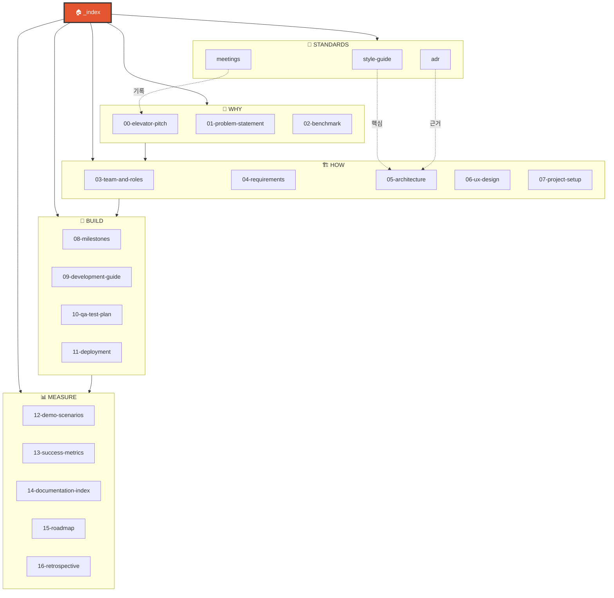

---
tags:
  - project/blog-ai-agent
  - vault/home
  - phase/all
date: 2026-05-20
created: 2026-05-20
updated: 2026-05-23
aliases:
  - Blog AI Agent Home
  - blog_ai_agent
  - 🏠 Vault Home
status: active
related:
  - "[[README]]"
  - "[[08-milestones]]"
  - "[[style-guide/blog-style]]"
---

# 🏠 Blog AI Agent — Vault Home

> 옵시디언 vault 진입점. GitHub README는 [`../README.md`](../README.md), 문서 인덱스는 [`README.md`](README.md).

---

## 🎯 한 문장 정의

**웹 브라우저에서 "X 블로그 만들어줘" 한 줄 → [AI의 정석] 양식 6,000~18,000자 글 + 다이어그램 5장 + Tistory 게시까지 자동. Claude Max 구독만 사용, 편당 $0.**

[[00-elevator-pitch|→ 자세한 엘리베이터 피치]]

---

## 🗺️ 문서 그래프



---

## 📑 핵심 문서 바로가기

### 🔥 처음 보는 사람을 위한 순서

1. [[00-elevator-pitch|🎯 한 줄 피치]]
2. [[01-problem-statement|❓ 왜 만드는가]]
3. [[05-architecture/README|🏗️ 시스템 설계 개요]]
4. [[style-guide/blog-style|✍️ 양식 표준 (가장 중요)]]
5. [[08-milestones|🗺️ 현재 진행 상황]]

### 💎 핵심 의사결정

- [[adr/001-claude-agent-sdk-vs-langgraph|ADR 001 · 왜 Claude Agent SDK인가]]
- [[adr/003-mermaid-vs-paid-image-api|ADR 003 · 왜 Mermaid + HTML 썸네일인가]]
- [[adr/005-html-css-thumbnail|ADR 005 · 썸네일 무료 자동화 방법]]

### 🔨 구현하면서 자주 참조할 것

- [[style-guide/blog-style|블로그 양식 (STYLE.md)]]
- [[style-guide/tone-guide|한국어 격식체 톤 가이드]]
- [[05-architecture/pipeline-stages|6단계 파이프라인 상세]]
- [[09-development-guide|개발 가이드 (수직 슬라이스)]]

---

## 🏷️ 태그 구조 (옵시디언 검색용)

```
#project/blog-ai-agent     ← 이 프로젝트 모든 문서
#phase/0 ~ phase/16        ← 부록 E Phase 별
#vault/home                ← 이 _index
#docs/index                ← README 류
#style-guide               ← 양식 관련
#adr                       ← 의사결정
#meeting                   ← 회의록
#status/active             ← 현재 유효
#status/draft              ← 작성 중
#status/archived           ← 보관
```

---

## 🔄 현재 상태 (자동 갱신 필요)

| 항목 | 값 |
|------|------|
| 프로젝트 단계 | **M6 완료 · v0.1.0 릴리스** |
| 마지막 업데이트 | 2026-05-23 |
| 완료 마일스톤 | M1~M6 ✅ |
| 다음 마일스톤 | M7 — 실제 글 3편 발행 + 성과 측정 |
| 플랫폼 형태 | 웹 플랫폼 (React 19 + Vite 6 + FastAPI + Claude Code CLI) |
| 테스트 | 862건 (백엔드 502 + 프론트엔드 344 + E2E 16) |
| CI/CD | GitHub Actions 3-job 파이프라인 ✅ 전체 통과 |
| GitHub 푸시 | ✅ dev + main 브랜치 |

---

## 🔗 외부 링크

- 🏠 [GitHub: JaylenAI/blog_ai_agent](https://github.com/JaylenAI/blog_ai_agent)
- 📝 [운영 블로그: jaylenhan.tistory.com](https://jaylenhan.tistory.com)
- 👤 [GitHub @JaylenHan](https://github.com/JaylenHan)
- 💼 [LinkedIn](https://www.linkedin.com/in/%EC%8A%B9%ED%97%8C-%ED%95%9C-a450792a3/)
- 📖 [Anthropic Skills 공식 문서](https://docs.anthropic.com/en/docs/agent-sdk/skills)
- 📚 [부록 E: 프로젝트 E2E 프로세스](#) (사용자 가이드 베이스)

---

## 📝 데일리 노트 / 회의록

회의 / 의사결정 / 데일리 메모는 [[meetings/]] 아래에. 시작:
- [[meetings/2026-05-20-kickoff|2026-05-20 Kickoff]]

---

> 💡 **이 vault의 사용법**: 옵시디언으로 이 폴더(`docs/`)를 vault로 열면 그래프 뷰에서 16 Phase의 연결 구조를 시각화할 수 있다. 변경할 때마다 frontmatter의 `updated:` 갱신을 잊지 말 것.
