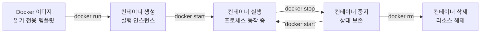
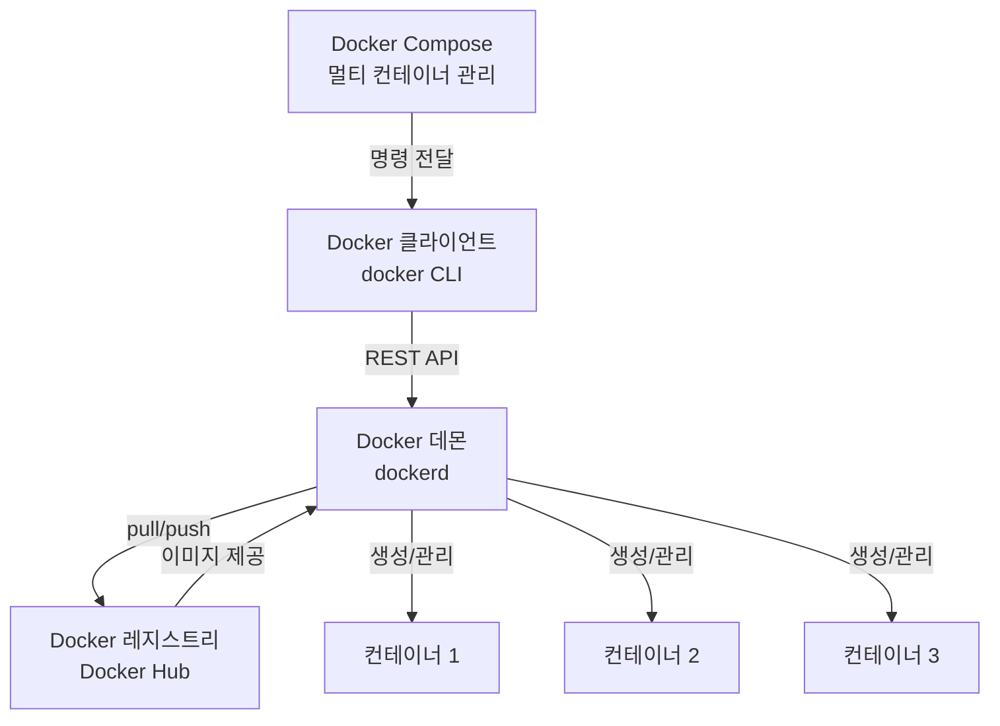

---
tags:
  - blog/published
  - category/devops
  - keyword/Docker 컨테이너
  - keyword/Docker 기초
  - keyword/Docker 명령어
  - keyword/컨테이너 가상화
  - keyword/Docker 이미지
date: 2026-05-26
title: "Docker 컨테이너 기초 — 개념부터 실전 명령어까지 완벽 정리"
status: published
---

# Docker 컨테이너 기초 — 개념부터 실전 명령어까지 완벽 정리

## 1. 들어가며

"제 컴퓨터에서는 되는데요?"

개발자라면 한 번쯤 이 문장을 말하거나 들어본 경험이 있을 것입니다. 로컬 환경에서 완벽하게 동작하던 애플리케이션이 동료의 컴퓨터나 서버에 올리는 순간 오류를 뿜어내는 상황은 개발 현장에서 너무나 흔합니다. 운영체제 버전, 라이브러리 의존성, 환경 변수 설정까지 — 개발 환경의 미세한 차이가 예측 불가능한 장애로 이어지곤 합니다.

Docker 컨테이너는 이 문제를 근본적으로 해결합니다. 2013년 dotCloud의 솔로몬 하익스(Solomon Hykes)가 처음 공개한 Docker는 애플리케이션과 그 실행 환경을 하나의 패키지로 묶어 어디서든 동일하게 실행할 수 있는 길을 열었습니다. 등장 이후 불과 몇 년 만에 개발·테스트·배포의 패러다임을 완전히 바꿔놓았고, 현재는 네이버, 카카오, 쿠팡 등 국내 주요 기업은 물론 전 세계 대부분의 클라우드 인프라에서 표준으로 자리 잡았습니다.

이 글에서는 Docker 컨테이너의 핵심 개념부터 아키텍처 구조, 반드시 알아야 할 명령어, 그리고 실무 활용 사례까지 체계적으로 정리합니다. Docker를 처음 접하는 분도 이 글을 끝까지 읽으면 컨테이너 기술의 전체 그림을 그릴 수 있을 것입니다.

## 2. Docker 컨테이너란 무엇인가

Docker 컨테이너란 **애플리케이션과 그 실행에 필요한 모든 환경을 하나로 묶은 격리된 프로세스**입니다. 코드, 런타임, 시스템 라이브러리, 설정 파일까지 모든 것이 하나의 단위로 패키징되어 어떤 환경에서든 동일하게 실행됩니다.

일상적인 비유로 설명하면, 컨테이너는 이사할 때 사용하는 **이삿짐 박스**와 같습니다. 박스 안에 물건뿐 아니라 배치도까지 함께 들어 있어서, 새 집에 도착해도 박스를 열기만 하면 이전과 똑같은 상태로 꺼낼 수 있습니다. 서울에서 부산으로 이사하든, 뉴욕으로 이사하든 박스 안의 내용물은 변하지 않습니다.

이 개념을 이해하려면 **이미지**와 **컨테이너**의 관계를 명확히 구분해야 합니다. Docker 이미지는 레시피(읽기 전용 템플릿)이고, 컨테이너는 그 레시피로 만든 요리(실행 인스턴스)입니다. 하나의 이미지에서 수십 개의 컨테이너를 만들 수 있지만, 각 컨테이너는 서로 독립적으로 동작합니다.

기술적으로 Docker 컨테이너는 리눅스 커널의 **네임스페이스(namespaces)**와 **cgroup(control groups)**을 활용합니다. 네임스페이스가 프로세스, 네트워크, 파일시스템을 격리하고, cgroup이 CPU와 메모리 같은 자원 사용량을 제한합니다. 이 두 가지 메커니즘 덕분에 컨테이너는 가상머신처럼 무거운 OS 전체를 올리지 않고도 안전한 격리 환경을 제공할 수 있습니다.



## 3. 가상머신 vs 컨테이너 — 무엇이 다른가

컨테이너를 이해하는 가장 빠른 방법은 기존 가상화 기술인 가상머신(VM)과 비교하는 것입니다.


가상머신은 **하이퍼바이저** 위에 게스트 운영체제 전체를 올리는 구조입니다. 하나의 물리 서버에서 여러 VM을 실행하면, 각각이 완전한 OS를 포함하므로 수 기가바이트의 디스크와 메모리를 차지합니다. 부팅에도 수 분이 걸립니다.

반면 Docker 컨테이너는 **호스트 OS의 커널을 공유**하며 애플리케이션 레벨만 격리합니다. 게스트 OS가 필요 없으므로 컨테이너 하나의 용량은 수십~수백 메가바이트에 불과하고, 시작 시간은 수 초 이내입니다. AWS의 비교 가이드에서도 이 아키텍처 차이가 리소스 효율성의 핵심이라고 설명합니다.

<table>
  <thead>
    <tr>
      <th>비교 항목</th>
      <th>가상머신(VM)</th>
      <th>Docker 컨테이너</th>
    </tr>
  </thead>
  <tbody>
    <tr>
      <td>시작 시간</td>
      <td>수 분</td>
      <td>수 초</td>
    </tr>
    <tr>
      <td>메모리 사용량</td>
      <td>수 GB (게스트 OS 포함)</td>
      <td>수십~수백 MB</td>
    </tr>
    <tr>
      <td>디스크 용량</td>
      <td>수십 GB</td>
      <td>수십~수백 MB</td>
    </tr>
    <tr>
      <td>격리 수준</td>
      <td>완전한 하드웨어 수준 격리</td>
      <td>프로세스 수준 격리 (커널 공유)</td>
    </tr>
    <tr>
      <td>이식성</td>
      <td>하이퍼바이저 종속적</td>
      <td>Docker 런타임만 있으면 어디서든 실행</td>
    </tr>
    <tr>
      <td>적합 용도</td>
      <td>이기종 OS 운영, 강력한 보안 격리 필요 시</td>
      <td>마이크로서비스, CI/CD, 빠른 스케일링</td>
    </tr>
  </tbody>
</table>

그렇다면 VM은 더 이상 쓸모가 없을까요? 그렇지 않습니다. 서로 다른 OS(예: 리눅스 서버에서 윈도우 애플리케이션)를 실행해야 하거나, 커널 수준의 완전한 격리가 보안 요건인 경우에는 여전히 VM이 적합합니다. 컨테이너는 동일 OS 위에서 빠르게 애플리케이션을 배포하고 확장하는 시나리오에 최적화된 기술입니다. 실무에서는 두 기술을 결합하여 — VM 위에서 Docker 컨테이너를 실행하는 — 형태가 가장 보편적입니다.

## 4. Docker 아키텍처와 핵심 구성요소

Docker는 **클라이언트-서버 모델**로 동작합니다. 사용자가 터미널에서 입력하는 `docker` 명령어는 Docker 클라이언트가 처리하고, 실제 컨테이너 생성과 관리는 백그라운드에서 실행 중인 Docker 데몬(dockerd)이 담당합니다.


Docker의 핵심 구성요소는 네 가지입니다.

**Docker 데몬(dockerd)**은 이미지 관리, 컨테이너 생성·실행·삭제 등 모든 핵심 작업을 수행하는 서버 프로세스입니다. **Docker 클라이언트(docker CLI)**는 사용자가 데몬에게 명령을 전달하는 인터페이스입니다. **Docker 이미지**는 컨테이너를 만들기 위한 읽기 전용 템플릿이며, **Docker 레지스트리(Docker Hub)**는 이미지를 저장하고 공유하는 중앙 저장소입니다.

이미지의 내부 구조도 이해할 필요가 있습니다. Docker 이미지는 **Union File System** 기반의 레이어 구조로 되어 있습니다. 각 Dockerfile 명령어가 하나의 레이어를 생성하고, 이 레이어들이 위로 쌓이는 형태입니다. 한 번 생성된 레이어는 변경되지 않으므로 다른 이미지에서 재사용(캐시)할 수 있어 빌드 속도와 저장 효율이 크게 향상됩니다. NHN Cloud Meetup의 기술 블로그에서도 이 레이어 캐시 전략을 Docker 이미지 최적화의 핵심으로 소개하고 있습니다.



여러 컨테이너를 동시에 관리해야 할 때는 **Docker Compose**를 사용합니다. `docker-compose.yml` 파일 하나로 웹 서버, 데이터베이스, 캐시 등 여러 서비스를 한꺼번에 정의하고 `docker compose up` 명령 한 줄로 실행할 수 있습니다.

## 5. 반드시 알아야 할 Docker 핵심 명령어

Docker를 실무에서 활용하려면 명령어 체계를 이해해야 합니다. 크게 컨테이너 라이프사이클, 이미지 관리, 상태 확인 세 가지 카테고리로 나뉩니다.


**컨테이너 라이프사이클 명령어**는 컨테이너의 생성부터 삭제까지를 다룹니다. `docker run`은 이미지로부터 새 컨테이너를 생성하고 실행하는 가장 기본적인 명령어입니다. `docker stop`은 실행 중인 컨테이너를 정상 종료하고, `docker start`는 중지된 컨테이너를 다시 시작합니다. `docker rm`은 중지된 컨테이너를 완전히 삭제합니다.

**이미지 관리 명령어**로는 `docker pull`이 레지스트리에서 이미지를 내려받고, `docker build`가 Dockerfile로부터 새 이미지를 생성합니다. `docker images`로 로컬에 저장된 이미지 목록을 확인하고, `docker rmi`로 불필요한 이미지를 삭제합니다.

**상태 확인 명령어**도 빈번하게 사용됩니다. `docker ps`는 실행 중인 컨테이너 목록을, `docker logs`는 컨테이너의 표준 출력 로그를, `docker inspect`는 컨테이너의 상세 설정 정보를 보여줍니다. `docker exec`는 실행 중인 컨테이너 내부에서 명령어를 실행할 때 사용합니다.

특히 `docker run` 명령어에서 자주 쓰이는 세 가지 옵션을 반드시 기억해야 합니다. `-d`는 백그라운드(detached) 모드 실행, `-p`는 호스트와 컨테이너 간 포트 매핑, `-v`는 볼륨 마운트로 데이터를 영구 저장하는 옵션입니다.

```bash
# Nginx 웹 서버를 백그라운드로 실행하고 80번 포트를 매핑
docker run -d -p 8080:80 --name my-nginx nginx

# 실행 중인 컨테이너 확인
docker ps

# 컨테이너 로그 확인
docker logs my-nginx

# 컨테이너 내부에 접속
docker exec -it my-nginx /bin/bash
```

<table>
  <thead>
    <tr>
      <th>카테고리</th>
      <th>명령어</th>
      <th>기능</th>
      <th>사용 예시</th>
    </tr>
  </thead>
  <tbody>
    <tr>
      <td rowspan="4">라이프사이클</td>
      <td>docker run</td>
      <td>컨테이너 생성 및 실행</td>
      <td><code>docker run -d -p 80:80 nginx</code></td>
    </tr>
    <tr>
      <td>docker stop</td>
      <td>컨테이너 정상 종료</td>
      <td><code>docker stop my-nginx</code></td>
    </tr>
    <tr>
      <td>docker start</td>
      <td>중지된 컨테이너 재시작</td>
      <td><code>docker start my-nginx</code></td>
    </tr>
    <tr>
      <td>docker rm</td>
      <td>컨테이너 삭제</td>
      <td><code>docker rm my-nginx</code></td>
    </tr>
    <tr>
      <td rowspan="4">이미지 관리</td>
      <td>docker pull</td>
      <td>레지스트리에서 이미지 다운로드</td>
      <td><code>docker pull python:3.12</code></td>
    </tr>
    <tr>
      <td>docker build</td>
      <td>Dockerfile로 이미지 빌드</td>
      <td><code>docker build -t my-app .</code></td>
    </tr>
    <tr>
      <td>docker images</td>
      <td>로컬 이미지 목록 확인</td>
      <td><code>docker images</code></td>
    </tr>
    <tr>
      <td>docker rmi</td>
      <td>이미지 삭제</td>
      <td><code>docker rmi nginx:latest</code></td>
    </tr>
    <tr>
      <td rowspan="4">상태 확인</td>
      <td>docker ps</td>
      <td>실행 중인 컨테이너 목록</td>
      <td><code>docker ps -a</code></td>
    </tr>
    <tr>
      <td>docker logs</td>
      <td>컨테이너 로그 출력</td>
      <td><code>docker logs -f my-app</code></td>
    </tr>
    <tr>
      <td>docker inspect</td>
      <td>컨테이너 상세 정보</td>
      <td><code>docker inspect my-app</code></td>
    </tr>
    <tr>
      <td>docker exec</td>
      <td>컨테이너 내부 명령 실행</td>
      <td><code>docker exec -it my-app bash</code></td>
    </tr>
  </tbody>
</table>

## 6. Dockerfile 작성과 이미지 빌드 기초

Dockerfile은 Docker 이미지를 만들기 위한 **설계도**입니다. 건축가가 설계도를 그려야 건물을 지을 수 있듯이, 개발자는 Dockerfile을 작성해야 나만의 커스텀 이미지를 만들 수 있습니다.

Dockerfile의 핵심 지시어 다섯 가지를 알면 대부분의 상황에 대응할 수 있습니다. **FROM**은 베이스 이미지를 지정합니다. 모든 Dockerfile의 첫 줄이며, 어떤 환경 위에 빌드할지를 선언합니다. **COPY**는 로컬 파일을 이미지 안으로 복사합니다. **RUN**은 이미지 빌드 시점에 실행할 명령어를 정의합니다. **EXPOSE**는 컨테이너가 사용할 포트를 문서화하고, **CMD**는 컨테이너 실행 시 기본으로 실행될 명령어를 지정합니다.

간단한 Python 웹 애플리케이션을 컨테이너로 만드는 Dockerfile 예시를 살펴보겠습니다.

```dockerfile
FROM python:3.12-slim

WORKDIR /app

COPY requirements.txt .
RUN pip install --no-cache-dir -r requirements.txt

COPY . .

EXPOSE 8000

CMD ["uvicorn", "main:app", "--host", "0.0.0.0", "--port", "8000"]
```

이 Dockerfile을 이미지로 빌드하려면 다음 명령어를 실행합니다.

```bash
docker build -t my-python-app:1.0 .
```

`-t` 옵션은 이미지에 이름과 태그를 부여합니다. 태그를 활용한 버전 관리(예: `v1.0`, `v1.1`, `latest`)는 운영 환경에서 롤백과 배포 추적에 필수적입니다.

이미지 경량화도 중요한 실무 기술입니다. 베이스 이미지를 `python:3.12` 대신 `python:3.12-slim`이나 `python:3.12-alpine`으로 선택하면 이미지 크기를 수백 MB에서 수십 MB로 줄일 수 있습니다. `.dockerignore` 파일을 활용해 불필요한 파일(`.git`, `node_modules`, `__pycache__` 등)이 이미지에 포함되지 않도록 하는 것도 기본 최적화 전략입니다.

## 7. 실무 활용 사례와 국내 도입 현황

Docker 컨테이너 기술은 이미 국내외 주요 기업에서 표준 인프라로 자리 잡았습니다.

**개발 환경 표준화** 측면에서 네이버는 Docker 기반으로 개발 환경을 통일한 사례를 D2 기술 블로그를 통해 공유한 바 있습니다. "제 컴퓨터에서는 되는데" 문제를 원천 차단하고, 신규 입사자가 첫날부터 동일한 환경에서 개발을 시작할 수 있게 되었습니다.

**CI/CD 파이프라인 통합**은 컨테이너의 가장 보편적인 활용 영역입니다. 코드 커밋부터 빌드, 테스트, 배포까지 모든 단계를 컨테이너 안에서 실행하면 환경 차이로 인한 빌드 실패를 방지할 수 있습니다. GitHub Actions, GitLab CI, Jenkins 등 주요 CI/CD 도구 모두 Docker 컨테이너를 실행 단위로 지원합니다.

**대규모 서비스 운영** 분야에서는 카카오가 컨테이너 기반 인프라 운영 경험을 kakao Tech를 통해 공유했습니다. 수천 대의 서버에서 실행되는 서비스를 컨테이너 단위로 관리하면서 배포 속도와 자원 효율성을 크게 향상시켰습니다.

**마이크로서비스 아키텍처**와 컨테이너는 자연스럽게 결합합니다. 하나의 거대한 애플리케이션을 기능 단위의 작은 서비스들로 분리하고, 각 서비스를 독립된 컨테이너로 운영하면 개별 배포, 독립적 확장, 장애 격리가 가능해집니다.

## 8. 한눈에 비교 — Docker 핵심 개념 요약

<table>
  <thead>
    <tr>
      <th>비교 항목</th>
      <th>개념 A</th>
      <th>개념 B</th>
      <th>핵심 차이</th>
    </tr>
  </thead>
  <tbody>
    <tr>
      <td>이미지 vs 컨테이너</td>
      <td>읽기 전용 템플릿 (레시피)</td>
      <td>실행 중인 인스턴스 (요리)</td>
      <td>이미지 하나에서 여러 컨테이너 생성 가능</td>
    </tr>
    <tr>
      <td>VM vs 컨테이너</td>
      <td>게스트 OS 포함, 완전 격리</td>
      <td>커널 공유, 프로세스 격리</td>
      <td>시작 속도 수 분 vs 수 초, 용량 GB vs MB</td>
    </tr>
    <tr>
      <td>Dockerfile vs Docker Compose</td>
      <td>단일 이미지 빌드 설계도</td>
      <td>멀티 컨테이너 오케스트레이션 도구</td>
      <td>이미지 정의 vs 서비스 구성 정의</td>
    </tr>
    <tr>
      <td>Docker Hub vs 로컬 레지스트리</td>
      <td>공개 이미지 중앙 저장소</td>
      <td>사내 전용 이미지 저장소</td>
      <td>공유 범위와 보안 요건에 따라 선택</td>
    </tr>
  </tbody>
</table>

Docker 도입 전후의 개발 워크플로 변화도 정리하면 다음과 같습니다. 도입 전에는 서버마다 수작업으로 환경을 설정하고, 배포 때마다 설정 차이로 인한 장애가 반복되었습니다. 도입 후에는 Dockerfile과 이미지를 통해 환경이 코드로 관리되며, 어떤 서버에서든 `docker run` 한 줄이면 동일한 애플리케이션이 실행됩니다.

입문자가 가장 많이 혼동하는 개념 세 가지도 짚어보겠습니다. 첫째, `docker run`은 이미지로부터 **새 컨테이너를 생성**하는 명령이고, `docker start`는 **이미 존재하는** 중지된 컨테이너를 재시작하는 명령입니다. 둘째, `EXPOSE`는 포트를 실제로 열지 않으며, 단지 문서화 역할만 합니다. 실제 포트 매핑은 `docker run -p` 옵션으로 해야 합니다. 셋째, 컨테이너를 삭제(`docker rm`)해도 이미지는 남아 있으므로 언제든 같은 이미지에서 새 컨테이너를 만들 수 있습니다.

## 9. 마치며


이 글에서 다룬 핵심을 세 줄로 요약합니다. Docker 컨테이너는 애플리케이션과 실행 환경을 하나로 패키징하는 경량 가상화 기술입니다. 클라이언트-서버 아키텍처 위에서 이미지, 컨테이너, 레지스트리가 유기적으로 동작하며, `run`, `build`, `ps`, `logs` 등 핵심 명령어로 전체 라이프사이클을 관리할 수 있습니다.

Docker 기초를 익혔다면 다음 단계로 **Docker Compose**를 활용한 멀티 컨테이너 관리, 이어서 **Kubernetes**를 통한 컨테이너 오케스트레이션, 최종적으로 클라우드 환경(AWS ECS, GKE 등)에서의 프로덕션 배포까지 학습 범위를 넓혀 나가시기 바랍니다.

컨테이너 기술은 더 이상 선택이 아닌 **현대 소프트웨어 개발의 기본 인프라**이며, 서버리스·엣지 컴퓨팅·AI 워크로드까지 그 영역을 빠르게 확장하고 있습니다.