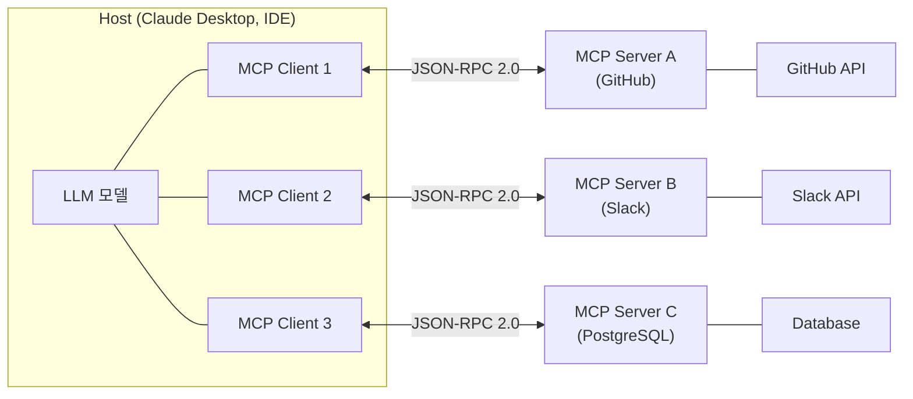

---
tags:
  - blog/published
  - category/ai-ml
  - keyword/MCP
  - keyword/Model Context Protocol
  - keyword/MCP란
  - keyword/AI 에이전트
  - keyword/MCP 서버
date: 2026-05-26
title: "MCP(Model Context Protocol)란? AI 에이전트 연결의 새로운 표준"
status: published
---

# MCP(Model Context Protocol)란? AI 에이전트 연결의 새로운 표준

## 1. 들어가며

AI 에이전트를 개발해 본 경험이 있다면, 외부 도구와의 연동이 얼마나 고된 작업인지 체감하셨을 것입니다. Slack에 메시지를 보내려면 Slack 전용 커넥터를, GitHub에서 코드를 읽으려면 GitHub 전용 커넥터를, 데이터베이스를 조회하려면 또 다른 커넥터를 만들어야 합니다. 모델이 3종이고 연동할 도구가 10개라면, 최악의 경우 30개의 개별 통합 코드를 작성해야 하는 셈입니다. 이것이 바로 **M×N 통합 문제**입니다.

이 상황은 과거 스마트폰 충전 케이블의 혼란과 놀랍도록 닮아 있습니다. 마이크로 USB, 라이트닝, 미니 USB, 독자 규격까지 — 기기마다 다른 케이블이 필요했던 시절이 있었습니다. USB-C라는 단일 표준이 등장하면서 이 혼란이 정리된 것처럼, AI 도구 연결 영역에도 하나의 표준이 필요한 시점이 도래했습니다.

2024년 11월, Anthropic은 이 문제에 대한 답으로 **MCP(Model Context Protocol)**를 오픈소스로 공개했습니다. 발표와 동시에 Block(구 Square), Zed, Replit, Apollo, Sourcegraph 등이 초기 파트너로 참여를 선언하며 업계의 주목을 받았습니다.

이 글에서는 MCP의 정의부터 아키텍처, 핵심 기능, 기존 Function Calling과의 차이, 그리고 실무 활용 사례까지 체계적으로 살펴보겠습니다.

## 2. MCP란 무엇인가: 핵심 개념 정의

**MCP(Model Context Protocol)란 LLM 애플리케이션과 외부 데이터 소스·도구를 연결하는 개방형 표준 프로토콜입니다.** Anthropic이 설계하고 오픈소스로 공개한 이 프로토콜은, AI 모델이 다양한 외부 시스템과 소통하는 방식을 하나의 규격으로 통일합니다.


좀 더 직관적으로 이해하기 위해 레스토랑을 떠올려 보겠습니다. 레스토랑에는 여러 명의 웨이터(AI 모델)와 여러 개의 주방 섹션(외부 도구)이 있습니다. 만약 표준화된 주문서 양식이 없다면 어떤 일이 벌어질까요? 파스타 섹션에는 이탈리아어로, 스시 섹션에는 일본어로, 그릴 섹션에는 영어로 주문서를 각각 따로 작성해야 할 것입니다. MCP는 바로 이 **표준화된 주문서 양식**에 해당합니다. 어떤 웨이터든, 어떤 주방이든 같은 형식의 주문서로 소통할 수 있게 만드는 것입니다.

MCP가 해결하는 핵심 문제는 통합 복잡도의 극적인 감소입니다. 기존에는 '모델 수 × 도구 수'만큼의 커넥터가 필요했지만, MCP를 적용하면 이것이 '모델 수 + 도구 수'로 줄어듭니다. 모델 3개와 도구 10개의 조합이 30개의 커넥터 대신 13개만으로 충분해지는 것입니다.

MCP의 설계는 세 가지 원칙 위에 서 있습니다. 첫째, **표준화(Standardization)** — 모든 연결이 하나의 프로토콜 규격을 따릅니다. 둘째, **개방성(Open Source)** — 특정 기업에 종속되지 않으며 누구나 구현할 수 있습니다. 셋째, **보안(Human-in-the-loop)** — 도구 실행 전 사용자의 승인을 거치는 안전장치를 프로토콜 수준에서 보장합니다.

## 3. MCP 아키텍처: 클라이언트-서버 구조 이해하기

MCP의 아키텍처를 이해하려면 세 계층의 역할 분담을 파악해야 합니다. 최상위에는 **Host**(Claude Desktop, IDE 등 사용자가 직접 상호작용하는 애플리케이션)가 있고, 그 안에 **MCP Client**(프로토콜 통신을 담당하는 내장 모듈)가 존재하며, 외부에는 **MCP Server**(도구와 데이터를 노출하는 제공자)가 위치합니다.



이 구조에서 핵심은 **각 MCP Client가 하나의 MCP Server와 1:1로 연결되는 상태를 유지**한다는 점입니다. Host는 여러 개의 Client를 동시에 운용할 수 있으므로, 하나의 AI 애플리케이션이 GitHub, Slack, 데이터베이스 등 다수의 외부 시스템과 동시에 소통할 수 있습니다.

통신을 담당하는 **전송 계층(Transport Layer)**은 두 가지 방식을 지원합니다. **stdio**는 로컬 프로세스 간 표준 입출력을 통한 통신으로, 같은 머신에서 실행되는 서버에 적합합니다. **HTTP+SSE(Server-Sent Events)**는 원격 서버와의 통신에 사용되며, 네트워크를 넘어 클라우드에 배포된 MCP 서버에 접근할 때 활용됩니다.

모든 메시지는 **JSON-RPC 2.0** 형식을 따릅니다. 클라이언트가 요청을 보내고 서버가 응답을 반환하는 요청-응답 패턴과, 일방적으로 상태 변화를 알리는 알림(notification) 패턴이 함께 사용됩니다.

연결이 시작될 때는 **기능 협상(Capability Negotiation)**이 이루어집니다. 이 핸드셰이크 과정에서 클라이언트와 서버가 서로 지원하는 기능 목록을 교환합니다. 예를 들어 "이 서버는 Tools와 Resources를 지원합니다" 또는 "이 클라이언트는 sampling을 지원합니다"와 같은 정보를 주고받아, 양측이 호환 가능한 범위 내에서 통신을 진행하게 됩니다.

## 4. MCP의 3대 핵심 기능: Resources, Tools, Prompts

MCP 서버가 클라이언트에 노출하는 기능은 크게 세 가지 primitive로 구분됩니다.


**Resources(자원)**는 서버가 클라이언트에 제공하는 읽기 전용 데이터입니다. 파일 내용, 데이터베이스 레코드, API 응답 등이 이에 해당합니다. 웹에서의 GET 요청과 유사하게, 데이터를 조회하되 변경하지는 않습니다. URI 형식으로 식별되며, 모델이 추론에 필요한 컨텍스트를 획득하는 통로 역할을 합니다.

**Tools(도구)**는 모델이 실제로 호출하여 실행할 수 있는 함수입니다. 이메일 전송, 파일 생성, 데이터베이스 쿼리 실행 등 부수 효과(side effect)를 수반하는 작업이 여기에 속합니다. 각 도구는 JSON Schema로 입력 형식이 정의되며, 서버가 자신이 제공하는 도구 목록을 동적으로 노출합니다. 클라이언트는 런타임에 이 목록을 발견하고, 모델의 판단에 따라 적절한 도구를 호출합니다.

**Prompts(프롬프트)**는 서버가 제공하는 재사용 가능한 프롬프트 템플릿입니다. 특정 도메인에 최적화된 상호작용 패턴을 미리 정의해 두고, 사용자가 선택적으로 활용할 수 있게 합니다. 예를 들어 코드 리뷰 서버가 "이 PR의 보안 취약점을 분석해 주세요"라는 전문 프롬프트를 템플릿으로 제공하는 식입니다.

<table>
  <thead>
    <tr>
      <th>구분</th>
      <th>Resources</th>
      <th>Tools</th>
      <th>Prompts</th>
    </tr>
  </thead>
  <tbody>
    <tr>
      <td><strong>용도</strong></td>
      <td>컨텍스트 데이터 제공</td>
      <td>실행 가능한 작업 수행</td>
      <td>상호작용 패턴 템플릿</td>
    </tr>
    <tr>
      <td><strong>제어 주체</strong></td>
      <td>애플리케이션(Host)</td>
      <td>모델(LLM)이 판단</td>
      <td>사용자가 선택</td>
    </tr>
    <tr>
      <td><strong>실행 방식</strong></td>
      <td>읽기 전용 (GET과 유사)</td>
      <td>실행 + 부수 효과 (POST와 유사)</td>
      <td>템플릿 렌더링</td>
    </tr>
    <tr>
      <td><strong>실제 예시</strong></td>
      <td>파일 내용 조회, DB 레코드 읽기</td>
      <td>이메일 전송, 코드 실행, 파일 생성</td>
      <td>코드 리뷰 요청, 버그 분석 요청</td>
    </tr>
  </tbody>
</table>

특히 주목할 점은 **human-in-the-loop 승인 메커니즘**입니다. Tools가 실행되기 전, 사용자에게 "이 도구를 실행해도 되겠습니까?"라는 확인을 거치도록 프로토콜 수준에서 설계되어 있습니다. AI가 사용자의 동의 없이 이메일을 보내거나 파일을 삭제하는 상황을 원천적으로 방지하는 안전장치입니다.

## 5. Function Calling vs MCP: 무엇이 다른가

MCP를 이해하는 가장 빠른 방법은 기존 Function Calling과의 차이를 살펴보는 것입니다.


**Before — Function Calling 방식**에서는 개발자가 도구의 스키마를 모델 API 호출 코드에 직접 하드코딩합니다. 도구가 추가될 때마다 코드를 수정해야 하고, 다른 모델로 전환하면 해당 모델의 API 형식에 맞춰 도구 정의를 다시 작성해야 합니다. 도구의 존재를 모델이 런타임에 스스로 발견하는 것이 아니라, 개발자가 명시적으로 알려주는 구조입니다.

**After — MCP 방식**에서는 서버가 자신이 제공하는 도구를 동적으로 노출하고, 클라이언트가 런타임에 이를 자동으로 발견합니다. 새 도구가 추가되어도 클라이언트 코드를 수정할 필요가 없습니다. 서버만 업데이트하면 클라이언트가 다음 연결 시 새 도구를 인식합니다.

<table>
  <thead>
    <tr>
      <th>비교 항목</th>
      <th>Function Calling</th>
      <th>MCP</th>
    </tr>
  </thead>
  <tbody>
    <tr>
      <td><strong>도구 발견 방식</strong></td>
      <td>개발자가 코드에 스키마를 직접 정의</td>
      <td>서버가 동적으로 노출, 클라이언트가 런타임 발견</td>
    </tr>
    <tr>
      <td><strong>표준화 수준</strong></td>
      <td>각 모델 제공자마다 고유 형식</td>
      <td>단일 오픈 프로토콜 (JSON-RPC 2.0)</td>
    </tr>
    <tr>
      <td><strong>생태계 확장성</strong></td>
      <td>모델별 개별 통합 필요 (M×N)</td>
      <td>서버 한 번 구축으로 모든 클라이언트 지원 (M+N)</td>
    </tr>
    <tr>
      <td><strong>보안 모델</strong></td>
      <td>애플리케이션 단에서 개별 구현</td>
      <td>프로토콜 수준의 human-in-the-loop 내장</td>
    </tr>
    <tr>
      <td><strong>런타임 유연성</strong></td>
      <td>정적 — 도구 변경 시 재배포 필요</td>
      <td>동적 — 서버 업데이트만으로 도구 추가·변경 가능</td>
    </tr>
  </tbody>
</table>

다만 한 가지 명확히 할 점이 있습니다. **MCP는 Function Calling을 대체하는 것이 아닙니다.** Function Calling은 모델이 구조화된 출력을 생성하는 기본 메커니즘이고, MCP는 그 위에 올라가는 **표준 연결 계층**입니다. 실제로 MCP 클라이언트 내부에서는 모델의 Function Calling 기능을 활용하여 MCP 도구를 호출합니다. MCP는 이 과정을 표준화하고 자동화하는 프로토콜인 것입니다.

## 6. MCP 생태계와 실전 활용 사례

MCP의 진정한 가치는 생태계에서 발현됩니다. 이미 다양한 공식·커뮤니티 MCP 서버가 구축되어 있으며, 대표적으로 **GitHub**(코드 저장소 접근), **Slack**(메시지 전송·조회), **PostgreSQL**(데이터베이스 쿼리), **파일 시스템**(로컬 파일 읽기·쓰기) 등이 있습니다. 개발자는 이러한 기성 서버를 설정 파일에 등록하는 것만으로 AI 에이전트에 해당 기능을 부여할 수 있습니다.

개발 환경 통합도 빠르게 진행되고 있습니다. **Claude Desktop**은 MCP를 네이티브로 지원하며, **Cursor**, **Zed** 등의 AI 코딩 에디터도 MCP 클라이언트를 내장하여 개발자가 IDE 안에서 다양한 외부 도구를 AI를 통해 활용할 수 있게 합니다.

에이전트 프레임워크와의 통합도 주목할 만합니다. LangChain 팀은 **LangGraph 에이전트에 MCP 서버를 도구로 연결하는 패턴**을 공식 블로그에서 소개했습니다. 이를 통해 기존 에이전트 워크플로에 MCP 생태계의 도구를 손쉽게 결합할 수 있습니다.

간단한 MCP 서버의 구조를 살펴보면, 도구를 노출하는 방식이 얼마나 직관적인지 알 수 있습니다.

```python
from mcp.server import Server
from mcp.types import Tool, TextContent

server = Server("weather-server")

@server.list_tools()
async def list_tools():
    return [
        Tool(
            name="get_weather",
            description="지정한 도시의 현재 날씨를 조회합니다",
            inputSchema={
                "type": "object",
                "properties": {
                    "city": {"type": "string", "description": "도시 이름"}
                },
                "required": ["city"]
            }
        )
    ]

@server.call_tool()
async def call_tool(name: str, arguments: dict):
    if name == "get_weather":
        city = arguments["city"]
        weather = await fetch_weather(city)
        return [TextContent(type="text", text=f"{city}의 현재 날씨: {weather}")]
```

`@server.list_tools()`로 도구 목록을 노출하고, `@server.call_tool()`로 실행 로직을 정의합니다. 이 서버를 MCP 클라이언트에 등록하면, AI 모델이 "서울 날씨 알려줘"라는 요청을 받았을 때 자동으로 이 도구를 발견하고 호출합니다.

초기 도입 기업들의 활용 방향도 다양합니다. **Block**(핀테크)은 AI 어시스턴트가 내부 금융 데이터에 안전하게 접근하도록 MCP를 활용하고 있으며, **Apollo**(데이터 플랫폼)는 AI 에이전트와 데이터 파이프라인을 연결하는 데 MCP를 적용하고 있습니다. **Sourcegraph**는 코드 검색 및 분석 기능을 MCP 서버로 노출하여, 어떤 AI 모델에서든 코드베이스를 탐색할 수 있게 했습니다.

## 7. 한눈에 비교: MCP 핵심 정리 테이블

지금까지 살펴본 내용을 종합하여, 기존 도구 연동 방식과 MCP를 한눈에 비교하겠습니다.

<table>
  <thead>
    <tr>
      <th>비교 항목</th>
      <th>개별 API 연동</th>
      <th>Function Calling</th>
      <th>MCP</th>
    </tr>
  </thead>
  <tbody>
    <tr>
      <td><strong>통합 복잡도</strong></td>
      <td>M × N (모델별 × 도구별)</td>
      <td>M × N (모델 형식별 개별 정의)</td>
      <td>M + N (표준 프로토콜로 통합)</td>
    </tr>
    <tr>
      <td><strong>표준화</strong></td>
      <td>없음 (각자 구현)</td>
      <td>모델 제공자별 고유 규격</td>
      <td>오픈 표준 (JSON-RPC 2.0)</td>
    </tr>
    <tr>
      <td><strong>도구 발견</strong></td>
      <td>수동 연동</td>
      <td>개발자가 코드에 정의</td>
      <td>서버가 동적 노출, 런타임 자동 발견</td>
    </tr>
    <tr>
      <td><strong>보안</strong></td>
      <td>개별 구현 필요</td>
      <td>애플리케이션 단 구현</td>
      <td>프로토콜 수준 human-in-the-loop</td>
    </tr>
    <tr>
      <td><strong>확장성</strong></td>
      <td>도구 추가마다 전면 수정</td>
      <td>도구 추가마다 스키마 추가</td>
      <td>서버만 추가 등록하면 완료</td>
    </tr>
    <tr>
      <td><strong>생태계</strong></td>
      <td>없음</td>
      <td>모델 제공자 종속</td>
      <td>오픈소스 커뮤니티 기반 확장</td>
    </tr>
  </tbody>
</table>

MCP의 장점은 명확합니다. 표준화된 연결로 통합 비용을 줄이고, 오픈소스 생태계를 통해 기성 서버를 즉시 활용할 수 있으며, 보안을 프로토콜 수준에서 보장합니다.

동시에 현재 한계점도 솔직히 짚어야 합니다. MCP는 아직 **초기 단계**입니다. 서버 생태계가 충분히 성숙하지 않았고, 프로덕션 환경에서의 대규모 검증 사례가 제한적입니다. 원격 서버 인증 및 권한 관리에 대한 표준화도 아직 진행 중이며, 모든 LLM 제공자가 MCP를 채택한 것은 아닙니다.

그렇다면 어떤 상황에서 MCP 도입을 고려해야 할까요? **3개 이상의 외부 도구를 AI 에이전트에 연동해야 할 때**, **여러 모델을 병행하거나 전환 가능성이 있을 때**, 그리고 **도구 연동의 보안과 표준화가 중요한 엔터프라이즈 환경**에서 MCP의 가치가 극대화됩니다.

## 8. 마치며

MCP의 핵심 가치를 세 문장으로 요약하면 다음과 같습니다. 첫째, **표준화된 연결** — M×N 통합 문제를 M+N으로 해소합니다. 둘째, **생태계 확장** — 한 번 구축한 MCP 서버를 모든 호환 클라이언트가 공유합니다. 셋째, **안전한 도구 사용** — human-in-the-loop 승인이 프로토콜에 내장되어 있습니다.

AI 에이전트를 개발하거나 외부 도구 연동을 계획하고 있다면, 개별 커넥터를 직접 만들기 전에 MCP 생태계에 이미 해당 서버가 존재하는지 먼저 확인해 보시기 바랍니다. 작은 시작이지만, 장기적으로 유지보수 비용을 크게 줄여 줄 것입니다.

AI 에이전트 시대에 MCP는 HTTP가 웹에서 했던 역할을 — 도구 연결이라는 영역에서 해나가게 될 것입니다.