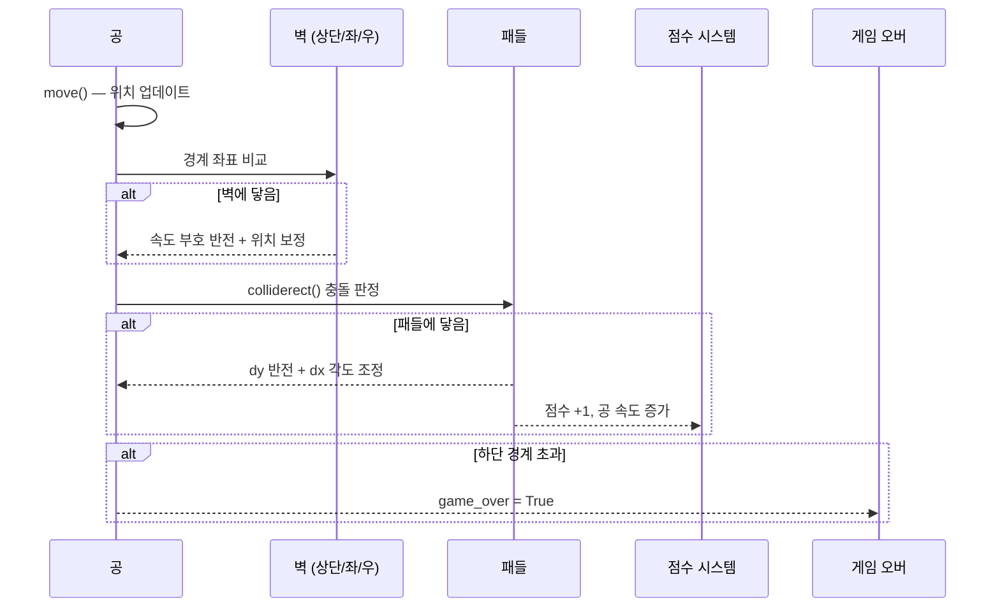

---
tags:
  - blog/published
  - category/python
  - keyword/Pygame 튜토리얼
  - keyword/Python 게임 만들기
  - keyword/바운스볼 게임
  - keyword/Pygame 입문
  - keyword/Python 게임 개발
date: 2026-05-26
title: "Python으로 바운스볼 게임 만들기 — Pygame 실습 튜토리얼"
status: published
---

# Python으로 바운스볼 게임 만들기 — Pygame 실습 튜토리얼

## 1. 들어가며

이 글을 따라하면 30분 안에 Python과 Pygame으로 완전한 바운스볼 게임을 만들 수 있습니다. 공이 화면 안에서 튀어다니고, 패들로 받아내며, 점수가 올라가는 인터랙티브 게임을 직접 구현하게 됩니다.


바운스볼 게임은 게임 개발 입문에 가장 적합한 프로젝트입니다. 좌표계 이해, 충돌 감지, 게임 루프, 사용자 입력 처리, 객체지향 설계까지 — 게임 프로그래밍의 핵심 개념을 하나의 프로젝트에서 모두 학습할 수 있기 때문입니다. 단순한 규칙 위에 점수 시스템, 사운드 효과, 난이도 조절 같은 기능을 하나씩 쌓아 올리면서 Python 게임 개발의 전체 흐름을 체험하게 됩니다.

완성된 게임의 모습은 다음과 같습니다. 화면 중앙에서 출발한 공이 벽에 부딪히며 방향을 바꾸고, 화면 하단의 패들을 좌우 방향키로 조작하여 공을 받아냅니다. 공을 놓치면 게임 오버, 받아낼 때마다 점수가 올라가며 공의 속도가 점점 빨라집니다.

필요한 사전 지식은 Python 기초 문법 — 변수, 조건문, 반복문, 클래스 — 만 알면 충분합니다. Pygame을 처음 접하더라도 각 단계를 그대로 따라하면 문제없이 완성할 수 있습니다.

## 2. 사전 준비

본격적인 Pygame 튜토리얼에 들어가기 전에 개발 환경을 점검합니다.

운영체제는 Windows 10 이상, macOS 12 이상, Ubuntu 20.04 이상이면 모두 지원됩니다. 먼저 Python 버전을 확인합니다.

```bash
python --version
# Python 3.10 이상이면 정상
```

> **주의**: macOS나 Linux에서 `python` 명령이 동작하지 않는다면 `python3 --version`을 시도하세요. 이후 모든 명령에서 `python` 대신 `python3`을 사용하면 됩니다.

프로젝트 디렉토리 구조를 생성합니다.

```bash
mkdir bounce-ball
cd bounce-ball
mkdir assets
touch main.py
```

이 구조에서 `main.py`에 전체 게임 코드를 작성하고, `assets/` 폴더에는 효과음 파일을 배치합니다.

다음 체크리스트로 사전 준비 상태를 확인하세요.

<table>
  <thead>
    <tr>
      <th>항목</th>
      <th>확인 명령어</th>
      <th>권장 버전</th>
    </tr>
  </thead>
  <tbody>
    <tr>
      <td>운영체제</td>
      <td>-</td>
      <td>Windows 10+ / macOS 12+ / Ubuntu 20.04+</td>
    </tr>
    <tr>
      <td>Python</td>
      <td><code>python --version</code></td>
      <td>3.10 이상</td>
    </tr>
    <tr>
      <td>pip</td>
      <td><code>pip --version</code></td>
      <td>22.0 이상</td>
    </tr>
    <tr>
      <td>텍스트 에디터</td>
      <td>-</td>
      <td>VS Code, PyCharm 등</td>
    </tr>
  </tbody>
</table>

모든 항목이 확인되었다면 Pygame 설치로 넘어갑니다.

## 3. Pygame 설치 및 환경 설정

Pygame은 pip 한 줄로 설치할 수 있습니다.


```bash
pip install pygame
```

설치가 완료되면 Python 인터프리터에서 버전을 확인합니다.

```python
import pygame
print(pygame.ver)
# 정상 실행 시 다음과 같은 출력을 확인할 수 있습니다: 2.6.0
```

이제 `main.py`에 게임의 기본 뼈대를 작성합니다. `pygame.init()`으로 모든 모듈을 초기화하고, `display.set_mode()`로 게임 윈도우를 생성합니다.

```python
import pygame
import sys

# Pygame 초기화
pygame.init()

# 화면 크기 및 게임 설정 상수
WIDTH, HEIGHT = 800, 600
FPS = 60

# RGB 색상 상수
BLACK = (0, 0, 0)
WHITE = (255, 255, 255)
RED = (231, 76, 60)
BLUE = (52, 152, 219)
GREEN = (46, 204, 113)

# 게임 윈도우 생성
screen = pygame.display.set_mode((WIDTH, HEIGHT))
pygame.display.set_caption("바운스볼 게임")

# FPS 제어용 시계 객체
clock = pygame.time.Clock()

# 메인 루프
running = True
while running:
    for event in pygame.event.get():
        if event.type == pygame.QUIT:
            running = False

    screen.fill(BLACK)
    pygame.display.flip()
    clock.tick(FPS)

pygame.quit()
sys.exit()
```

이 코드를 실행하면 800×600 크기의 검은 배경 윈도우가 나타납니다.

```bash
python main.py
# 정상 실행 시 "바운스볼 게임" 제목의 검은 윈도우가 표시됩니다
```

> **주의**: macOS에서 Pygame 창이 표시되지 않거나 즉시 닫히는 경우, 먼저 `python3 -m pygame.examples.aliens`를 실행하여 Pygame 설치 자체가 정상인지 검증하세요. Apple Silicon Mac에서는 `pip install pygame --pre` 명령으로 최신 프리릴리스 버전을 설치하면 호환성 문제가 해결되는 경우가 많습니다.

색상 상수와 화면 크기를 파일 상단에 분리해 둔 이유는, 이후 게임 파라미터를 조정할 때 한 곳만 수정하면 되도록 하기 위함입니다. 이 패턴은 파이썬 2D 게임 개발에서 널리 사용되는 설정 관리 방식입니다.

## 4. 게임 루프의 구조 이해하기

Pygame으로 만드는 모든 게임은 **게임 루프**를 중심으로 동작합니다. 게임 루프는 매 프레임마다 세 가지 단계를 반복합니다.


1. **이벤트 처리**: 키보드, 마우스, 창 닫기 등 사용자 입력을 감지합니다.
2. **상태 업데이트**: 공의 위치 이동, 충돌 판정, 점수 계산 등 게임 로직을 실행합니다.
3. **화면 렌더링**: 업데이트된 상태를 바탕으로 화면을 다시 그립니다.

```mermaid
sequenceDiagram
    participant Loop as 게임 루프
    participant Event as 이벤트 처리
    participant Update as 상태 업데이트
    participant Render as 화면 렌더링

    loop 매 프레임 (1/60초)
        Loop->>Event: pygame.event.get()
        Event-->>Loop: 키 입력, 종료 이벤트
        Loop->>Update: 공 이동, 충돌 판정, 점수 계산
        Update-->>Loop: 갱신된 게임 상태
        Loop->>Render: screen.fill() → draw() → display.flip()
        Render-->>Loop: 화면 출력 완료
        Loop->>Loop: clock.tick(60) — 다음 프레임 대기
    end
```

`pygame.event.get()`은 이벤트 큐에 쌓인 모든 이벤트를 가져옵니다. 이 함수를 호출하지 않으면 운영체제가 프로그램이 응답하지 않는다고 판단하여 "응답 없음" 상태가 됩니다.

`pygame.time.Clock()`의 `tick(60)` 메서드는 프레임 간 시간 간격을 조절하여 초당 60프레임을 유지합니다. 이 호출이 없으면 CPU 성능에 따라 게임 속도가 달라지는 문제가 발생합니다.

```python
# 이벤트 처리 기본 패턴
for event in pygame.event.get():
    if event.type == pygame.QUIT:
        running = False
    elif event.type == pygame.KEYDOWN:
        if event.key == pygame.K_ESCAPE:
            running = False
```

> **주의**: 메인 루프 종료 후 `pygame.quit()`과 `sys.exit()`을 반드시 호출하세요. 이 두 줄이 빠지면 윈도우가 정상적으로 닫히지 않고 프로세스가 백그라운드에 남아 있게 됩니다.

## 5. 공(Ball) 클래스 구현

게임의 주인공인 공을 객체지향 방식으로 구현합니다. Ball 클래스는 위치, 속도, 외형 정보를 속성으로 갖고, 이동과 그리기를 메서드로 제공합니다.


```python
class Ball:
    def __init__(self, x, y, radius, color, dx, dy):
        self.x = x
        self.y = y
        self.radius = radius
        self.color = color
        self.dx = dx  # 수평 속도
        self.dy = dy  # 수직 속도
        self.trail = []  # 잔상 효과용 이전 위치 기록

    def move(self):
        self.trail.append((self.x, self.y))
        if len(self.trail) > 10:
            self.trail.pop(0)
        self.x += self.dx
        self.y += self.dy

    def bounce_off_walls(self, width, height):
        # 좌우 벽 충돌
        if self.x - self.radius <= 0:
            self.x = self.radius
            self.dx = abs(self.dx)
        elif self.x + self.radius >= width:
            self.x = width - self.radius
            self.dx = -abs(self.dx)

        # 상단 벽 충돌
        if self.y - self.radius <= 0:
            self.y = self.radius
            self.dy = abs(self.dy)

    def draw(self, surface):
        pygame.draw.circle(surface, self.color, (int(self.x), int(self.y)), self.radius)
```

`pygame.draw.circle()` 함수는 네 개의 인자를 받습니다 — 그릴 Surface 객체, RGB 색상 튜플, 중심 좌표, 반지름입니다.

`move()` 메서드는 매 프레임마다 `x += dx`, `y += dy`로 위치를 갱신합니다. 이 프레임 기반 업데이트가 Pygame 게임 루프의 핵심 패턴입니다.

벽 충돌 감지는 공의 위치와 반지름을 화면 경계 좌표와 비교하여 판정합니다. 공이 왼쪽 벽에 닿으면(`x - radius <= 0`) 수평 속도를 양수로, 오른쪽 벽에 닿으면 음수로 전환합니다.

> **주의**: 단순히 `self.dx = -self.dx`만 사용하면 공이 벽에 "끼이는" 현상이 발생할 수 있습니다. 공이 한 프레임에 경계를 넘어간 상태에서 다음 프레임에도 여전히 경계 밖이면 속도가 다시 반전되어 벽 안에 갇히게 됩니다. 위 코드처럼 `abs()`로 방향을 강제 지정하고, 위치를 경계값으로 보정하면 이 문제를 방지할 수 있습니다.

## 6. 패들(Paddle) 구현과 충돌 처리

패들은 화면 하단에서 좌우로 이동하며 공을 받아내는 역할을 합니다. Pygame의 `Rect` 객체를 활용하면 사각형 패들을 간편하게 관리할 수 있습니다.

```python
class Paddle:
    def __init__(self, x, y, width, height, color, speed):
        self.rect = pygame.Rect(x, y, width, height)
        self.color = color
        self.speed = speed

    def move(self, keys, screen_width):
        if keys[pygame.K_LEFT]:
            self.rect.x -= self.speed
        if keys[pygame.K_RIGHT]:
            self.rect.x += self.speed

        # 화면 밖으로 나가지 않도록 경계 제한
        if self.rect.left < 0:
            self.rect.left = 0
        if self.rect.right > screen_width:
            self.rect.right = screen_width

    def draw(self, surface):
        pygame.draw.rect(surface, self.color, self.rect)
```

`pygame.key.get_pressed()`는 현재 눌려 있는 모든 키의 상태를 딕셔너리 형태로 반환합니다. `KEYDOWN` 이벤트와 달리, 키를 누르고 있는 동안 매 프레임 연속으로 반응하므로 부드러운 패들 이동에 적합합니다.

공과 패들의 충돌은 `colliderect()`로 판정합니다. 공의 바운딩 박스(외접 사각형)를 패들의 Rect와 비교하는 사각형-원 근사 방식입니다.

```python
def check_paddle_collision(ball, paddle):
    ball_rect = pygame.Rect(
        ball.x - ball.radius,
        ball.y - ball.radius,
        ball.radius * 2,
        ball.radius * 2
    )
    if ball_rect.colliderect(paddle.rect) and ball.dy > 0:
        ball.dy = -abs(ball.dy)

        # 패들 중심 기준 좌우 편차에 따른 반사 각도 조정
        offset = (ball.x - paddle.rect.centerx) / (paddle.rect.width / 2)
        ball.dx = offset * 5

        # 공이 패들 내부에 파고드는 것을 방지
        ball.y = paddle.rect.top - ball.radius
        return True
    return False
```

패들 중심에서 벗어난 위치에 공이 닿을수록 `offset` 값이 커지면서 `dx`(수평 속도)가 변화합니다. 이 방식으로 플레이어가 공의 반사 각도를 조절할 수 있어 게임의 전략성이 높아집니다.

## 7. 점수 시스템과 게임 오버 로직

점수 표시를 위해 `pygame.font.SysFont()`으로 폰트 객체를 생성합니다.

```python
font = pygame.font.SysFont("Arial", 36)
score = 0
game_over = False

def draw_score(surface, score):
    text = font.render(f"Score: {score}", True, WHITE)
    surface.blit(text, (10, 10))

def draw_game_over(surface, score):
    big_font = pygame.font.SysFont("Arial", 72)
    text = big_font.render("GAME OVER", True, RED)
    rect = text.get_rect(center=(WIDTH // 2, HEIGHT // 2 - 50))
    surface.blit(text, rect)

    score_text = font.render(f"최종 점수: {score}", True, WHITE)
    score_rect = score_text.get_rect(center=(WIDTH // 2, HEIGHT // 2 + 20))
    surface.blit(score_text, score_rect)

    restart_text = font.render("SPACE를 눌러 다시 시작", True, GREEN)
    restart_rect = restart_text.get_rect(center=(WIDTH // 2, HEIGHT // 2 + 70))
    surface.blit(restart_text, restart_rect)
```

게임 오버 조건은 공이 화면 하단을 넘어갈 때 발생합니다. 게임 상태는 `running`과 `game_over` 두 개의 플래그로 관리합니다.

```python
# 메인 루프 내 상태 전환 패턴
if not game_over:
    ball.move()
    ball.bounce_off_walls(WIDTH, HEIGHT)

    if ball.y + ball.radius >= HEIGHT:
        game_over = True

    keys = pygame.key.get_pressed()
    paddle.move(keys, WIDTH)

    if check_paddle_collision(ball, paddle):
        score += 1
else:
    for event in pygame.event.get():
        if event.type == pygame.KEYDOWN and event.key == pygame.K_SPACE:
            # 게임 리셋
            ball = Ball(WIDTH // 2, HEIGHT // 2, 12, RED, 4, 4)
            score = 0
            game_over = False
```

아래 표에 커스터마이징 가능한 게임 파라미터를 정리합니다. 이 값들을 조정하여 게임의 난이도와 플레이 감각을 자유롭게 바꿀 수 있습니다.

<table>
  <thead>
    <tr>
      <th>파라미터</th>
      <th>기본값</th>
      <th>설명</th>
      <th>난이도 효과</th>
    </tr>
  </thead>
  <tbody>
    <tr>
      <td>공 속도 (dx, dy)</td>
      <td>4, 4</td>
      <td>프레임당 이동 픽셀</td>
      <td>높일수록 어려움</td>
    </tr>
    <tr>
      <td>공 반지름</td>
      <td>12px</td>
      <td>공의 크기</td>
      <td>작을수록 어려움</td>
    </tr>
    <tr>
      <td>패들 너비</td>
      <td>120px</td>
      <td>패들의 가로 길이</td>
      <td>좁을수록 어려움</td>
    </tr>
    <tr>
      <td>패들 높이</td>
      <td>15px</td>
      <td>패들의 세로 두께</td>
      <td>영향 적음</td>
    </tr>
    <tr>
      <td>패들 속도</td>
      <td>7</td>
      <td>프레임당 이동 픽셀</td>
      <td>느릴수록 어려움</td>
    </tr>
    <tr>
      <td>FPS</td>
      <td>60</td>
      <td>초당 프레임 수</td>
      <td>높일수록 부드러움</td>
    </tr>
    <tr>
      <td>속도 증가량</td>
      <td>0.2</td>
      <td>점수 획득 시 공 속도 증가분</td>
      <td>높일수록 급격히 어려움</td>
    </tr>
  </tbody>
</table>

## 8. 사운드 효과와 시각 효과 추가

사운드는 게임의 몰입감을 크게 높여줍니다. `pygame.mixer`로 WAV 파일을 로드하고 충돌 시 재생합니다.

```python
pygame.mixer.init()

# 효과음 로드 (assets/ 폴더에 WAV 파일 준비)
try:
    bounce_sound = pygame.mixer.Sound("assets/bounce.wav")
    game_over_sound = pygame.mixer.Sound("assets/game_over.wav")
    has_sound = True
except FileNotFoundError:
    has_sound = False

# 충돌 시 재생
if check_paddle_collision(ball, paddle):
    score += 1
    if has_sound:
        bounce_sound.play()
```

> **주의**: Pygame은 WAV 포맷을 가장 안정적으로 지원합니다. MP3는 일부 환경에서 디코딩 오류가 발생할 수 있으므로 WAV 또는 OGG 포맷을 권장합니다. 무료 효과음은 freesound.org 또는 opengameart.org에서 구할 수 있습니다.

공의 궤적에 잔상(trail) 효과를 추가하면 시각적으로 훨씬 역동적이 됩니다. Ball 클래스의 `trail` 리스트에 저장된 이전 위치들을 투명도를 감소시키며 그립니다.

```python
def draw_with_trail(self, surface):
    for i, pos in enumerate(self.trail):
        alpha = int(255 * (i + 1) / (len(self.trail) + 1) * 0.3)
        trail_surface = pygame.Surface((self.radius * 2, self.radius * 2), pygame.SRCALPHA)
        pygame.draw.circle(
            trail_surface,
            (*self.color, alpha),
            (self.radius, self.radius),
            self.radius
        )
        surface.blit(trail_surface, (int(pos[0]) - self.radius, int(pos[1]) - self.radius))
    pygame.draw.circle(surface, self.color, (int(self.x), int(self.y)), self.radius)
```

난이도 점진 상승은 점수가 오를수록 공 속도를 증가시키는 방식으로 구현합니다.

```python
if check_paddle_collision(ball, paddle):
    score += 1
    # 점수 획득 시 공 속도 0.2씩 증가
    speed_increase = 0.2
    ball.dx = ball.dx + speed_increase if ball.dx > 0 else ball.dx - speed_increase
    ball.dy = ball.dy + speed_increase if ball.dy > 0 else ball.dy - speed_increase
```

## 9. 전체 코드 통합과 동작 확인

지금까지 구현한 모든 요소를 하나의 `main.py`로 통합합니다.

```python
import pygame
import sys

pygame.init()
pygame.mixer.init()

# === 게임 설정 상수 ===
WIDTH, HEIGHT = 800, 600
FPS = 60
BLACK = (0, 0, 0)
WHITE = (255, 255, 255)
RED = (231, 76, 60)
BLUE = (52, 152, 219)
GREEN = (46, 204, 113)

screen = pygame.display.set_mode((WIDTH, HEIGHT))
pygame.display.set_caption("바운스볼 게임")
clock = pygame.time.Clock()
font = pygame.font.SysFont("Arial", 36)

# === 효과음 로드 ===
try:
    bounce_sound = pygame.mixer.Sound("assets/bounce.wav")
    game_over_sound = pygame.mixer.Sound("assets/game_over.wav")
    has_sound = True
except FileNotFoundError:
    has_sound = False


class Ball:
    def __init__(self, x, y, radius, color, dx, dy):
        self.x = x
        self.y = y
        self.radius = radius
        self.color = color
        self.dx = dx
        self.dy = dy
        self.trail = []

    def move(self):
        self.trail.append((self.x, self.y))
        if len(self.trail) > 10:
            self.trail.pop(0)
        self.x += self.dx
        self.y += self.dy

    def bounce_off_walls(self, width, height):
        if self.x - self.radius <= 0:
            self.x = self.radius
            self.dx = abs(self.dx)
        elif self.x + self.radius >= width:
            self.x = width - self.radius
            self.dx = -abs(self.dx)
        if self.y - self.radius <= 0:
            self.y = self.radius
            self.dy = abs(self.dy)

    def draw(self, surface):
        for i, pos in enumerate(self.trail):
            alpha = int(255 * (i + 1) / (len(self.trail) + 1) * 0.3)
            trail_surface = pygame.Surface((self.radius * 2, self.radius * 2), pygame.SRCALPHA)
            pygame.draw.circle(
                trail_surface, (*self.color, alpha),
                (self.radius, self.radius), self.radius
            )
            surface.blit(trail_surface, (int(pos[0]) - self.radius, int(pos[1]) - self.radius))
        pygame.draw.circle(surface, self.color, (int(self.x), int(self.y)), self.radius)


class Paddle:
    def __init__(self, x, y, width, height, color, speed):
        self.rect = pygame.Rect(x, y, width, height)
        self.color = color
        self.speed = speed

    def move(self, keys, screen_width):
        if keys[pygame.K_LEFT]:
            self.rect.x -= self.speed
        if keys[pygame.K_RIGHT]:
            self.rect.x += self.speed
        if self.rect.left < 0:
            self.rect.left = 0
        if self.rect.right > screen_width:
            self.rect.right = screen_width

    def draw(self, surface):
        pygame.draw.rect(surface, self.color, self.rect)


def check_paddle_collision(ball, paddle):
    ball_rect = pygame.Rect(
        ball.x - ball.radius, ball.y - ball.radius,
        ball.radius * 2, ball.radius * 2
    )
    if ball_rect.colliderect(paddle.rect) and ball.dy > 0:
        ball.dy = -abs(ball.dy)
        offset = (ball.x - paddle.rect.centerx) / (paddle.rect.width / 2)
        ball.dx = offset * 5
        ball.y = paddle.rect.top - ball.radius
        return True
    return False


def draw_score(surface, score):
    text = font.render(f"Score: {score}", True, WHITE)
    surface.blit(text, (10, 10))


def draw_game_over(surface, score):
    big_font = pygame.font.SysFont("Arial", 72)
    text = big_font.render("GAME OVER", True, RED)
    surface.blit(text, text.get_rect(center=(WIDTH // 2, HEIGHT // 2 - 50)))
    score_text = font.render(f"최종 점수: {score}", True, WHITE)
    surface.blit(score_text, score_text.get_rect(center=(WIDTH // 2, HEIGHT // 2 + 20)))
    restart_text = font.render("SPACE를 눌러 다시 시작", True, GREEN)
    surface.blit(restart_text, restart_text.get_rect(center=(WIDTH // 2, HEIGHT // 2 + 70)))


# === 게임 초기화 ===
ball = Ball(WIDTH // 2, HEIGHT // 2, 12, RED, 4, 4)
paddle = Paddle(WIDTH // 2 - 60, HEIGHT - 40, 120, 15, BLUE, 7)
score = 0
game_over = False
running = True

# === 메인 루프 ===
while running:
    for event in pygame.event.get():
        if event.type == pygame.QUIT:
            running = False
        if event.type == pygame.KEYDOWN:
            if event.key == pygame.K_ESCAPE:
                running = False
            if game_over and event.key == pygame.K_SPACE:
                ball = Ball(WIDTH // 2, HEIGHT // 2, 12, RED, 4, 4)
                paddle = Paddle(WIDTH // 2 - 60, HEIGHT - 40, 120, 15, BLUE, 7)
                score = 0
                game_over = False

    if not game_over:
        keys = pygame.key.get_pressed()
        paddle.move(keys, WIDTH)
        ball.move()
        ball.bounce_off_walls(WIDTH, HEIGHT)

        if ball.y + ball.radius >= HEIGHT:
            game_over = True
            if has_sound:
                game_over_sound.play()

        if check_paddle_collision(ball, paddle):
            score += 1
            if has_sound:
                bounce_sound.play()
            speed_increase = 0.2
            ball.dx = ball.dx + speed_increase if ball.dx > 0 else ball.dx - speed_increase
            ball.dy = ball.dy + speed_increase if ball.dy > 0 else ball.dy - speed_increase

    screen.fill(BLACK)
    ball.draw(screen)
    paddle.draw(screen)
    draw_score(screen, score)
    if game_over:
        draw_game_over(screen, score)
    pygame.display.flip()
    clock.tick(FPS)

pygame.quit()
sys.exit()
```

실행합니다.

```bash
python main.py
```

정상 실행 시 검은 배경 위에 빨간 공이 튀어다니고, 하단에 파란 패들이 표시됩니다. 좌우 방향키로 패들을 움직여 공을 받아내세요.

자주 발생하는 에러와 해결법은 다음과 같습니다.

- **`ModuleNotFoundError: No module named 'pygame'`**: 가상환경이 활성화되지 않았거나 다른 Python 버전에 설치된 경우입니다. `pip install pygame`을 다시 실행하거나, `python -m pip install pygame`으로 현재 인터프리터에 직접 설치하세요.
- **`pygame.error: No available video device`**: SSH 등 디스플레이가 없는 환경에서 발생합니다. 로컬 데스크톱 환경에서 실행해야 합니다.
- **프레임 드롭 / 공이 끊겨 보이는 현상**: `clock.tick(FPS)` 호출 위치가 루프 최상단이 아닌 최하단에 있는지 확인하세요. 또한 잔상 효과의 `trail` 리스트 길이가 너무 길면 렌더링 부하가 발생할 수 있습니다.

아래 다이어그램은 공과 패들, 벽 간의 충돌 처리 흐름을 보여줍니다.



여기까지 완성했다면 추가 도전 과제에 도전해 보세요. Ball 인스턴스를 리스트로 관리하면 다중 공 모드를 구현할 수 있고, 화면 상단에 블록 배열을 추가하면 클래식 Breakout 게임으로 확장할 수 있습니다. `dy`에 매 프레임 작은 값을 더하면 중력 효과도 적용할 수 있습니다.

## 10. 마치며

이 튜토리얼에서는 Python과 Pygame을 활용하여 완전한 바운스볼 게임을 처음부터 끝까지 구현했습니다. 게임 루프의 3단계 패턴(이벤트 처리 → 상태 업데이트 → 렌더링), Ball과 Paddle 클래스를 활용한 OOP 게임 설계, Rect 기반 충돌 감지, 점수 시스템, 사운드 효과와 잔상 시각 효과까지 — Python 게임 개발의 핵심 요소를 하나의 프로젝트에서 모두 다루었습니다.

이 과정에서 학습한 핵심 개념을 정리하면 다음과 같습니다. 2D 좌표계에서의 객체 위치 관리, 프레임 기반 상태 업데이트 방식, 이벤트 드리븐 사용자 입력 처리, 그리고 속성과 메서드를 분리한 객체지향 게임 아키텍처입니다. 이 개념들은 Pygame뿐 아니라 Unity, Godot 등 다른 게임 엔진에서도 동일하게 적용됩니다.

다음 단계로는 블록 배열을 추가한 Breakout 게임 확장, 스프라이트 시트를 활용한 캐릭터 애니메이션 적용, 또는 pymunk 물리 엔진을 연동한 현실적 물리 시뮬레이션에 도전해 볼 수 있습니다. 30분 만에 만든 이 작은 게임이 Python 게임 개발의 출발점이 되기를 바랍니다.